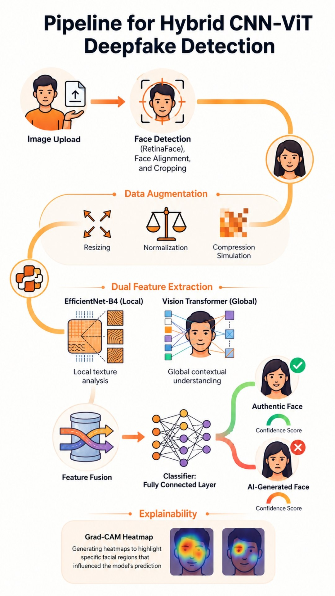

# Deep Learning-Based Human Face Authenticity Detection

Detect authentic vs AI-generated/manipulated human faces in images and videos using a hybrid deep learning pipeline (EfficientNet-B4 + Vision Transformer), robust preprocessing, and explainable AI (Grad-CAM).

---

## Abstract

The rapid evolution of generative AI has enabled highly realistic synthetic facial media, increasing risks of misinformation, impersonation, identity theft, and digital fraud. This project proposes a deep learning-based human face authenticity detection framework that combines local texture learning and global contextual understanding through a hybrid EfficientNet-B4 and Vision Transformer architecture.  
To improve practical usability, the pipeline integrates face detection and alignment preprocessing, compression-aware robustness strategies, cross-dataset evaluation, and Grad-CAM heatmap explainability.  
The system is designed for reliable real-world deployment across both image and video inputs, with benchmark-driven evaluation on datasets such as FaceForensics++, Celeb-DF, and DFDC.

---

## Quick Start

### Prerequisites

- Python 3.10+ (3.11 recommended)
- `pip` / virtual environment (`venv` or conda)
- CUDA-enabled GPU (recommended for training)

### 1. Clone the repository

```bash
git clone https://github.com/Vishakharoy1/Group-11-DS-and-AI-Lab-Project.git
cd Group-11-DS-and-AI-Lab-Project
```

### 2. Set up a virtual environment

```bash
python -m venv .venv
```

Windows PowerShell:

```powershell
.\.venv\Scripts\Activate.ps1
```

Linux/macOS:

```bash
source .venv/bin/activate
```

### 3. Install dependencies

```bash
pip install -r requirements.txt
```

> If `requirements.txt` is not added yet, install the required packages after your training/inference modules are finalized.

### 4. Run training / inference

Add your scripts first (for example under `src/`), then run:

```bash
python src/train.py
python src/evaluate.py
python src/infer.py --input path/to/image_or_video
```

---

## Project Scope (Milestone 1)

- Develop explainable deepfake image detection using a Vision Transformer (ViT) with RGB and frequency-domain feature fusion.
- Extract spatial and frequency-domain features using FFT/DCT-based frequency analysis and a cross-attention fusion mechanism.
- Improve model generalization across multiple GAN-based and diffusion-based deepfake datasets.
- Provide explainability via transformer attention visualizations highlighting facial regions and frequency patterns.
- Enable automated forensic report generation including predictions, confidence scores, and explainability visuals.
- Compare the framework against CNN models on Accuracy, Precision, Recall, F1-score, ROC-AUC, inference time, and cross-dataset performance.

---

## Proposed Architecture

The proposed framework combines:

- **RGB Spatial Feature Extraction** alongside **FFT/DCT-based frequency analysis** for spectral feature extraction.
- **Vision Transformer (ViT)** backbone for capturing long-range spatial dependencies.
- **Cross-Attention Fusion Mechanism** to combine spatial and spectral feature branches.
- **Explainability Visualizations** highlighting relevant facial regions and frequency patterns.
- **Forensic Report Generation** aggregating predictions, confidence scores, and attention maps.

## Architecture



---

## Benchmark Datasets

- **FaceForensics++ (FF++)**
- **Celeb-DF**
- **DeepFake Detection Challenge (DFDC)**
- **WildDeepfake** (for real-world robustness studies)

---

## Evaluation Strategy

Typical split strategy (as defined in the milestone plan):

- **Training:** FaceForensics++ + GAN-based images
- **Validation:** Celeb-DF
- **Testing:** DFDC + Diffusion-based dataset (if available)

Primary metrics:

- Accuracy
- Precision
- Recall
- F1-Score
- ROC-AUC
- Matthews Correlation Coefficient (MCC)
- Confusion Matrix
- Inference Time

---

## Current Repository Structure

```text
Group-11-DS-and-AI-Lab-Project/
|
├── doc/
│   └── Milestone-1/
│       ├── Milestone-1-Report.md
│       └── Team-Contribution-Tracker.md
|
└── README.md
```

---

## Team Contributions (Milestone 1)

| Team Member | Role |
| --- | --- |
| Rohit | Project Objectives & Problem Definition Lead |
| Raunak | Literature Review & Benchmark Analysis Lead |
| Vishakha | Research Findings & Comparative Analysis Lead |
| Aman | Baseline Performance & Evaluation Strategy Lead |

Detailed responsibilities are documented in `doc/Milestone-1/Team-Contribution-Tracker.md`.

---

## Documentation

- Milestone report: `doc/Milestone-1/Milestone-1-Report.md`
- Team contribution tracker: `doc/Milestone-1/Team-Contribution-Tracker.md`

---

## Opportunities for Improvement

- Improve cross-dataset generalization for unseen deepfake generation techniques.
- Enhance robustness against compression, screenshot capture, camera recapture, and other anti-forensic post-processing operations.
- Extend the framework to support real-time video-based deepfake detection.
- Improve explainability through advanced transformer attribution and frequency-domain interpretation techniques.
- Optimize the cross-attention fusion module to reduce computational complexity and inference latency.
- Incorporate additional forensic cues such as camera sensor noise (PRNU), image provenance, and metadata analysis to further improve detection reliability.

---

## License

License information will be added in upcoming milestones.

