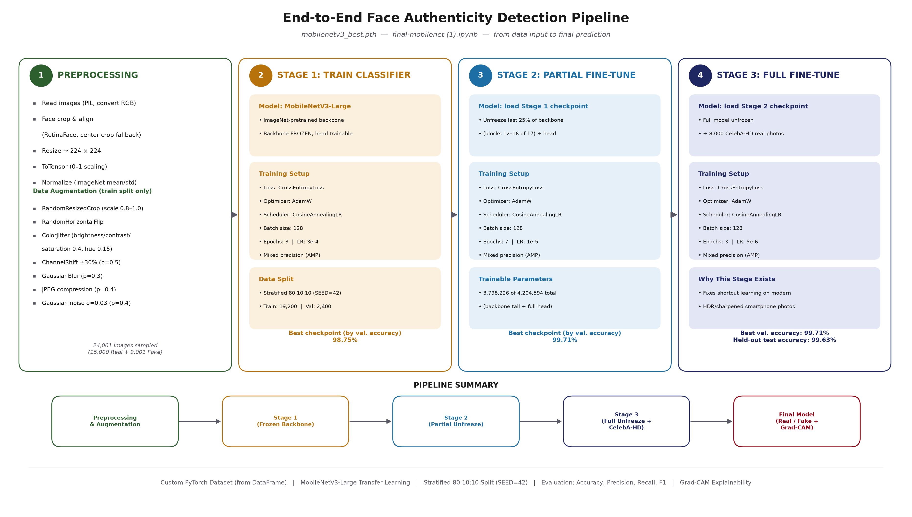

# Deep Learning-Based Human Face Authenticity Detection

Detect authentic vs. AI-generated human faces using **MobileNetV3-Large**
with a three-stage transfer-learning strategy, Grad-CAM explainability,
and automated forensic report generation — deployed as a local FastAPI +
web app for interactive testing.

> **Note on project history:** the Milestone 1 proposal (below) described
> a hybrid EfficientNet-B4 + Vision Transformer approach. Milestone 3's
> architecture bake-off selected **MobileNetV3-Large** instead, based on
> demonstrated out-of-distribution generalization and a far smaller
> footprint (4.2M vs. 40.7M parameters). Everything below the Abstract
> reflects the actual final system.

---

## Abstract

The rapid evolution of generative AI has enabled highly realistic
synthetic facial media, increasing risks of misinformation,
impersonation, identity theft, and digital fraud. This project delivers
a deep learning-based human face authenticity detection system built on
**MobileNetV3-Large**, trained via a three-stage transfer-learning
strategy (frozen backbone → partial unfreeze → full unfreeze with
additional HD real-photo data) to correct a shortcut-learning failure
mode identified during evaluation. The system integrates face detection
and alignment preprocessing (RetinaFace, with a center-crop fallback),
Grad-CAM explainability, real-world manipulation robustness testing, and
an automated forensic report generator, and is evaluated end-to-end in
`doc/Milestone-5/Milestone5.md` — including honest documentation of what
remains unmeasured or open, not just headline accuracy numbers.

---

## Quick Start

### Prerequisites

- Python 3.10+ (3.11 recommended)
- `pip` / virtual environment (`venv` or conda)
- A Kaggle account with GPU quota, for training/reproducing the notebooks (Section "Training Notebooks" below)
- No local GPU is required to run the web app — it works CPU-only (see Deployment Readiness in `doc/Milestone-5/Milestone5.md` Section 9)

### 1. Clone the repository

```bash
git clone https://github.com/Vishakharoy1/Group-11-DS-and-AI-Lab-Project.git
cd Group-11-DS-and-AI-Lab-Project
```

### 2. Set up a virtual environment

```bash
python -m venv .venv
```

Windows PowerShell:

```powershell
.\.venv\Scripts\Activate.ps1
```

Linux/macOS:

```bash
source .venv/bin/activate
```

### 3. Install dependencies and run the web app

```bash
cd webapp/backend
pip install -r requirements.txt
uvicorn app.main:app --reload --port 8000
```

Then open `http://127.0.0.1:8000` in a browser — a 5-page app (Main
Model, Cross-Domain Model, Grad-CAM, Forensic Report, History). Full
details — model loading, endpoints (`/predict`, `/robustness`,
`/compare`, `/report`, `/report/docx`), and troubleshooting — are in
`webapp/backend/README.md`; a full code/config walkthrough is in
`DeveloperGuide.md`.

### 4. Train or reproduce a model

See **Training Notebooks** below — this covers attaching datasets on
Kaggle, running each notebook cell-by-cell, reproducing results, and
what each output file means.

---

## Architecture



The final framework combines:

- **MobileNetV3-Large backbone** (ImageNet-pretrained, depthwise-separable convolutions, Squeeze-and-Excitation, Hardswish activations) — 4,204,594 total parameters.
- **Three-stage transfer learning**: Stage 1 (frozen backbone, classifier head only) → Stage 2 (last 25% of backbone unfrozen) → Stage 3 (full unfreeze + CelebA-HD real photos, added specifically to fix a shortcut-learning failure mode identified in Milestone 5 — see `doc/Milestone-5/Milestone5.md`).
- **Grad-CAM explainability**, highlighting the facial regions driving each prediction.
- **Automated forensic report generation** — prediction, confidence, Grad-CAM evidence, and known reliability limitations compiled into a printable document, downloadable as PDF or a real Word (`.docx`) file.

---

## Web Application

A 5-page local web app (`webapp/backend/`, FastAPI + static HTML/JS, no
build step) for interactively testing the trained checkpoints — see
`webapp/backend/README.md` for setup/run instructions and the API
reference, `DeveloperGuide.md` for the full file-by-file implementation
walkthrough. What each page actually does:

### 1. Main Model

Upload a face image, click Analyze, get a Real/AI-Generated verdict with
a confidence score. Powered by **`mobilenetv3_noaug.pth`** — note this is
a deliberate choice, *not* `mobilenetv3_best.pth` (the checkpoint
`doc/Milestone-5/Milestone5.md` evaluates in depth); see
`DeveloperGuide.md` Section 8 for why, and how to repoint it if you want
"Main Model" to serve `best` instead. Shows AI/Real probability, model
info, and an Analysis ID — then unlocks the Grad-CAM and Forensic Report
actions for that result.

### 2. Cross-Domain Model

Same upload → analyze → result flow, powered by **`mobilenetv3_cross_domain.pth`**
— trained on general, non-face images across multiple domains (Nano
Banana, CIFAKE, CrossDomain, Places365, Artifact; see Training Notebooks
§2.1) rather than the face-specific FFHQ/Stable Diffusion/CelebA data the
Main Model uses. Intended for images outside the core face domain, or as
a second opinion with a differently-trained model.

### 3. Grad-CAM

Visual explainability for whichever image was most recently analyzed on
either model page above: the original image next to an adjustable
heatmap overlay. Three modes (Original / Heatmap / Overlay) plus a real
intensity slider — the slider actually re-blends the real Grad-CAM
heatmap over the original image via CSS opacity, it isn't a
pre-rendered/fixed image. Empty state with a "Go to Main Model" link if
nothing's been analyzed yet.

### 4. Forensic Report

A full document-style report for the most recent analysis: case info
(Analysis ID, timestamp, filename), image info (resolution, size,
format), model info (which checkpoint, prediction, confidence), which
inference-time preprocessing steps were actually applied (vs. which
augmentations were only used during training — kept clearly separate, not
conflated), the Grad-CAM evidence, a final assessment, and a disclaimer.
Download as **PDF** (browser print) or a real **`.docx`** file (server-
generated via `POST /report/docx`, `python-docx`).

### 5. History

Every analysis run this browser session — table view (search by Analysis
ID/filename, filter by model/result) plus a right-hand timeline grouped
by date. Persisted to `localStorage` so it survives a page reload (there
is **no backend database** — clearing browser data or switching browsers
starts it empty). Capped at 15 entries. Each row has a "View Details"
action that reloads that historical result into the Grad-CAM/Report
pages. Failed analyses are logged too, with the real error message shown
inline.

Plus a static **User Guide** page (how to use each of the above, aimed at
a non-technical user).

---

## Training Notebooks — Usage Instructions

Two Kaggle notebooks produce the checkpoints used throughout this
project and the local web app:

| Notebook | Produces | Status |
|---|---|---|
| `final-mobilenet (1).ipynb` | `mobilenetv3_best.pth` — the main face-authenticity model | Complete, fully trained |
| `cross-domain.ipynb` | `mobilenetv3_cross_domain.pth` — a separate model for non-face/general images | **Complete, fully trained** — `mobilenetv3_cross_domain.pth` is live in the web app's Cross-Domain Model page and verified working (see note below) |

> **Note on `cross-domain.ipynb`'s status:** the checkpoint itself is
> real, trained, and confirmed working (loaded by the app, verified with
> real predictions). However, the copy of this notebook checked into this
> repo still only shows output through the dataset-path-verification
> cell (2b) — the full training run that actually produced the working
> checkpoint was completed separately, and that run's own cell outputs
> (final dataset composition actually used, per-domain accuracy) weren't
> captured back into the notebook file here. Section 2 below documents
> the *intended* recipe (which datasets to attach, cell order) rather
> than a verified record of the specific run that produced the deployed
> checkpoint.

### 1. `final-mobilenet (1).ipynb` — the main face model

#### 1.1 Attaching datasets on Kaggle

In the notebook's right sidebar, click **+ Add Input** and attach these
three datasets:

| Dataset | Kaggle slug | Used as |
|---|---|---|
| Real vs AI Generated Faces Dataset | `philosopher0808/real-vs-ai-generated-faces-dataset` | `REAL_DIR` — FFHQ real face images (70,000 available) |
| Stable Diffusion Dataset | `mohannadaymansalah/stable-diffusion-dataaaaaaaaa` | `FAKE_DIR` — AI-generated fake face images (9,001 available) |
| CelebA Dataset | `jessicali9530/celeba-dataset` | `REAL_DIR_CELEBA` — additional HD real photos, used only in **Stage 3** to fix modern-photo shortcut learning (see 1.3 below) |

The CelebA dataset is auto-detected: if it isn't attached, Stage 3 is
skipped automatically (`INCLUDE_CELEBA = REAL_DIR_CELEBA.exists()`) and
the notebook produces a 2-stage model instead of the intended 3-stage
one — attach it if you want the model this project actually deploys.

Also enable **Settings → Internet → ON** — the notebook installs
`retina-face` via pip early on, which needs internet access. If it fails
to install, face detection silently falls back to a center-crop (the
notebook prints a warning; this does not stop the run).

#### 1.2 Running the notebook — cell order

Run top-to-bottom (**Run All**, or **Restart & Run All** if the kernel
has stale state from a previous partial run):

| Cell | What it does |
|---:|---|
| 1 | Imports, configuration, hyperparameters (`SEED=42`, `IMG_SIZE=224`, `BATCH_SIZE=128`, `IMAGES_PER_CLASS=15000`), dataset paths |
| 2 | Installs `retina-face` (needs internet) |
| 3 | Defines `crop_and_align_face()` — RetinaFace crop with center-crop fallback |
| 4 | Builds the dataset DataFrame: loads FFHQ + Stable Diffusion (+ CelebA-HD if attached), samples down to `IMAGES_PER_CLASS`, shuffles |
| 5 | 80:10:10 stratified train/val/test split (`SEED=42`) |
| 6 | Transforms (training augmentation incl. `ChannelShift`, `JPEGCompression`, Gaussian noise/blur) + `DataLoader`s |
| 7 | Builds MobileNetV3-Large (ImageNet-pretrained backbone, 2-class classifier head) |
| 8 | **Stage 1**: 3 epochs, classifier head only, backbone frozen, LR `3e-4` |
| 9 | **Stage 2**: 7 epochs, unfreezes last 25% of backbone (blocks 12–16 of 17), LR `1e-5` |
| 10 | **Stage 3**: 3 epochs, full-model unfreeze, LR `5e-6`, adds CelebA-HD — **skipped automatically if CelebA isn't attached** |
| 11 | Final evaluation: loads the best checkpoint, runs it on the held-out test set, prints the classification report + confusion matrix |
| 12 | Defines `get_gradcam()` — Grad-CAM heatmap + layer-activation visualization function |
| 13 | Interactive `ipywidgets` file-upload cell (optional, for manual spot-checks inside the notebook) |
| 14 | Loads the saved checkpoint and runs a prediction on the uploaded image (run after Cell 13) |

Each stage's training loop only saves a new checkpoint when it beats the
previous best validation accuracy — Stage 1's and Stage 2's own
intermediate weights are **not** kept once a later stage overwrites the
file at `MODEL_SAVE_PATH`. If you need to compare stages against the test
set individually (not just validation accuracy), save each stage's
checkpoint under a different filename before letting the next stage
overwrite it.

#### 1.3 Reproducing results

1. Attach all three datasets (1.1 above) — CelebA is required to
   reproduce the actual 3-stage model this project deploys.
2. **Restart & Run All.**
3. Download `/kaggle/working/mobilenetv3_best.pth` from the Kaggle
   Output tab — this is exactly what the local web app
   (`webapp/backend/`) expects in its `output/` folder.

Expected results on this dataset composition (verified, from an actual
run): **99.63% test accuracy** on the 2,401-image held-out test set,
**99.71%** best validation accuracy. See `doc/Milestone-5/Milestone5.md`
Section 4 for the full breakdown (classification report, confusion
matrix, per-stage validation accuracy).

#### 1.4 What this notebook does *not* save to disk

Unlike `cross-domain.ipynb` below, this notebook does **not** call
`plt.savefig()` anywhere — the confusion matrix and Grad-CAM figures are
only shown inline (`plt.show()`) during the Kaggle session, not written
to `/kaggle/working/`. The **only file this notebook saves** is the
checkpoint itself (`mobilenetv3_best.pth`). If you need the confusion
matrix or Grad-CAM images as files, either add your own `plt.savefig()`
calls before re-running, or extract them from the notebook's own saved
output (the `.ipynb` file embeds the last-rendered figure as inline
image data even without an explicit save — this is how the confusion
matrix image in `doc/Milestone-5/images/confusion_matrix_best_model.png`
was obtained).

### 2. `cross-domain.ipynb` — the general/non-face model

**Status: the checkpoint is trained and deployed** (see the note in the
table above) — the instructions below are the intended recipe for
reproducing it from scratch, not a description of an untrained notebook.

#### 2.1 Attaching datasets on Kaggle

| Dataset | Kaggle slug | Used as |
|---|---|---|
| AI Image with Nano Banana 2.0 vs Real Image | `ahnuf05/ai-imagewith-nano-banana-2-0-vs-real-image` | Real + Fake — AI art vs. real photos |
| CIFAKE | `birdy654/cifake-real-and-ai-generated-synthetic-images` | Real + Fake — SDXL-generated vs. real CIFAR-10 objects |
| CrossDomain | `rahulshetty1020/crossdomain` | Real + Fake — small hand-collected set (only ~10 real images) |
| Places365 (2 scenes) | `nickj26/places2-mit-dataset` | Real — indoor/outdoor scene photos, capped at 10,000 |
| Artifact | `awsaf49/artifact-dataset` | Fake — AI-generated scenes (DALL-E, Stable Diffusion, Midjourney), capped at 8,000 |

Run **Cell 2b (Verify all dataset paths)** first after attaching — it
prints which paths actually resolve, so you can confirm all five before
committing to a full run.

#### 2.2 Running the notebook — cell order

| Cell | What it does |
|---:|---|
| 1 | Imports |
| 2 | Configuration: dataset paths, `IMG_SIZE=224`, `BATCH_SIZE=32`, per-directory image caps |
| 2b | **Verify dataset paths** — run this first to confirm what's actually attached |
| 3 | Collect image paths into a labeled DataFrame |
| 4 | Transforms (crop, flip, colour jitter, blur, random erasing) |
| 5 | 85:15 train/val split with a class-balancing `WeightedRandomSampler` |
| 6 | Builds MobileNetV3-Large |
| 7 | Training helper functions |
| 8 | **Stage 1**: 3 epochs, frozen backbone |
| 9 | **Stage 2**: 7 epochs, last 25% of backbone unfrozen |
| 10 | Plots + saves training curves |
| 11 | Per-domain validation accuracy breakdown |
| 12 | Confusion matrix + classification report, saved as an image |
| 13 | Interactive `ipywidgets` upload-and-test cell (optional) |

This notebook, unlike the main one, does **not** use RetinaFace or any
face cropping — it trains directly on whole images, since it's meant for
general (non-face) content.

#### 2.3 Reproducing results

1. Attach all five datasets (2.1 above), confirm with Cell 2b.
2. **Restart & Run All.**
3. Download everything under `/kaggle/working/output/` — the checkpoint
   plus the CSV/PNG artifacts described below.

#### 2.4 What the output files mean

All written to `/kaggle/working/output/`:

| File | Contents |
|---|---|
| `mobilenetv3_cross_domain.pth` | Model checkpoint (state dict + val accuracy + class list) |
| `training_curves.png` | Train/val accuracy per epoch across both stages |
| `domain_accuracy.csv` | Validation accuracy broken down by data source (Nano Banana, CIFAKE, CrossDomain, Places365, Artifact) |
| `confusion_matrix.png` | Validation-set confusion matrix (Real vs. Fake) |

### 3. Where these outputs get used

Both checkpoints are consumed by the local web app's `ModelRegistry`
(`webapp/backend/app/model.py`), which loads whichever files it finds in
`output/` and skips missing ones gracefully. See `webapp/backend/README.md`
for how to run the app itself, and `doc/Milestone-5/Milestone5.md` for
the full evaluation of `mobilenetv3_best.pth` (Sections 2–9).

---

## Datasets Actually Used

| Dataset | Role | Size used |
|---|---|---|
| FFHQ (via `philosopher0808/real-vs-ai-generated-faces-dataset`) | Real faces (Stages 1–2) | 70,000 available, 15,000 sampled |
| Stable Diffusion Face Dataset | Fake/AI-generated faces | 9,001 |
| CelebA-HD | Additional real faces (Stage 3 only — fixes shortcut learning) | 8,000 |
| Nano Banana 2.0 / CIFAKE / CrossDomain / Places365 / Artifact | Cross-domain model training (`cross-domain.ipynb`) | see Training Notebooks §2.1 |

*(Milestone 1's originally proposed benchmark datasets — FaceForensics++,
Celeb-DF, DFDC, WildDeepfake — were never used; the datasets above are
what the project actually trained and evaluated on.)*

---

## Evaluation Strategy

Actual train/validation/test split used by `final-mobilenet (1).ipynb`
(80:10:10, stratified, `SEED=42`):

| Split | Real | Fake | Total |
|---|---:|---:|---:|
| Train | 12,000 | 7,200 | 19,200 |
| Validation | 1,500 | 900 | 2,400 |
| Test | 1,500 | 901 | 2,401 |

Metrics used (full derivation and real, measured results in
`doc/Milestone-5/Milestone5.md`, Sections 3–4): Accuracy, Precision,
Recall, F1-score, ROC-AUC (partially open — see the report), plus
dedicated cross-domain, manipulation-robustness, and out-of-distribution
evaluations that a single in-distribution test-set score cannot capture.

Headline result: **99.63% test accuracy** in-distribution — but only
**8.6% accuracy** on genuine real photos from a different capture
era/device (cross-domain probe), which is the central finding
Milestone 5 exists to document. See the report for the full picture,
including what was root-caused, what was fixed, and what's still open.

---

## Current Repository Structure

```text
Group-11-DS-and-AI-Lab-Project/
|
├── final-mobilenet (1).ipynb      # Main face model training notebook
├── cross-domain.ipynb             # Cross-domain model training notebook
├── README.md                      # This file
|
├── images/
│   └── mobilenetv3_pipeline_v3.png
|
├── webapp/
│   ├── backend/                   # FastAPI app + static frontend (README.md inside)
│   └── output/                    # Checkpoints + training artifacts consumed by the app
|
├── Test Sample/                   # Manually curated real/fake test images
|
├── outputs/                       # Local verification scripts + their results (see below)
|
└── doc/
    ├── Milestone-1/ .. Milestone-5/
    │   ├── *-Report.md
    │   └── Team-Contribution-Tracker.md
    └── Milestone-5/
        ├── Milestone5.md          # Full evaluation report (start here)
        └── images/                # Confusion matrix, ROC/PR curves, Grad-CAM
```

### `outputs/` — local verification scripts and their results

Generated while producing `doc/Milestone-5/Milestone5.md`, to get real
numbers directly from `mobilenetv3_best.pth` rather than relying on
notebook claims alone:

| File | What it is |
|---|---|
| `kaggle_gpu_benchmark_cell.py` | Ready-to-paste Kaggle cell to measure real GPU latency + VRAM for `mobilenetv3_best.pth` on a T4 — not yet successfully run; Section 4.4/9.2/9.3 of the report currently use an estimate instead |
| `kaggle_roc_auc_cell.py` | Ready-to-paste Kaggle cell to compute a real ROC-AUC/PR curve on the actual 2,401-image held-out test set — the training notebook itself never computed this; not yet run |
| `local_latency_benchmark.csv` | Real, measured CPU latency/throughput for `mobilenetv3_best.pth` on this development machine (15.53 ms mean, 64.4 images/sec) |
| `local_test_sample_results.csv` | Real, measured accuracy/ROC-AUC/PR-AUC from running the checkpoint against the local `Test Sample/` folder (a supplementary check, not the official held-out test set) |
| `ood_nonface_results.csv` | Real, measured predictions from running the checkpoint against 10 non-face images, to characterize its out-of-domain behaviour (Section 7.1) |

> **Note:** an earlier draft of this repo had a `doc/Milestone-5-rohit/`
> folder — a separate benchmark (Adam-vs-AdamW comparison, confusion
> matrices, ROC/PR curves) measured on a **different training run** than
> `final-mobilenet (1).ipynb` (6,401-image test set vs. the real 2,401;
> an Adam/AdamW ablation that doesn't exist in the actual notebook; Apple
> MPS GPU numbers vs. the real Tesla T4 environment). `Milestone5.md`
> never referenced this data. It has been removed from `main` — the
> original files live on the `rohit_week5` branch
> (`doc/Milestone-5/adam_vs_adamw.csv` etc., commit `596174f`), which
> also has a `full_logs.log` not present anywhere on `main`.

---

## Team Contributions

Current (Milestone 5) roles — see `doc/Milestone-5/Team-Contribution-Tracker.md`
for full detail per member:

| Team Member | Role |
| --- | --- |
| Vishakha | Pipeline & Presentation Lead |
| Rohit | Training Stability |
| Aman | Preprocessing & Transfer Learning |
| Raunak | Dataset & Bias Analysis |
| Somendu | Explainability & Optimisation |

Milestone 1's original role assignments are in
`doc/Milestone-1/Team-Contribution-Tracker.md`.

---

## Documentation

- **Start here:** `doc/Milestone-5/Milestone5.md` — full evaluation report (dataset, metrics, quantitative results, error analysis, robustness, explainability, limitations, deployment readiness)
- **Full developer/setup/code reference:** `DeveloperGuide.md`
- Training notebooks: this file, "Training Notebooks — Usage Instructions" above
- Web app quick reference: `webapp/backend/README.md`
- Team contribution trackers: `doc/Milestone-{1..5}/Team-Contribution-Tracker.md`
- Earlier milestone reports: `doc/Milestone-{1,2,3,4}/`

---

## Known Open Items / Opportunities for Improvement

From Milestone 5's Actionable Insights (`doc/Milestone-5/Milestone5.md`,
Section 8 — written before `cross-domain.ipynb`'s training run
completed, so its "complete cross-domain training" item below is now
done; `Milestone5.md` itself hasn't been re-updated to reflect that):

**Short-term (no retraining required):**
- Recalibrate the deployed decision threshold (currently plain 50% argmax) to reduce the false-positive rate on real photos.
- Make Grad-CAM optional on the `/predict` path to remove the ~140× latency overhead it currently adds.
- Run a proper demographic-fairness audit using a dataset with verified (not inferred) demographic labels.
- Complete a real GPU/VRAM benchmark for `mobilenetv3_best.pth` (currently only CPU-measured, GPU is an estimate).

**Long-term (requires retraining or new data):**
- Targeted HDR/sharpening-simulation augmentation — the existing `ChannelShift` augmentation is already applied but doesn't address the actual failure mode.
- Expand the Real class beyond FFHQ + CelebA-HD with more capture devices/eras.
- Hard-negative mining using the actual misclassified Real-Latest images.
- Complete `cross-domain.ipynb` training — this unblocks three separate open items at once (Section 2.3, part of Section 4.2's ROC-AUC gap, and the out-of-distribution test on the cross-domain model).

---

## License

License information will be added in upcoming milestones.
