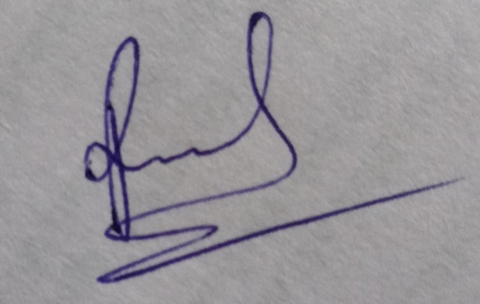

# Deep Learning-Based Human Face Authenticity Detection

**Milestone 1**

---

## 1. Problem Statement

The rapid advancement of Artificial Intelligence has enabled the creation of highly realistic AI-generated and manipulated human faces in both images and videos. While these technologies have numerous beneficial applications, they are increasingly being exploited for deepfakes, misinformation, identity theft, impersonation, and digital fraud. Existing deepfake detection methods often rely primarily on spatial features learned from RGB images, making them less effective when faced with compressed media, unseen manipulation techniques, and newly emerging AI-generated content. Furthermore, many existing approaches function as black-box models, providing predictions without sufficient explanation of the factors influencing their decisions. 

### Challenges Arising from Advancements in AI Technology

- AI-generated images and videos are rapidly spreading across social media, news platforms, and digital communication channels, making it increasingly difficult to distinguish authentic facial content from manipulated media.
- Recent advances in generative AI models, including GANs and diffusion models, have significantly improved the realism of synthetic faces, enabling misuse for misinformation, impersonation, identity theft, and digital fraud.
- Existing CNN-based and conventional deepfake detection methods often rely mainly on RGB spatial features and struggle to generalize across compressed media, unseen manipulation techniques, and cross-dataset scenarios.
- Hidden frequency-domain artifacts introduced during image generation are often overlooked by traditional detection methods, reducing their effectiveness against modern AI-generated images.
- Many existing detection systems lack explainability and provide only prediction labels without indicating the facial regions or hidden artifacts that influenced the decision, limiting user trust and transparency.
- There is a need for an explainable deepfake detection framework that combines Vision Transformers, RGB–frequency feature fusion, and attention-based interpretation to improve robustness, generalization, and user confidence.

---

## 2. Project Objectives

- To develop an explainable deepfake image detection system using a Vision Transformer (ViT) integrated with RGB and frequency-domain feature fusion for accurate identification of authentic and AI-generated facial images.
- To extract complementary spatial and frequency-domain features by combining RGB information with FFT/DCT-based frequency analysis through a cross-attention fusion mechanism to improve robustness against unseen manipulation techniques.
- To enhance the model's generalization capability by evaluating its performance across multiple benchmark datasets containing GAN-based and diffusion-based deepfake images.
- To improve the transparency of deepfake detection by incorporating transformer attention visualization and explainability techniques that highlight the facial regions and frequency patterns influencing the model's predictions.
- To generate an automated forensic analysis report containing prediction results, confidence scores, explainability visualizations, detected faces, and processing details for end users.
- To evaluate and compare the proposed framework against existing CNN-based deepfake detection models using standard metrics such as Accuracy, Precision, Recall, F1-score, ROC-AUC, inference time, and cross-dataset performance.

---

## 3. Literature Review and Existing Solutions

This section reviews the evolution of AI-generated facial media, existing deepfake detection approaches, standard baseline models, and benchmark datasets used to evaluate deepfake detection systems. It also highlights the strengths and limitations of current methods, providing the motivation for the proposed solution.

### 3.1 Evolution of AI-Generated Facial Media

The rapid advancement of generative AI has significantly improved the realism of synthetic human faces. Early deepfake generation methods produced noticeable visual artifacts, whereas modern diffusion-based models generate highly realistic images that are difficult for both humans and traditional detection algorithms to identify.

| Feature | Early Generation (approx. 2018) | Modern Generation (Current State-of-the-Art) |
| --- | --- | --- |
| Facial Details | Blurry ears, mismatched eyes, distorted teeth | Realistic skin texture, consistent facial features, natural lighting |
| Geometry and Physics | Incorrect shadows, hair artifacts, inconsistent backgrounds | Accurate facial geometry, realistic reflections and shadows |
| Detection Difficulty | Easily detected using conventional CNNs | Requires advanced deep learning models to detect subtle artifacts |

### 3.2 Existing Deepfake Detection Approaches

Modern deepfake detection systems employ different feature extraction strategies to identify AI-generated facial content.

#### 3.2.1 Spatial CNN-Based Detection

CNN-based detectors treat deepfake detection as a binary image classification problem by learning spatial features directly from RGB images.

**Target Features**

- Skin texture
- Lighting inconsistencies
- Facial artifacts
- Edge information

**Strengths**

- Simple architecture
- Fast inference
- High accuracy on benchmark datasets

**Limitations**

- Learns dataset-specific artifacts
- Poor cross-dataset generalization
- Performance degrades on unseen deepfake generators

#### 3.2.2 Vision Transformer (ViT)-Based Detection

Vision Transformers divide an image into patches and learn long-range dependencies using self-attention mechanisms.

**Target Features**

- Facial symmetry
- Global facial structure
- Illumination consistency
- Contextual relationships

**Strengths**

- Better global feature representation
- Improved cross-domain generalization
- Strong performance on modern benchmark datasets

**Limitations**

- High computational cost
- Requires larger datasets for effective training

#### 3.2.3 Frequency and Wavelet-Based Detection

Frequency-domain methods analyze spectral information instead of raw pixel values.

**Core Principle**

GANs and diffusion models introduce subtle frequency-domain artifacts during image generation that remain invisible in RGB space.

**Strengths**

- Effective against highly realistic deepfakes
- Captures artifacts missed by spatial models

**Limitations**

- Sensitive to image compression
- Performance varies across different generation techniques

#### 3.2.4 Noise Residual-Based Detection

Noise residual methods analyze camera sensor fingerprints present in authentic photographs.

**Target Features**

- Sensor Pattern Noise (SPN)
- Demosaicing artifacts
- Camera hardware signatures

**Strengths**

- Effective for distinguishing camera-captured images from synthetic images

**Limitations**

- Less reliable after heavy compression or image editing
- Ineffective if sensor traces are significantly degraded

#### 3.2.5 Multi-Scale Detection

Multi-scale architectures process facial images at multiple resolutions to capture both global and local forgery artifacts.

**Strengths**

- Detects fine-grained and large-scale manipulations
- Improved robustness

**Limitations**

- Higher computational complexity
- Increased training time

### 3.3 Proposed Approach

The proposed system presents an Explainable Dual-Stream Vision Transformer (ViT) framework integrated with RGB–Frequency Fusion for deepfake image detection. Unlike conventional CNN-based methods that primarily learn local spatial features, the proposed framework combines spatial information from RGB images with frequency-domain features extracted using the Fast Fourier Transform (FFT) or Discrete Cosine Transform (DCT). By integrating these complementary feature representations through a cross-attention fusion mechanism, the system can identify both visible facial inconsistencies and hidden artifacts introduced during AI-generated image synthesis.

The proposed methodology consists of the following stages:

#### Step 1: Image Acquisition and Validation
The system accepts facial images in commonly used formats such as JPG, JPEG, PNG, and WEBP. Before processing, each uploaded image is validated to verify its file format, resolution, and integrity. Invalid or corrupted files are rejected to ensure reliable analysis.

#### Step 2: Face Detection
After validation, the image is processed using a face detection model such as RetinaFace or MTCNN. If multiple faces are detected within a single image, each face is extracted and cropped individually. This step removes unnecessary background information and ensures that only facial regions are analyzed, thereby improving detection accuracy.

#### Step 3: Image Preprocessing
Each cropped face is resized to the input dimensions required by the Vision Transformer (typically 224 × 224 pixels) and normalized to standardize pixel values. During training, data augmentation techniques including random horizontal flipping, rotation, brightness adjustment, contrast variation, and JPEG compression augmentation are applied to improve the model's robustness and generalization capability under real-world conditions.

To further enhance robustness against post-processing and anti-forensic techniques, the training dataset will also include augmentations such as image resizing, screenshot simulation, Gaussian blur, and noise addition. These transformations enable the model to learn features that remain informative even when frequency-domain artifacts are partially reduced by screenshot capture, camera recapture, or image recompression, thereby improving its performance on real-world manipulated images.

#### Step 4: Dual-Stream Feature Extraction
The preprocessed face image is simultaneously processed through two independent feature extraction streams.

The RGB stream utilizes the original facial image, which is divided into fixed-size patches and converted into embeddings. These embeddings are processed by the Vision Transformer to learn high-level spatial features such as facial structure, skin texture, lighting consistency, facial symmetry, and geometric relationships between different facial regions.

Simultaneously, the frequency stream converts the same image into the frequency domain using FFT or DCT. This branch extracts hidden frequency-based characteristics, including checkerboard artifacts, interpolation errors, abnormal high-frequency noise, and compression inconsistencies that are commonly associated with AI-generated facial images but are difficult to observe in the RGB domain.

#### Step 5: RGB–Frequency Cross-Attention Fusion
Rather than directly concatenating the extracted features, the proposed framework employs a cross-attention fusion mechanism. This module enables meaningful interaction between RGB and frequency-domain features by learning the relationship between spatial facial regions and their corresponding frequency characteristics. The resulting fused representation contains richer and more discriminative information, allowing the model to distinguish authentic and manipulated facial images more effectively.

#### Step 6: Vision Transformer-Based Classification
The fused feature representation is passed through additional transformer encoder layers, followed by a classification head that predicts the authenticity of the input face. The proposed system primarily performs binary classification (Real or Deepfake), while the architecture can be extended to support multi-class classification (Real, AI-Generated, and Deepfake) if required.

The classifier also produces a confidence score that indicates the probability associated with each prediction, providing users with an estimate of the model's certainty.

#### Step 7: Explainability Framework
To improve transparency and user trust, the proposed framework incorporates transformer-based explainability techniques such as Attention Rollout and Transformer Attribution. These methods generate attention maps that highlight the facial regions contributing most significantly to the prediction.

Additionally, frequency-domain saliency visualization is used to identify the spectral components that influence the classification process. By combining both spatial and frequency-domain explanations, the framework provides a comprehensive interpretation of the prediction, enabling users to understand why an image has been classified as authentic or manipulated.

#### Step 8: Report Generation
Finally, the system generates a detailed PDF-based forensic report summarizing the complete analysis. The report includes:
- Image filename
- Prediction result
- Confidence score
- Detected face details
- Processing time
- Model information
- Spatial attention heatmap
- Frequency-domain visualization
- Combined explainability summary

The generated report provides an interpretable record of the detection process, making the proposed framework suitable for applications in digital forensics, cybersecurity, journalism, media verification, and content authentication.

### 3.4 Standard Detection Baseline Models

Researchers compare newly proposed models against widely accepted baseline architectures.

| Baseline Model | Category | Characteristics |
| --- | --- | --- |
| MesoNet | CNN | Lightweight baseline for early deepfake detection |
| XceptionNet | CNN | Standard benchmark for spatial artifact detection |
| EfficientNet | CNN | Improved feature extraction with fewer parameters |
| ConvNeXt | CNN | Modern convolutional architecture with enhanced performance |
| Vision Transformer (ViT) | Transformer | Captures global contextual relationships |
| Swin Transformer | Transformer | Hierarchical transformer with improved efficiency |
| Face X-ray | Artifact Detection | Detects blending boundary inconsistencies during face swapping |

### 3.5 Benchmark Datasets

Benchmark datasets provide standardized evaluation for comparing deepfake detection methods.

| Dataset | Characteristics | Research Significance |
| --- | --- | --- |
| FaceForensics++ (FF++) | 1,000 original videos manipulated using four face manipulation methods | Standard benchmark for deepfake detection research |
| WildDeepfake | 7,314 face sequences containing approximately 1.18 million face images collected from internet videos | Evaluates performance under real-world conditions |
| DeepFake Detection Challenge (DFDC) | More than 100,000 videos with varying compression levels, lighting conditions, and backgrounds | Measures robustness and cross-domain generalization |

### 3.6 Research Gaps Identified

Although significant progress has been made in deepfake detection, several challenges remain:

- Existing CNN-based detectors often overfit to dataset-specific artifacts and struggle with unseen manipulation techniques.
- Transformer-based models provide better generalization but require greater computational resources.
- Frequency-domain and noise-based methods are sensitive to compression and post-processing operations.
- Most existing systems operate as black-box models and provide limited explainability.
- There is a need for robust models that combine local texture analysis, global contextual understanding, and explainable AI for reliable real-world deployment.

### 3.7 Proposed Approach to Address the Research Gaps

Based on the research gaps identified in the existing literature, the proposed framework introduces the following improvements:

- Develops an explainable deepfake image detection system using a **Vision Transformer (ViT)** integrated with RGB and frequency-domain feature fusion.

- Extracts complementary spatial and frequency-domain features by combining RGB information with **FFT/DCT-based frequency analysis** through a **cross-attention fusion mechanism**.

- Enhances model generalization by evaluating its performance across multiple benchmark datasets containing both **GAN-based** and **diffusion-based** deepfake images.

- Incorporates **transformer attention visualization and explainability techniques** that highlight both the facial regions and frequency patterns influencing predictions.

- Generates an **automated forensic analysis report** containing prediction results, confidence scores, explainability visualizations, detected faces, and processing details for end users.

- Evaluates and compares the proposed framework against existing CNN-based deepfake detection models using standard metrics such as Accuracy, Precision, Recall, F1-score, ROC-AUC, inference time, and cross-dataset performance.
---

## 4. Detailed Findings and Comparative Analysis

This section presents the key findings obtained from the literature review, benchmark datasets, and recent research on deepfake detection. It summarizes the performance of existing approaches, highlights current challenges, and compares them with the proposed hybrid deep learning framework.

### 4.1 Detailed Findings from Existing Research

The findings presented below are based on the research papers *FaceForensics++: Learning to Detect Manipulated Facial Images* (ICCV 2019) and *A Contemporary Survey on Deepfake Detection: Datasets, Algorithms, and Challenges* (Electronics, 2024).

#### 4.1.1 Key Findings

- Deep learning-based approaches significantly outperform traditional handcrafted feature extraction techniques for detecting manipulated facial images.
- CNN-based models, particularly XceptionNet, achieve high detection accuracy by learning subtle manipulation artifacts present in deepfake images.
- Recent research has shifted towards Vision Transformers (ViTs) and hybrid architectures that capture global contextual relationships and improve cross-dataset generalization.
- Benchmark datasets such as FaceForensics++, Celeb-DF, and DFDC have become the standard for evaluating deepfake detection systems.
- Deepfake datasets are expanding rapidly, with research indicating an approximate 300% annual growth, highlighting the need for continuously improving detection methods.
- Modern detection systems increasingly combine preprocessing techniques, feature extraction, and attention mechanisms to improve robustness.
- Current research focuses more on cross-dataset generalization than simply achieving high benchmark accuracy.

#### 4.1.2 Detection Accuracy and Performance

- XceptionNet achieves over 99% accuracy on raw FaceForensics++ images, making it one of the strongest CNN-based baseline models.
- CNN-based architectures consistently outperform traditional machine learning approaches on benchmark datasets.
- Transformer-based models demonstrate superior cross-dataset performance by learning long-range spatial dependencies.
- Detection accuracy decreases significantly on compressed images due to the loss of subtle forensic artifacts.
- Models trained on a single dataset often exhibit poor generalization when evaluated on unseen datasets.
- Recent contrastive learning and consistency learning methods provide improved robustness compared to conventional CNN architectures.

#### 4.1.3 Challenges Identified

- Image compression significantly reduces the visibility of forensic artifacts.
- Existing models often overfit to specific datasets and struggle with unseen manipulation techniques.
- Diffusion-based and GAN-based generators continue to improve, making synthetic media increasingly difficult to detect.
- Most current detectors experience noticeable performance degradation during cross-dataset evaluation.
- Transformer-based architectures offer better robustness but require higher computational resources.
- Limited diversity within benchmark datasets restricts model generalization.

### 4.2 Relevant Data, Statistics, and Sources

#### 4.2.1 Benchmark Dataset Statistics

| Dataset | Statistics |
| --- | --- |
| FaceForensics++ | 1,000 real videos and 4,000 manipulated videos |
| DeepFake Detection Challenge (DFDC) | 119,197 video clips collected from real actors |
| Celeb-DF v2 | 590 real videos and 5,639 manipulated videos |

#### 4.2.2 Performance Statistics

| Model | Dataset | Performance |
| --- | --- | --- |
| XceptionNet | FaceForensics++ | 99% Accuracy (Raw Images) |
| T-Face | FaceForensics++ | 99.3% AUC |
| T-Face | DFDC | 76.7% AUC |
| T-Face | Celeb-DF | 82.3% AUC |

#### 4.2.3 Important Statistics

- Deepfake datasets are growing by approximately 300% annually.
- FaceForensics++ contains four manipulation techniques: DeepFakes, Face2Face, FaceSwap, and Neural Textures.
- DFDC is one of the largest publicly available deepfake benchmark datasets.
- Detection accuracy drops significantly during cross-dataset evaluation, indicating limited model generalization.

### 4.3 Comparison of Existing Solutions with the Proposed Approach

#### 4.3.1 Comparative Analysis

| Feature | Existing Solutions | Proposed Approach |
| --- | --- | --- |
| Architecture | CNNs or Vision Transformers individually | Vision Transformer (ViT) with RGB and Frequency-domain Fusion |
| Input Media | Images or extracted video frames | Images and video frames |
| Feature Learning | Spatial features only | Cross-attention fusion of spatial (RGB) & frequency-domain (FFT/DCT) features |
| Preprocessing | Limited preprocessing | RGB Extraction + FFT/DCT Spectral Decomposition |
| Generalization | Limited on unseen datasets | Evaluated across GAN-based and diffusion-based datasets |
| Robustness | Sensitive to compression / unseen methods | Cross-attention fusion mechanism for robust artifact detection |

#### 4.3.2 Key Differences

- Integrates spatial (RGB) and frequency-domain (FFT/DCT) feature fusion inside a Vision Transformer framework.
- Uses a cross-attention fusion mechanism to combine complementary spatial and spectral features.
- Incorporates transformer attention visualization and explainability techniques that highlight both facial regions and frequency patterns.
- Generates an automated forensic analysis report containing prediction results, confidence scores, explainability visualizations, detected faces, and processing details.
- Evaluates model generalization using multiple benchmark datasets with both GAN-based and diffusion-based images.
  
### 4.3.3 Comparison with TruthScan

TruthScan is a commercial AI-powered deepfake detection system developed by Undetectable.ai for identifying AI-generated content. Unlike academic deepfake detection models, TruthScan does not publicly disclose its model architecture, training methodology, or benchmark evaluation results. Therefore, a direct performance comparison is not possible. However, the proposed framework emphasizes transparency, reproducibility, and benchmark-based evaluation.

| Feature | TruthScan | Proposed Framework |
|----------|-----------|-------------------|
| Model Architecture | Proprietary | Vision Transformer (ViT) with RGB & Frequency Feature Fusion |
| Explainability | Not publicly disclosed | Transformer Attention Visualizations (facial & frequency patterns) |
| Benchmark Evaluation | Not publicly available | FaceForensics++, Celeb-DF, DFDC |
| Research Reproducibility | No | Yes |
| Cross-Dataset Evaluation | Not publicly disclosed | Planned as part of this work |

---

## 5. Baseline Performance and Evaluation Strategy

This section presents the baseline performance of existing deepfake detection models using standardized benchmark results. It also describes the proposed model architecture, evaluation strategy, and expected outcomes for assessing the effectiveness of the proposed deep learning framework.

### 5.1 Baseline Performance Analysis

Recent advancements in Generative Adversarial Networks (GANs) and diffusion-based models have significantly improved the realism of AI-generated facial images and videos, making deepfake detection increasingly challenging. Numerous detection approaches have been proposed using CNNs, Vision Transformers, spatial artifact analysis, and frequency-domain techniques. However, direct comparison between these methods is difficult because they are often evaluated using different datasets and experimental settings.

To ensure a fair and standardized comparison, this project adopts DeepfakeBench as the reference benchmark. DeepfakeBench evaluates multiple state-of-the-art deepfake detection models using a unified training and evaluation protocol, making it one of the most reliable benchmarks for comparing detector performance.

#### 5.1.1 Representative Baseline Models

| Detector | Detection Type | Backbone | Within-Domain AUC | Cross-Domain AUC |
| --- | --- | --- | --- | --- |
| Xception | Naive CNN | Xception | 0.9450 | 0.7718 |
| EfficientNet-B4 | Naive CNN | EfficientNet-B4 | 0.9389 | 0.7718 |
| UCF | Spatial-Based | Xception | 0.9527 | 0.7801 |
| F3Net | Frequency-Based | Xception | 0.9449 | 0.7645 |
| SPSL | Frequency-Based | Xception | 0.9408 | 0.7875 |

#### 5.1.2 Analysis of Baseline Performance

- All baseline models achieve high within-domain performance (AUC > 0.94), indicating strong detection capability when training and testing data belong to the same distribution.
- UCF records the highest within-domain AUC (0.9527), making it one of the strongest benchmark detectors.
- Cross-domain evaluation results show a significant decline in performance, highlighting the challenge of detecting previously unseen deepfake generation techniques.
- SPSL achieves the highest cross-domain AUC (0.7875), demonstrating better generalization than other baseline models.
- The benchmark indicates that cross-dataset generalization remains one of the primary limitations of current deepfake detection systems.

#### 5.1.3 Baseline Evaluation Metric

DeepfakeBench primarily reports the Receiver Operating Characteristic - Area Under the Curve (ROC-AUC) as its evaluation metric.

ROC-AUC measures a model's ability to distinguish between authentic and manipulated facial images and videos across different classification thresholds. A higher ROC-AUC indicates better classification performance, robustness, and generalization capability.

### 5.2 Proposed Model and Evaluation Strategy

Based on the benchmark analysis, the primary limitation of existing deepfake detectors is poor cross-dataset generalization rather than benchmark accuracy alone. Therefore, the proposed framework focuses on improving robustness, explainability, and real-world performance.

The proposed system uses a Vision Transformer (ViT) integrated with RGB (spatial) and frequency-domain (FFT/DCT-based spectral) features via a cross-attention fusion mechanism to combine complementary information. Spatial features capture pixel-level texture details, while frequency analysis highlights artifacts introduced by generative operations. Evaluating the model across multiple GAN and diffusion datasets ensures robust generalization, supported by detailed attention visualizations and automated forensic reporting.

#### 5.2.1 Model Evaluation Strategy

The proposed framework will be evaluated using multiple benchmark datasets.

| Stage | Dataset |
| --- | --- |
| Training Dataset | FaceForensics++ |
| Validation Dataset | Celeb-DF |
| Testing Dataset | DeepFake Detection Challenge (DFDC) |

The proposed model will be compared against the following baseline detectors:

- Xception
- EfficientNet-B4
- UCF
- F3Net
- SPSL

#### 5.2.2 Performance Evaluation Metrics

The proposed model will be evaluated using the following metrics:

- Accuracy
- Precision
- Recall
- F1-Score
- ROC-AUC
- Inference Time
- Confusion Matrix

These metrics provide a comprehensive assessment of the model's classification performance, robustness, and ability to generalize across different benchmark datasets.

#### 5.2.3 Expected Outcomes

The proposed deep learning framework is expected to:

- Distinguish authentic human faces from synthetic media generated by GAN and diffusion models.
- Achieve superior cross-dataset generalization compared to existing baseline detectors.
- Effectively fuse RGB spatial information and FFT/DCT frequency-domain analysis using cross-attention.
- Incorporate transformer attention visualizations that highlight facial regions and frequency patterns influencing prediction.
- Generate automated forensic analysis reports detailing prediction results, confidence scores, detected faces, and explainability visuals.
- Compare favorably against baseline CNN models on standard performance metrics, cross-dataset generalization, and inference speed.

### 5.3 Opportunities for Improvement

- Improve cross-dataset generalization for unseen manipulation techniques.
- Increase robustness against compressed and low-quality images and videos.
- Enhance transparency through multi-modal (spatial and frequency) attention visualizations.
- Optimize cross-attention fusion layers to reduce model latency and improve real-time processing capabilities.
- Automate forensic report generation to streamline user workflow.

### 5.4 References

1. Rossler, A., Cozzolino, D., Verdoliva, L., Riess, C., Thies, J., & Niessner, M. (2019). *FaceForensics++: Learning to Detect Manipulated Facial Images*. Proceedings of the IEEE/CVF International Conference on Computer Vision (ICCV), 2019. <https://openaccess.thecvf.com/content_ICCV_2019/html/Rossler_FaceForensics_Learning_to_Detect_Manipulated_Facial_Images_ICCV_2019_paper.html>
2. Shiohara, K., Yamasaki, T., et al. (2023). *DeepfakeBench: A Comprehensive Benchmark of Deepfake Detection*. NeurIPS Datasets and Benchmarks Track, 2023. <https://arxiv.org/abs/2307.01426>
3. Gong, L. Y., & Li, X. J. (2024). *A Contemporary Survey on Deepfake Detection: Datasets, Algorithms, and Challenges*. Electronics, 13(19), 3863. <https://doi.org/10.3390/electronics13193863>
4. Zi, B., Chang, M., Chen, J., Ma, X., & Jiang, Y.-G. (2020). *WildDeepfake: A Challenging Real-World Dataset for Deepfake Detection*. Proceedings of the 28th ACM International Conference on Multimedia (ACM MM 2020). <https://arxiv.org/abs/2007.09384>

---

## Team Declaration

We certify that all team members have actively contributed to the preparation of this milestone report. Each member has reviewed the contents of the document, understands the work presented, and agrees with the submitted report.

| Team Member | Role | Signature |
| --- | --- | --- |
| Rohit | Project Objectives & Problem Definition Lead |  |
| Raunak | Literature Review & Benchmark Analysis Lead |  |
| Vishakha | Research Findings & Comparative Analysis Lead |  |
| Aman | Baseline Performance & Evaluation Strategy Lead |  |
