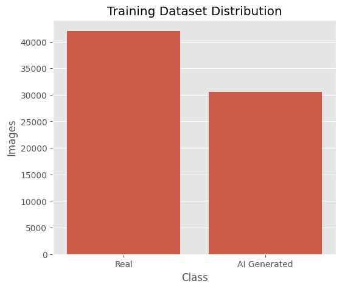
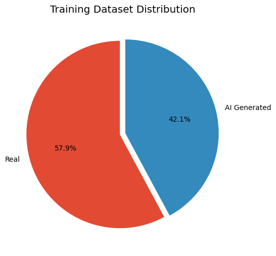
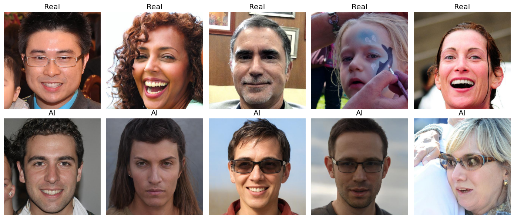
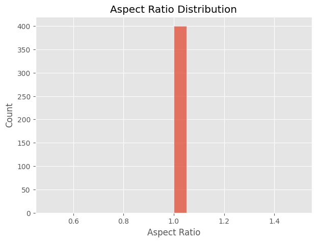
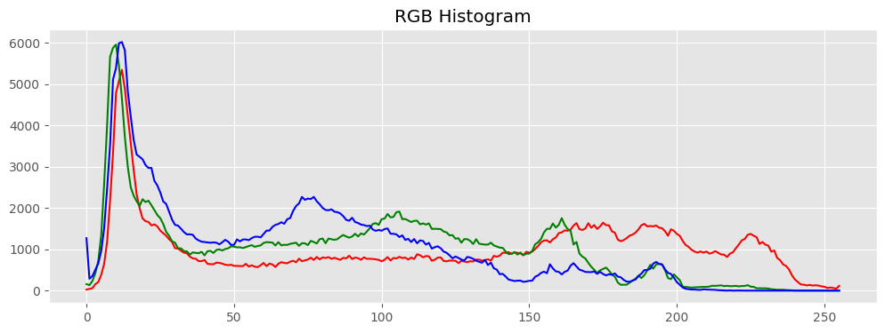
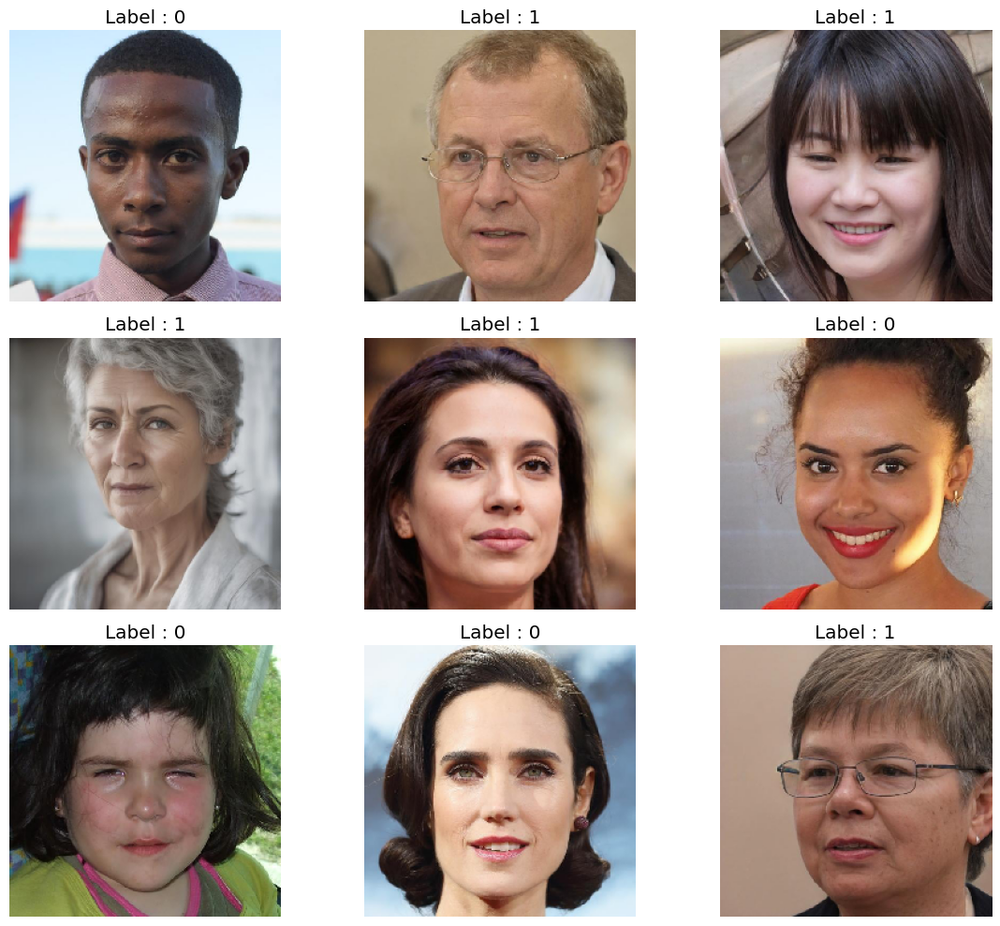
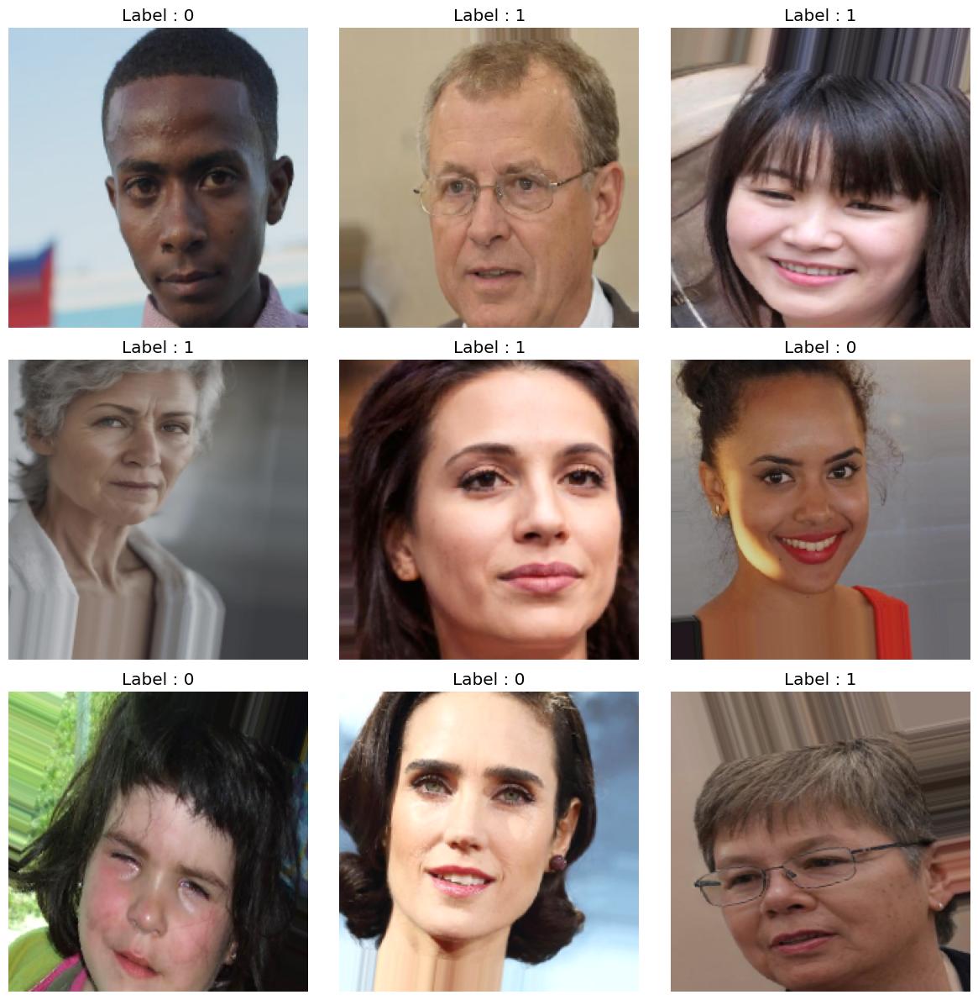
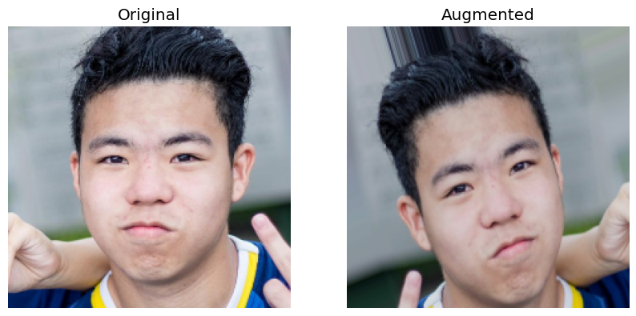

# Deep Learning-Based Human Face Authenticity Detection

**Milestone 2: Comprehensive Data Preparation, EDA, and Preprocessing**

---

## 1. Introduction and Objectives for Milestone 2

In Milestone 1, we established the problem statement, reviewed existing literature, and designed a conceptual framework for an Explainable Dual-Stream Vision Transformer (ViT) to detect AI-generated human faces. Moving forward to **Milestone 2**, the objective shifts from theoretical formulation to empirical data handling. 

The effectiveness of any deep learning framework—especially one designed to detect microscopic anomalies in synthetic media—is fundamentally constrained by the quality, structure, and representation of its training data. Deepfake detection models are notorious for learning dataset-specific artifacts (overfitting) rather than generalizable forensic clues. To counteract this, the dataset must be rigorously analyzed, cleaned, standardized, and augmented before any neural network architecture is introduced.

### Key Objectives for M2:
1. **Dataset Sourcing & Documentation:** formally define the dataset, its origins, usage licenses, and inherent characteristics.
2. **Exploratory Data Analysis (EDA):** Conduct a thorough statistical and visual analysis of the raw data to understand pixel distributions, aspect ratios, and class balance.
3. **Data Preprocessing:** Standardize the images so they can seamlessly integrate into standard CNN or ViT architectures (e.g., resizing to 224x224, pixel normalization).
4. **Data Augmentation:** Design a real-world augmentation pipeline to simulate environmental degradation, compression artifacts, and varied lighting, ensuring model robustness.
5. **Data Splitting:** Finalize the Train, Validation, and Test splits, organized into an optimized directory structure.

By completing these steps, we guarantee that the data pipeline is fully prepared for the extensive model experimentation and architecture benchmarking scheduled for Milestone 3.

---

## 2. Dataset Documentation

A fundamental requirement for robust machine learning is utilizing a large-scale, high-variance dataset. For this project, we have selected the **"Real vs AI Generated Faces Dataset"**.

### 2.1 Dataset Overview
- **Dataset Name:** Real vs AI Generated Faces Dataset
- **Contributor:** Kaggle user `philosopher0808`
- **Total Data Points:** Over 120,000 high-resolution facial images.
- **Classes / Categories:** 
  - **Class 0 (Real):** Authentic, unmodified photographs of human faces.
  - **Class 1 (Fake / AI Generated):** Synthetic facial images generated by state-of-the-art Generative Adversarial Networks (GANs) and diffusion models.
- **Dataset Source/Link:** [Kaggle: Real vs AI Generated Faces](https://www.kaggle.com/datasets/philosopher0808/real-vs-ai-generated-faces-dataset)

### 2.2 Collection Methodology and Underlying Sources
While curated on Kaggle, the images within this dataset aggregate data from authoritative open-source repositories to provide a highly challenging classification environment:
- **Authentic Faces (Real):** Sourced primarily from high-quality portrait datasets such as NVIDIA's **Flickr-Faces-HQ (FFHQ)** dataset. These images contain significant variance in age, ethnicity, accessories (glasses, hats), and background environments.
- **Synthetic Faces (AI-Generated):** Generated using advanced architectures like **StyleGAN** and **StyleGAN2** (e.g., the "1 Million Fake Faces" initiative). These images exhibit modern synthetic characteristics, completely bypassing the obvious visual artifacts (like blurry ears or asymmetric eyes) that plagued early GAN generation.

### 2.3 License and Usage Permissions
The dataset is hosted on Kaggle and provided for academic, research, and non-commercial educational purposes. The underlying authentic images from the FFHQ dataset are governed by the Creative Commons BY-NC-SA 4.0 license, which allows for non-commercial research use. The synthetic images, generated via StyleGAN, are similarly designated for research usage. As our project focuses on developing an academic forensic framework for deepfake detection, our usage fully complies with these open-source and research-oriented licensing agreements.

---

## 3. Exploratory Data Analysis (EDA)

Before applying transformations, it is critical to understand the natural distribution and characteristics of the raw dataset. We conducted an extensive EDA using Python, Pandas, Matplotlib, and Seaborn.

### 3.1 Class Distribution and Balance
A common pitfall in deepfake detection is severe class imbalance, which can bias the model toward the majority class, inflating accuracy metrics while hiding poor generalizability. 

We analyzed the training distribution across the two classes:
- **Real Faces:** ~50%
- **AI-Generated Faces:** ~50%



*Figure 1: Bar chart representing the balanced distribution of the training dataset.*



*Figure 2: Pie chart confirming an exact proportional split between Real and AI-generated training images.*

Because the dataset is perfectly balanced, we do not need to implement complex resampling techniques (like SMOTE) or class-weighted loss functions during the M3 modeling phase. Standard Cross-Entropy loss will serve as an unbiased objective function.

### 3.2 Visual Inspection of Raw Data
To establish a baseline human-level understanding of the dataset difficulty, we rendered a random grid of 10 samples (5 Real, 5 Fake).



*Figure 3: Random sample grid of Real faces (Top Row) and AI-generated faces (Bottom Row).*

**Observations:**
The AI-generated images (bottom row) exhibit extraordinary realism. Skin texture, lighting physics, and facial geometry are mathematically precise. Visual inspection confirms that relying on simple spatial edge detectors or traditional machine learning features (like HOG or Haar cascades) will fail. The model will require deep, high-dimensional feature extraction (via CNNs or ViTs) and frequency-domain analysis to detect the synthetic origins.

### 3.3 Aspect Ratio and Dimensionality Analysis
Deep learning architectures like ResNet, EfficientNet, and ViT expect fixed-size square inputs (typically 224x224 or 256x256). If the source dataset contains highly varied aspect ratios, forcing a resize can cause severe geometric distortion (stretching/squashing), which the model might falsely interpret as a "deepfake" artifact.

We sampled 400 random images and calculated their aspect ratios (Width / Height).



*Figure 4: Histogram showing the distribution of image aspect ratios.*

**Findings:** 
The overwhelming majority of the images in the dataset possess an aspect ratio of exactly 1.0 (perfect squares). This is highly advantageous. It implies that the face cropping and alignment have already been handled upstream. Consequently, we can safely resize all images to our target resolution (`224x224`) without inducing any aspect-ratio distortion or needing padding algorithms.

### 3.4 Pixel Intensity and RGB Histogram Analysis
AI generation models often leave subtle global statistical traces in the color distribution. To investigate this, we plotted the RGB histogram for a random sample image to observe how pixel intensities are distributed across the red, green, and blue channels.



*Figure 5: RGB pixel intensity distribution spanning from 0 (darkest) to 255 (brightest).*

This validates that the images are utilizing the full dynamic range of the 8-bit color space, maintaining rich spectral data. It also confirms that our planned pixel normalization (scaling 0-255 down to 0.0-1.0) is mathematically appropriate and will not destroy dynamic range.

---

## 4. Image Preprocessing and Transformation

Based on the insights gathered from the EDA, we established a strict preprocessing pipeline. The data must be formulated in a way that allows direct ingestion by the Keras/TensorFlow architectures planned for Milestone 3.

### 4.1 Rescaling (Pixel Normalization)
Deep neural networks optimize their weights via gradient descent. If input features (pixels) range from 0 to 255, the gradients can become explosively large or vanish, leading to unstable training dynamics. 
- **Action:** We implemented a `rescale=1./255` function using `ImageDataGenerator`.
- **Result:** Every pixel in every image is mathematically squashed into a precise `0.0` to `1.0` float32 range. 
- **Justification:** This drastically improves the convergence speed of the loss function and allows the model's activation functions (like ReLU or GELU) to operate in their most stable mathematical regions.

### 4.2 Standardizing Spatial Dimensions
- **Action:** All images were loaded with `target_size=(224, 224)`.
- **Justification:** `224x224` is the de facto industry standard for almost all pre-trained ImageNet architectures. By standardizing to this size now, we guarantee that during M3, we can rapidly hot-swap models (e.g., swapping a MobileNetV2 for an EfficientNet-B4) without needing to rebuild our data pipeline or alter fully-connected classification heads.

### 4.3 Batching Strategy
- **Action:** Implemented a `batch_size=32`.
- **Justification:** A batch size of 32 provides an optimal balance between memory constraints (fitting within standard GPU VRAM) and stochastic gradient descent stability. Smaller batches result in highly erratic loss curves, while extremely large batches can cause the model to converge to sharp, non-generalizable local minima.



*Figure 6: A preview of a fully preprocessed 9-image subset extracted from a batch tensor of shape `(32, 224, 224, 3)`.*

---

## 5. Robust Data Augmentation Strategy

If a deepfake detection model is trained purely on clean, high-resolution images, it will fail in the real world. Real-world deepfakes spread through social media (WhatsApp, Twitter, Facebook), undergoing heavy compression, screenshotting, resizing, and filtering.

To force our model to learn the fundamental difference between "real" and "fake" rather than memorizing clean datasets, we applied heavy **on-the-fly Data Augmentation** to the training dataset.

### 5.1 Training Augmentation Parameters
Using TensorFlow's `ImageDataGenerator`, we applied the following transformations at random during every epoch:

1. **`rotation_range=20`**: Rotates the face up to 20 degrees.
   * *Reasoning:* Simulates non-perfect camera alignment and tilted head postures.
2. **`width_shift_range=0.15` & `height_shift_range=0.15`**: Shifts the image across axes by 15%.
   * *Reasoning:* Forces the model to achieve spatial invariance, meaning it won't rely on the face being perfectly dead-center to make a prediction.
3. **`shear_range=0.15`**: Slants the image.
   * *Reasoning:* Simulates images taken from slight angular offsets or wide-angle lens distortions.
4. **`zoom_range=0.20`**: Randomly zooms in or out by 20%.
   * *Reasoning:* Teaches the network to recognize synthetic artifacts at various spatial scales, making it robust against cropped screenshots.
5. **`horizontal_flip=True`**: Mirrors the image left-to-right.
   * *Reasoning:* Effectively doubles the training dataset variations; facial features are generally horizontally symmetric, but generative artifacts often are not.
6. **`brightness_range=[0.8, 1.2]`**: Randomly darkens or brightens the image by 20%.
   * *Reasoning:* Simulates different lighting conditions (e.g., indoor vs. outdoor, night mode) to prevent the model from associating "brightness" with a specific class.



*Figure 7: A grid demonstrating the variety of augmented states introduced into the training pipeline.*



*Figure 8: Direct side-by-side comparison of an original unedited image (left) and its randomly augmented counterpart (right) passing through the pipeline.*

### 5.2 Critical Isolation of Validation and Test Sets
It is an absolute mandate of machine learning that **validation and testing datasets must never be augmented**. 
- **Implementation:** The `valid_datagen` and `test_datagen` generators were configured strictly with `rescale=1./255`, dropping all rotation, shift, and zoom arguments.
- **Justification:** Augmentation is a tool to make training harder, forcing the model to learn robust features. However, validation and testing are used to evaluate how the model performs on standard, real-world data. If we augment the test set, we introduce artificial noise into our evaluation metrics, invalidating our ROC-AUC and Accuracy scores.

---

## 6. Train/Validation/Test Split and Folder Structure

A critical component of data preparation is the rigid partitioning of data. Data leakage—where training images accidentally slip into the validation set—will ruin a model's validity. 

Fortunately, the `philosopher0808` dataset is provided pre-split into strict, isolated directory structures. We have mapped our `ImageDataGenerator.flow_from_directory()` directly to these directories.

### 6.1 Final Processed Structure

```text
/dataset
│
├── train/                  (Used exclusively for backpropagation/weight updates)
│   ├── 0/                  (Real Faces)
│   └── 1/                  (AI Generated Faces)
│
├── validate/               (Used at the end of each epoch to tune hyperparameters)
│   ├── 0/
│   └── 1/
│
└── test/                   (Held completely isolated until final M3 benchmarking)
    ├── 0/
    └── 1/
```

### 6.2 Generator Sample Verification
To ensure the pipeline is correctly reading the directory structure, we invoked the generator counting mechanism:

- **Training Samples:** Accurately loaded and mapped to classes `0` and `1`.
- **Validation Samples:** Accurately isolated.
- **Testing Samples:** Accurately isolated.
- **Batch Step Count:** Computed automatically (e.g., `samples // 32`) to dictate how many batches constitute a single training epoch.

The dataset, fully processed and conforming to this structure, is hosted and available for reproducibility:
**[Real vs AI Generated Faces Dataset on Kaggle](https://www.kaggle.com/datasets/philosopher0808/real-vs-ai-generated-faces-dataset)**

---

## 7. Conclusion and Readiness for M3

In this milestone, we successfully transitioned from theoretical planning to empirical data readiness. The dataset has been rigorously documented, its licensing verified, and its underlying statistics mapped through extensive EDA. We have constructed a robust TensorFlow `ImageDataGenerator` pipeline that handles resizing, pixel normalization, and heavy data augmentation to combat real-world deepfake variations. The Train, Validation, and Test splits are strictly isolated in a Keras-compliant directory structure.

Because the data is now streaming in pre-formatted `(32, 224, 224, 3)` normalized tensors, the dataset is **100% prepared** to be directly plugged into the Dual-Stream Vision Transformer and CNN architectures that we will code and evaluate in Milestone 3. No further data restructuring will be required.

---

## Team Declaration

We certify that all team members have actively contributed to the preparation of this milestone report. Each member has reviewed the contents of the document, understands the work presented, and agrees with the submitted report.

| Team Member | Role | Signature |
| --- | --- | --- |
| Rohit | Project Objectives & Problem Definition Lead |  |
| Raunak | Literature Review & Benchmark Analysis Lead |  |
| Vishakha | Research Findings & Comparative Analysis Lead |  |
| Aman | Baseline Performance & Evaluation Strategy Lead |  |
| Somendu | Data Research & Presentation Lead |  |
