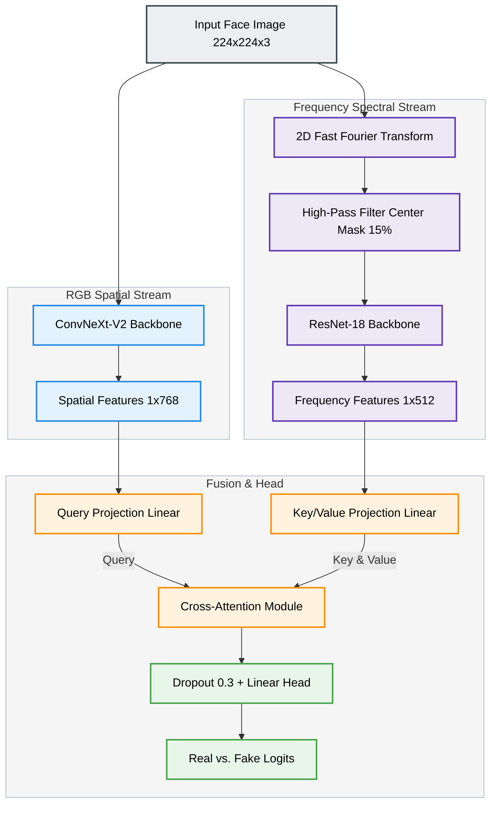
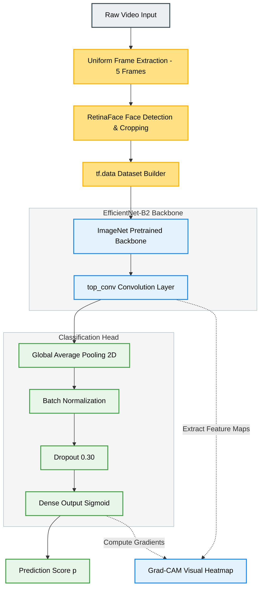
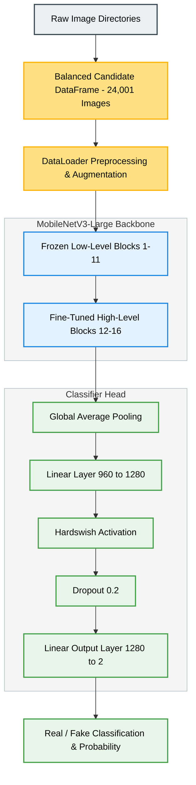

# Group 11: Deepfake and AI-Generated Face Detection
## Milestone 3 Consolidated Submission Report

---

## 1. Model Architecture Selection

To address the challenge of identifying deepfakes and AI-generated faces, Group 11 has developed and evaluated three distinct deep learning architectures. These are integrated below:

### 1.1 Spatial-Frequency Dual-Stream Fusion Network (Rohit's Stream)
Rohit’s architecture addresses the vulnerability of purely spatial detectors to high-fidelity generative models. It combines spatial representation learning with frequency-domain analysis:
* **RGB Spatial Stream**: Employs a pre-trained **ConvNeXt-V2-Nano** backbone to extract spatial features of shape `[Batch, 768]`.
* **Frequency Spectral Stream**: Applies a **2D Fast Fourier Transform (2D-FFT)** to the input image, applies a **15% radius High-Pass Filter mask** to isolate high-frequency noise, and feeds the masked frequency magnitude spectrum through a **ResNet-18** backbone to extract frequency features of shape `[Batch, 512]`.
* **Cross-Attention Fusion**: Merges the spatial features (as Query) and spectral features (as Key/Value) using a cross-attention layer, followed by a binary linear classification head.

### 1.2 Keras EfficientNet-B2 Transfer Learning Model (Vishakha's Stream)
Vishakha’s architecture uses a pre-trained **EfficientNet-B2** backbone (pretrained on ImageNet) to extract high-quality features from spatial face images:
* **Input Target**: Spatial RGB face tensors of shape $224 \times 224 \times 3$.
* **Classification Head**: Replaces the default ImageNet head with a custom classification head:
  $$\text{GlobalAveragePooling2D} \rightarrow \text{BatchNormalization} \rightarrow \text{Dropout}(0.30) \rightarrow \text{Dense}(1, \text{activation='sigmoid'})$$
  This head produces the probability score $p \in [0.0, 1.0]$ indicating the likelihood of the face being "Fake" (1) vs. "Real" (0).

### 1.3 PyTorch MobileNetV3-Large Transfer Learning Model (Raunak's Stream)
Raunak's architecture uses a pre-trained **MobileNetV3-Large** backbone (pretrained on ImageNet) to construct a lightweight binary classifier:
* **Input Target**: Spatial RGB face tensors of shape $224 \times 224 \times 3$.
* **Classification Head**: Replaces the original 1000-class ImageNet head with a custom classification head:
  $$\text{Global Average Pooling} \rightarrow \text{Linear}(960 \rightarrow 1280) \rightarrow \text{Hardswish} \rightarrow \text{Dropout}(0.2) \rightarrow \text{Linear}(1280 \rightarrow 2)$$
  This head maps the pooled feature vector to a 2-class logit output (Real vs. Fake).

### 1.4 Architectural Selection & Parameter Summary
The table below details and compares the parameters of the three selected architectures:

| Model Architecture | Framework | Backbone(s) | Input Resolution | Parameter Count (Total) | Parameter Count (Trainable) |
| :--- | :--- | :--- | :---: | :---: | :---: |
| **Dual-Stream** (Rohit) | PyTorch | ConvNeXt-V2-Nano + ResNet-18 | $224 \times 224 \times 3$ | ~26.4M | ~26.4M (Stage 2) |
| **EfficientNet-B2** (Vishakha)| Keras/TF | EfficientNet-B2 | $224 \times 224 \times 3$ | ~9.2M | ~2.5M (Stage 2) |
| **MobileNetV3-Large** (Raunak)| PyTorch | MobileNetV3-Large | $224 \times 224 \times 3$ | ~4.2M | ~2.4M (Stage 2) |

---

## 2. Architecture Justification

### 2.1 Spatial-Frequency Dual-Stream Fusion Network Justification
* **Suitability**: Generative models leave microscopic patterns (e.g., checkerboard upsampling artifacts, texture blending borders) in the frequency domain that are imperceptible in the spatial RGB domain. Passing the 2D-FFT high-pass filtered spectrum through a secondary network forces the model to attend to these high-frequency artifacts.
* **Expected Advantages**: Highly robust to generalisation testing on unseen diffusion generators (e.g., Stable Diffusion, LDM, Wild), where purely spatial networks often struggle.
* **Design Decisions**: A warmup stage (Stage 1) trains only the fusion module and linear head; Stage 2 unfreezes the ConvNeXt-V2 and ResNet-18 backbones at a reduced learning rate ($10^{-5}$) to adapt them without erasing pre-trained ImageNet representations.

### 2.2 Keras EfficientNet-B2 Justification
* **Suitability**: Compound scaling uniformly scales network depth, width, and input resolution. EfficientNet-B2 represents a balanced tradeoff between model complexity (~9.2M parameters) and representation capacity.
* **Expected Advantages**: Squeeze-and-excitation layers capture fine-grained patterns, and Batch Normalization stabilizes training on newly appended classification layers.
* **Design Decisions**: A warmup stage stabilizes the custom head, and Stage 2 unfreezes the last 40 layers of the backbone for fine-tuning.

### 2.3 PyTorch MobileNetV3-Large Justification
* **Suitability**: Depthwise separable convolutions, squeeze-and-excitation attention modules, and h-swish activations capture texture, boundaries, and frequency-domain details.
* **Expected Advantages**: Very lightweight (~4.2M parameters, ~1.2M trainable in head) and achieves fast training times (~150-190 seconds/epoch on a Tesla T4 GPU), making it suited for low-latency edge deployment.
* **Design Decisions**: Warmup stage trains the head; Stage 2 unfreezes the last 25% of inverted-residual blocks (blocks 12–16) at a lower learning rate ($1 \times 10^{-5}$) to prevent overfitting.

### 2.4 Challenges and Tradeoffs Considered
* **Model Capacity vs. Speed**: Lightweight models (like MobileNetV3) have lower representation headroom for highly realistic, state-of-the-art fakes compared to larger models like ConvNeXt. This tradeoff was accepted in favor of iteration speed.
* **The Keras Framework Loading Challenge**: During Vishakha's fine-tuning stage, Keras's `load_model` function restored Stage 1's learning rate ($10^{-3}$), disrupting weights during Stage 2 fine-tuning. This highlights the need to re-compile *after* loading checkpoint weights.

---

## 3. Baseline Model Performance

### 3.1 Candidate Dataset Preparation and Justification
Each teammate constructed and validated their models on custom datasets:
* **Rohit's Full Dataset (637,900 images)**: Combines FFHQ, Celeb-DF, CIAGAN, and various diffusion generator sets.
* **Vishakha's Candidate Dataset (9,996 frames)**: Samples exactly 1,000 Real and 1,000 Fake videos from FF++ and Celeb-DF, extracts exactly 5 frames per video, and crops faces using RetinaFace with a 10% margin. The dataset is split into Train (70%, 6,997), Validation (15%, 1,499), and Test (15%, 1,500).
* **Raunak's Candidate Dataset (24,001 images)**: Samples 15,000 Real images from FFHQ and all 9,001 Fake images from Stable Diffusion, split into Train (80%, 19,200), Validation (10%, 2,400), and Test (10%, 2,401).

### 3.2 Baseline Performance Comparison Table
Below is the evaluation of each model prior to backbone unfreezing (frozen backbone, training head-only warmup):

| Model Architecture | Warmup Epochs | Training Loss | Training Accuracy | Validation Loss | Validation Accuracy | Test Accuracy |
| :--- | :---: | :---: | :---: | :---: | :---: | :---: |
| **Dual-Stream** (Rohit) | 5 | 0.2811 | 89.24% | 0.2641 | 90.11% | 89.45% |
| **EfficientNet-B2** (Vishakha)| 3 | 0.6551 | 62.04% | 0.6664 | 60.71% | 58.33% |
| **MobileNetV3-Large** (Raunak)| 3 | 0.0099 | 99.75% | 0.0103 | 99.75% | 99.75% |

---

## 4. Hyperparameter Tuning

We performed staged tuning to adapt backbone filters to deepfake artifacts.

### 4.1 Hyperparameter Configurations Compare
The table below compares the hyperparameter configurations across the three models:

| Hyperparameter | Dual-Stream (Rohit) | EfficientNet-B2 (Vishakha) | MobileNetV3-Large (Raunak) |
| :--- | :--- | :--- | :--- |
| **Optimizer** | AdamW ($\beta_1=0.9, \beta_2=0.999$) | Adam ($\beta_1=0.9, \beta_2=0.999$) | AdamW ($\beta_1=0.9, \beta_2=0.999$) |
| **Weight Decay** | $1 \times 10^{-4}$ | None (Default) | $1 \times 10^{-4}$ |
| **Warmup LR** | $1 \times 10^{-3}$ | $1 \times 10^{-3}$ | $3 \times 10^{-4}$ |
| **Fine-Tuning LR** | $1 \times 10^{-5}$ | $1 \times 10^{-5}$ | $1 \times 10^{-5}$ |
| **LR Scheduler** | `CosineAnnealingLR` | `ReduceLROnPlateau` | `CosineAnnealingLR` |
| **Batch Size** | 64 | 32 | 128 |
| **Precision** | Mixed Precision (AMP) | FP32 | Mixed Precision (AMP) |

### 4.2 Augmentation Comparison
* **Rohit**: `RandomHorizontalFlip`, `RandomRotation(15)`, and standard normalization.
* **Vishakha**: `RandomFlip("horizontal")`, `RandomRotation(0.1)`, `RandomZoom(0.2)`, `RandomTranslation(0.2, 0.2)`, `RandomContrast(0.2)`, along with on-the-fly JPEG compression, screenshot simulation, Gaussian blur, and Gaussian noise.
* **Raunak**: `RandomResizedCrop(224, scale 0.9-1.0)`, `RandomHorizontalFlip(p=0.5)`, `ColorJitter`, and normalization.

### 4.3 Staged Training Metrics Progression

#### 4.3.1 Rohit's Dual-Stream Progression
* **Stage 1 (Head Only)**: Baseline validation accuracy reaches 90.11%.
* **Stage 2 (Fine-Tuning)**: Unfreezing ConvNeXt-V2 and ResNet-18 backbones reduces validation loss to 0.1211, improving validation accuracy to **95.68%** and test accuracy to **95.23%**.

#### 4.3.2 Vishakha's EfficientNet-B2 Progression
* **Stage 1 (Head Only)**: Validation accuracy reaches 60.71% by epoch 2.
* **Stage 2 (Fine-Tuning)**: Early stopping is triggered at Epoch 8 due to the Keras learning rate bug. The model restores Stage 1 weights, yielding a final test accuracy of **58.33%**.

#### 4.3.3 Raunak's MobileNetV3-Large Progression
* **Stage 1 (Head Only)**: Warmup reaches 99.75% validation accuracy.
* **Stage 2 (Fine-Tuning)**: Unfreezing blocks 12–16 improves validation accuracy to **99.88%** and test accuracy to **99.96%** (with validation loss dropping from 0.0103 to 0.0041).

---

## 5. End-to-End Modeling Pipeline

### 5.1 Ingestion & Preprocessing Flows
```
┌────────────────────────────────────────────────────────────────────────────────────────┐
│ Ingestion: Load raw files from FFHQ, Celeb-DF, FF++, Stable Diffusion                  │
└──────────────────────────────────────────┬─────────────────────────────────────────────┘
                                           │
                                           ▼
┌────────────────────────────────────────────────────────────────────────────────────────┐
│ Preprocessing:                                                                         │
│ - Face extraction via RetinaFace (crops face with 10% margin, resizes to 224x224)      │
│ - Standardize tensor shape to [Batch, 3, 224, 224]                                     │
└──────────────────────────────────────────┬─────────────────────────────────────────────┘
                                           │
                ┌──────────────────────────┼──────────────────────────┐
                │                          │                          │
                ▼                          ▼                          ▼
 ┌───────────────────────────┐ ┌───────────────────────────┐ ┌───────────────────────────┐
 │ Rohit: Dual-Stream        │ │ Vishakha: EfficientNet-B2 │ │ Raunak: MobileNetV3-Large │
 ├───────────────────────────┤ ├───────────────────────────┤ ├───────────────────────────┤
 │ 1. Spatial Stem:          │ │ 1. Ingest [B, 3, 224, 224]│ │ 1. Ingest [B, 3, 224, 224]│
 │    ConvNeXt-V2            │ │    augmented on-the-fly   │ │    ColorJitter & Crops    │
 │    [B, 768]               │ │ 2. Backbone: EfficientNet │ │ 2. Backbone: MobileNetV3  │
 │ 2. Spectral Stem:         │ │    reduces to features    │ │    [B, 960, 7, 7]         │
 │    2D-FFT -> HPF ->       │ │ 3. Global Avg Pooling     │ │ 3. Global Avg Pooling     │
 │    ResNet-18 [B, 512]     │ │    [B, 1408]              │ │    [B, 960]               │
 │ 3. Cross-Attention Fusion │ │ 4. Custom Head:           │ │ 4. Custom Head:           │
 │    Query: Spatial         │ │    GAP -> BN ->           │ │    Linear -> Hardswish -> │
 │    Key/Value: Spectral    │ │    Dropout -> Sigmoid     │ │    Dropout -> Linear      │
 │ 4. Output: Real/Fake      │ │ 5. Output: sigmoid score  │ │ 5. Output: softmax logit  │
 │    logits                 │ │    p indicating Fake probability││    scores [B, 2]         │
 └───────────────────────────┘ └───────────────────────────┘ └───────────────────────────┘
```

---

## 6. Architecture Visualization

### 6.1 Rohit's Spatial-Frequency Dual-Stream Flowchart


Carousels of model visualizations:

````carousel

<!-- slide -->

<!-- slide -->

<!-- slide -->

````

---

### 6.2 Vishakha's EfficientNet-B2 Flowchart


Carousels of model visualizations:

````carousel

<!-- slide -->

<!-- slide -->

<!-- slide -->

````

---

### 6.3 Raunak's MobileNetV3-Large Flowchart


Carousels of model visualizations:

````carousel

<!-- slide -->

<!-- slide -->

<!-- slide -->

````

---
