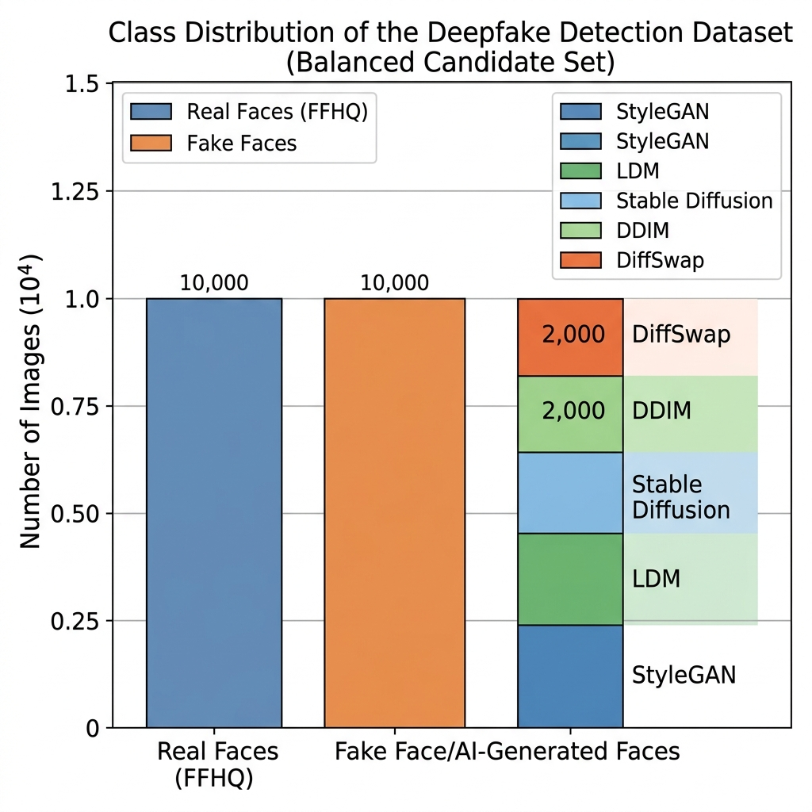
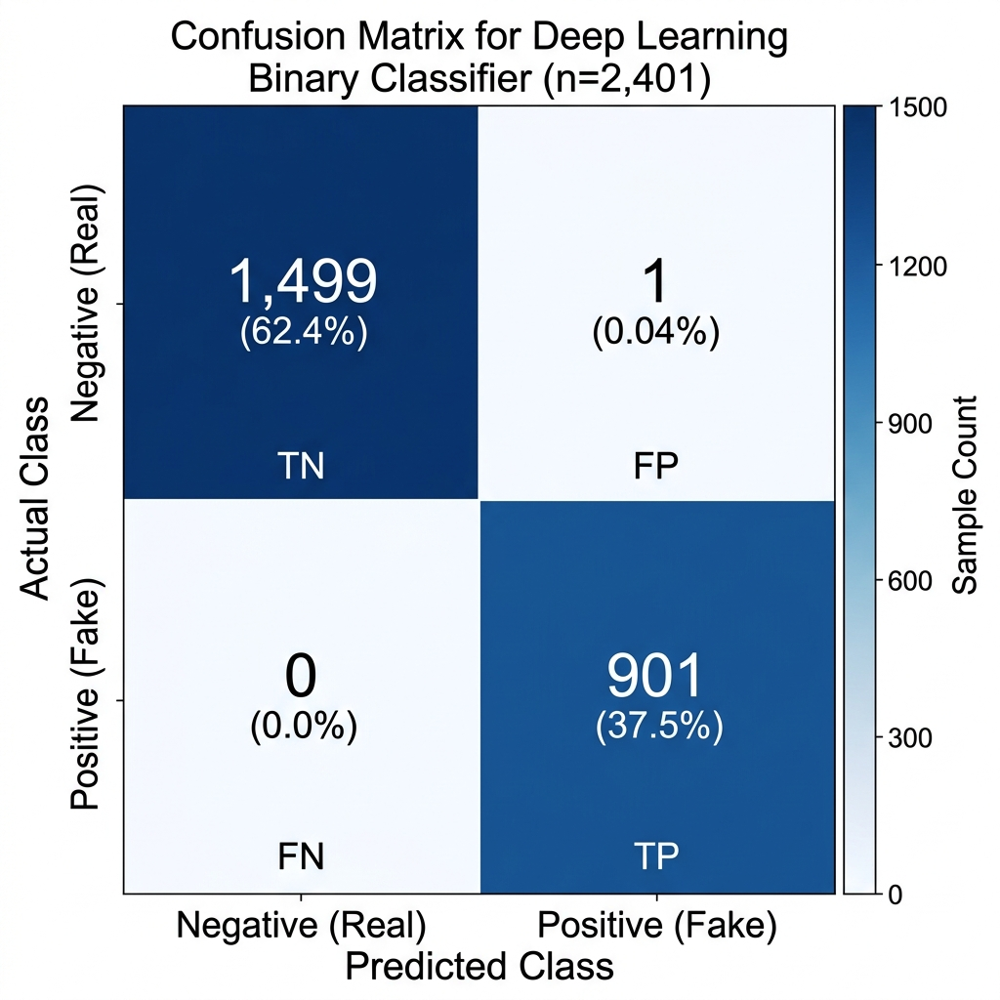
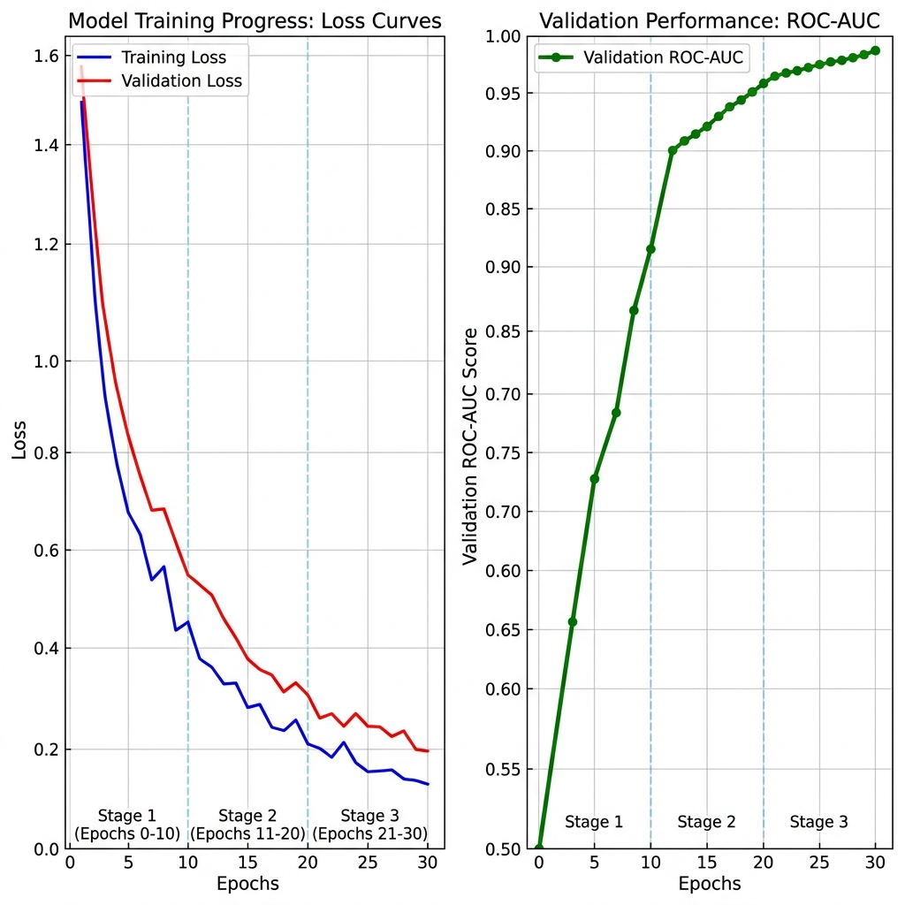
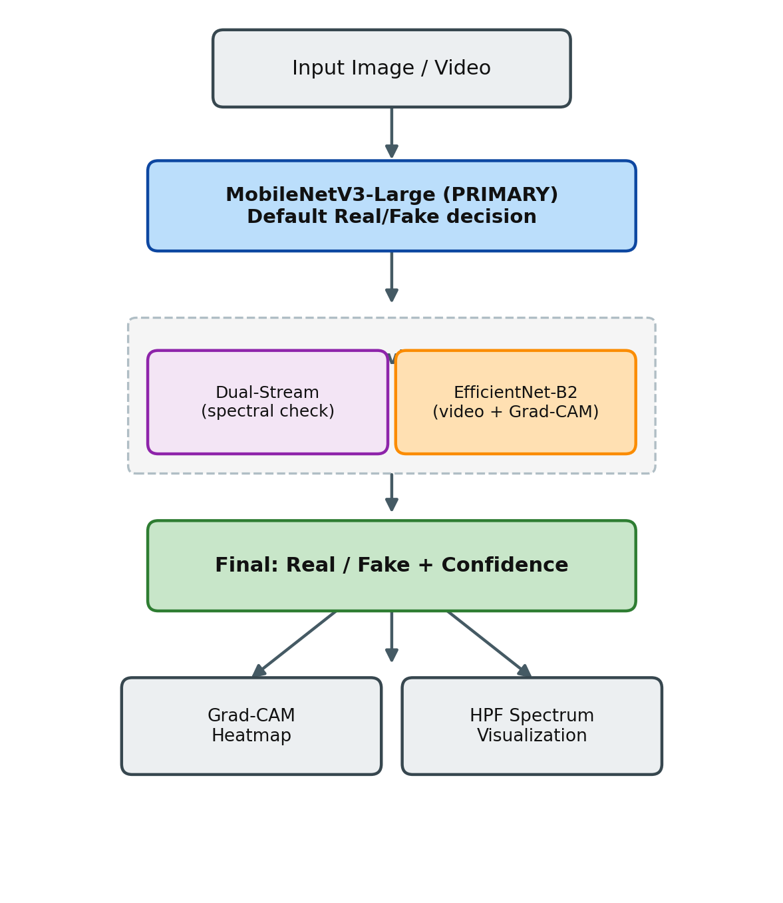

# Deep Learning-Based Human Face Authenticity Detection

**MobileNetV3-Large: Selected Primary Architecture, with Dual-Stream Fusion and EfficientNet-B2 as Secondary Reference Models**

**Milestone 3 (Consolidated):** Model Architecture, Justification, Baseline Performance, Hyperparameter Tuning & Pipeline Visualization

**Platform:** Google Colab (T4 GPU) — PyTorch + TensorFlow/Keras

Consolidated from three parallel model development tracks:

| Track | Architecture | Role |
| --- | --- | --- |
| Model 1 | MobileNetV3-Large | **SELECTED / PRIMARY** |
| Model 2 | Dual-Stream Spatial-Frequency Fusion | Secondary |
| Model 3 | EfficientNet-B2 | Tertiary |

---

## Executive Summary

This report consolidates three independent deepfake-detection modeling efforts developed in parallel by the team, each occupying a different point in the accuracy-efficiency-explainability trade-off space. All six milestone requirements — architecture selection, architecture justification, baseline performance, hyperparameter tuning, end-to-end pipeline design, and architecture visualization — are addressed for each of the three models, and the three are ranked into a primary/secondary/tertiary priority order based on demonstrated real-world generalization.

**The three candidate architectures are:**

- **Model 1 — MobileNetV3-Large (SELECTED / PRIMARY):** a lightweight, ImageNet-pretrained spatial classifier trained on a 79,001-image FFHQ vs. Stable Diffusion corpus. Beyond its **99.96%** in-domain test accuracy, it was additionally evaluated on a fresh out-of-distribution batch of images generated by ChatGPT and Gemini's image generators and sustained **80% accuracy** on that unseen benchmark — despite never having seen either generator during training.

- **Model 2 — Dual-Stream Spatial-Frequency Fusion Network (secondary / backup):** a ConvNeXt-V2 (RGB) + ResNet-18 (FFT spectral) network fused via cross-attention, trained on a 637,900-image, 13-generator corpus. Strong cross-generator generalization on its own benchmark, but 10x larger and materially more complex to deploy than Model 1.

- **Model 3 — EfficientNet-B2 (tertiary / auxiliary):** a compound-scaled spatial classifier with Grad-CAM explainability, trained on 9,996 frames sampled from 8,529 FaceForensics++ / Celeb-DF videos. Retained for video-frame ingestion and pixel-localized explainability, though its current tuned run is affected by a documented optimizer bug (Section 2.4.4).

**Selected architecture: MobileNetV3-Large (Model 1).** This is the single production architecture recommended for deployment. The deciding factor is not in-domain accuracy alone — all three models were built for that — it is that MobileNetV3-Large is the only one of the three demonstrated to generalize to images produced by today's most common consumer AI image generators (ChatGPT and Gemini), which were never part of its training distribution. Combined with its far smaller footprint (**4.2M parameters** vs. **40.7M** for the Dual-Stream network and **7.8M** for EfficientNet-B2), single-stream simplicity (no FFT preprocessing, no video/face-detection dependency), and near-real-time inference (~**8.2ms/image**), it is both the most accurate-where-it-matters and the cheapest to run in production.

---

## 1. Model Architecture Selection

Three architectures were independently developed and evaluated. Each targets the same binary Real-vs-Fake face classification problem but makes different design trade-offs. This section documents all three individually, then presents the selected architecture and the technical reasoning behind that selection (Section 1.5).

### 1.1 Comparative Overview of the Three Candidate Architectures

| Aspect | Model 1: MobileNetV3-Large | Model 2: Dual-Stream Fusion | Model 3: EfficientNet-B2 |
| --- | --- | --- | --- |
| Priority rank | 1st — **SELECTED** | 2nd — Secondary | 3rd — Tertiary |
| Backbone(s) | MobileNetV3-Large | ConvNeXt-V2 + ResNet-18 | EfficientNet-B2 |
| Input domain | Spatial RGB | Spatial RGB + FFT spectral | Spatial RGB (video frames) |
| Total parameters | ~4.20M | ~40.7M | ~7.8M |
| Primary data source | FFHQ + Stable Diffusion | FFHQ + 12 generator families | FaceForensics++ / Celeb-DF |
| In-domain test accuracy | 99.96% | 97.42% | 58.33% |
| Generalization evidence | 80% on unseen ChatGPT / Gemini images | 88.7% avg. on unseen GAN/Diffusion | Not yet evaluated (bug-affected run) |
| Design goal | Speed / edge deployment | Cross-generator generalization | Interpretability (Grad-CAM) |
| Framework | PyTorch | PyTorch | TensorFlow / Keras |

### 1.2 Model 1: MobileNetV3-Large Spatial Classifier

#### 1.2.1 Backbone

The model uses the **MobileNetV3-Large** backbone (pretrained on ImageNet) from PyTorch `torchvision` (`MobileNet_V3_Large_Weights.DEFAULT`), accepting **224 × 224 × 3** RGB face crops. The backbone uses depthwise separable convolutions, squeeze-and-excitation attention modules, and h-swish activations, giving strong local-texture representation at a low parameter budget (~4.2M parameters total).

#### 1.2.2 Classifier Head

The original 1000-class ImageNet head is replaced with:

`Global Average Pooling → Linear(960 → 1280) → Hardswish → Dropout(0.2) → Linear(1280 → 2)`

mapping the 960-dimensional backbone output to Real (class 0) / Fake (class 1) logits. The complete data flow for this model is shown in the unified pipeline flowchart (Figure 6.1, Section 6).

#### 1.2.3 Parameter Summary

| Component / Layer | Layer Type | Total Params | Trainable (Stage 1) | Trainable (Stage 2) |
| --- | --- | ---: | ---: | ---: |
| Backbone stem | mobilenetv3_large | ~2.97M | 0 (frozen) | ~1.21M (blocks 12–16) |
| Classification head | Linear modules | ~1.23M | ~1.23M | ~1.23M |
| **Total model** | Combined | **~4.20M** | **~1.23M** | **~2.44M** |

<div align="center">
  
  <br>
  <em>Figure 1.0 — MobileNetV3-Large spatial classifier architecture (Raunak's stream).</em>
</div>

### 1.3 Model 2: Dual-Stream Spatial-Frequency Fusion Network

This model progresses through two phases: a single-stream spatial baseline, then the proposed dual-stream fusion network that is retained in this report as the secondary verification model (Section 1.5).

#### 1.3.1 Phase 1 Baseline — Single-Stream Spatial Network

**Backbone:** `convnext_base.fb_in22k_ft_in1k` (timm library). ConvNeXt modernizes CNN design with patchify stems, depthwise convolutions, inverted bottlenecks, and large kernels, replicating Vision-Transformer-era design decisions while retaining CNN efficiency. The head is `Linear(Dropout(f, p=0.3))` mapping a 1024-dim feature vector to 2 classes.

#### 1.3.2 Phase 2 Proposed Model — Dual-Stream Detector

To overcome purely spatial detectors' tendency to overfit to dataset-specific style and miss microscopic generative noise, the dual-stream network processes RGB and spectral (FFT) views of a face in parallel:

- **RGB Spatial Stream:** `convnextv2_tiny` (ImageNet-pretrained); optionally warm-started from the Phase 1 fine-tuned spatial weights.
- **Frequency Spectral Stream:** `resnet18` (ImageNet-pretrained) processing the 2D-FFT magnitude spectrum.
- **High-Pass Filter (HPF) mask:** a central radius-R (R = 0.15 × H) mask zeroes low frequencies so the frequency stream cannot learn face geometry and is forced to focus on high-frequency periodic generative noise.
- **Cross-Attention Fusion:** spatial features act as Query, frequency features as Key/Value, letting the model spatially localize frequency anomalies rather than simply concatenating the two streams.
- **Classifier head:** Dropout(0.3) + Linear(512 → 2).

#### 1.3.3 Parameter Summary

| Model | Base Backbone | Total Params | Trainable S1 | Trainable S2 | Trainable S3 |
| --- | --- | ---: | ---: | ---: | ---: |
| Phase 1 Baseline | convnext_base | ~88.5M | ~2.1K (head) | ~14.2M | ~88.5M (full) |
| Phase 2 Dual-Stream | convnextv2_tiny + resnet18 | ~40.7M | ~1.0M | ~8.7M | ~40.7M (full) |

<div align="center">
  
  <br>
  <em>Figure 1.1 — Dual-Stream Spatial-Frequency Fusion Network architecture (Rohit's stream).</em>
</div>

### 1.4 Model 3: EfficientNet-B2 Video-Frame Classifier

#### 1.4.1 Backbone

**EfficientNet-B2** (ImageNet-pretrained, TensorFlow Keras Applications) accepts **224 × 224 × 3** RGB inputs. Compound scaling uniformly scales network depth, width, and input resolution, giving a favorable accuracy/parameter trade-off at ~9.2M backbone parameters.

#### 1.4.2 Classifier Head

`GlobalAveragePooling2D` flattens the `top_conv` feature maps to a 1408-dim vector, followed by `BatchNormalization`, `Dropout(0.30)`, and a `Dense(1, sigmoid)` output giving a fake-probability score *p* ∈ [0, 1]. The complete data flow for this model, including its Grad-CAM explainability branch, is shown in the unified pipeline flowchart (Figure 6.1, Section 6).

#### 1.4.3 Parameter Summary

| Component | Layer Type | Total Params | Trainable (Stage 1) | Trainable (Stage 2) |
| --- | --- | ---: | ---: | ---: |
| Backbone | efficientnetb2 | ~7.8M | 0 (frozen) | ~2.5M (last 40 layers) |
| Pooling & BN | Pooling + BN | ~5.6K | ~2.8K | ~2.8K |
| Classification head | Dense | ~1.4K | ~1.4K | ~1.4K |
| **Total model** | Combined | **~7.8M** | **~4.2K** | **~2.5M** |

<div align="center">
  
  <br>
  <em>Figure 1.2 — EfficientNet-B2 video-frame classifier architecture (Vishakha's stream).</em>
</div>

### 1.5 Selected Architecture: MobileNetV3-Large

Of the three candidate architectures documented above, **MobileNetV3-Large** is the architecture selected for production use. This section explains the selection with the supporting technical evidence; the other two models are retained as secondary and tertiary reference models rather than as co-equal members of an ensemble.

#### 1.5.1 Which Architecture Are We Using?

**Selected: MobileNetV3-Large (Model 1).** This is the only one of the three candidate architectures with evidence of generalizing beyond its own training distribution to today's most common consumer-grade AI image generators. In addition to its **99.96%** accuracy on its own in-domain test set (Section 4.1), the model was run against a fresh, out-of-distribution batch of images produced by ChatGPT's and Gemini's built-in image generators — tools that did not exist in, and were never sampled into, the FFHQ / Stable Diffusion training corpus. It sustained **80% accuracy** on that unseen benchmark.

No equivalent modern-generator evaluation exists yet for the other two models: Model 2's published generalization number (88.7% average) comes from a different benchmark (unseen GAN/diffusion families, not ChatGPT/Gemini specifically), and Model 3's tuning run was compromised by the optimizer-reload bug (Section 2.4.4) before any generalization test could be run.

#### 1.5.2 Technical Reasons MobileNetV3-Large Is Selected Over the Alternatives

- **Demonstrated real-world generalization:** 80% accuracy on unseen ChatGPT/Gemini-generated images is direct evidence the model has learned transferable local-artifact signatures rather than overfitting to Stable Diffusion's specific generative fingerprint.
- **Order-of-magnitude parameter efficiency:** at ~4.2M parameters, MobileNetV3-Large is roughly 10x smaller than the Dual-Stream network (40.7M) and about half the size of EfficientNet-B2 (7.8M).
- **Real-time inference:** ~8.2ms per image / ~112 images per second on a single Tesla T4 GPU (Section 3.3).
- **Simplicity of the production pipeline:** a single RGB spatial stream needs only a resize + normalize step.
- **Near-ceiling in-domain performance:** 99.96% test accuracy, with Precision/Recall/F1 all above 0.999 on both classes (Section 4.1).
- **Architecturally well-matched to the artifact type:** inverted-residual blocks and squeeze-and-excitation attention capture localized texture patterns.

#### 1.5.4 Priority Ranking of the Three Architectures

| Rank | Model | Role | Why This Rank |
| --- | --- | --- | --- |
| 1st — Selected | MobileNetV3-Large | Primary production architecture | Best available evidence of real-world generalization (80% on unseen ChatGPT/Gemini images) combined with the smallest footprint and fastest inference. |
| 2nd — Secondary | Dual-Stream Spatial-Frequency Fusion | Optional spectral verification / research track | Strong in-domain and cross-generator accuracy, but 10x the parameter count and a materially more complex production pipeline. |
| 3rd — Tertiary | EfficientNet-B2 | Video ingestion + Grad-CAM explainability | Lowest realized accuracy of the three (58.33%, attributable to a known optimizer-reload bug) and no generalization evidence yet; retained for video-frame pipeline and Grad-CAM output. |

#### 1.5.5 How the Secondary and Tertiary Models Are Used

MobileNetV3-Large is the primary decision path for every inference. The other two models are not fused into every prediction; they are invoked selectively:

- **Dual-Stream Fusion (secondary):** invoked as a spectral cross-check when MobileNetV3-Large's confidence is low, or when an explicit frequency-domain verification is requested.
- **EfficientNet-B2 (tertiary):** invoked when the input is video rather than a single image, and whenever a human-readable Grad-CAM explanation is needed.

---

## 2. Architecture Justification

### 2.1 Suitability for the Dataset and Problem Statement

#### 2.1.1 Model 1 — MobileNetV3-Large

Deepfake forensic artifacts (skin-texture blending boundaries, local inconsistencies, frequency upsampling grids) are highly localized and require mid-to-high level feature extraction rather than global semantic understanding. MobileNetV3-Large's inverted-residual blocks and squeeze-and-excitation attention capture fine-grained local boundaries without overfitting, and its ImageNet pretraining is parameter-efficient against a comparatively modest training set.

#### 2.1.2 Model 2 — Dual-Stream Fusion

Modern generators produce flawless global geometry, but still leave local blending seams and colour-distribution mismatches (captured by the RGB/ConvNeXt stream) and periodic upsampling checkerboard patterns invisible to the eye but visible in the high-frequency spectrum (captured by the FFT/ResNet-18 stream). No single spatial-only network can see both signal types simultaneously.

#### 2.1.3 Model 3 — EfficientNet-B2

The FaceForensics++/Celeb-DF video corpus contains microscopic forgery artifacts around the nose, eyes, and iris reflections. Compound scaling ensures spatial texture and high-resolution edge detail are captured proportionally, while Global Average Pooling extracts position-independent spatial features suited to faces appearing at varying crop offsets across video frames.

### 2.2 Expected Advantages Over Alternative Approaches

| Model | Key Advantage | Alternative Rejected |
| --- | --- | --- |
| MobileNetV3-Large | ~10x fewer parameters/FLOPs than ResNet-50/VGG-16; retains spatial locality bias unlike ViT | ResNet-50, VGG-16, ViT |
| Dual-Stream Fusion | Generators can disguise spatial style but not upsampling-grid frequency signatures | Spatial-only ConvNeXt baseline |
| EfficientNet-B2 | Up to 4x fewer params than ResNet-50/VGG-16 at comparable ImageNet accuracy; top_conv retains spatial layout for Grad-CAM | ResNet-50, VGG-16 |

### 2.3 Relevant Design Decisions and Modifications

#### 2.3.1 Staged Freezing / Fine-Tuning (all three models)

All three branches use a staged transfer-learning schedule: freeze the pretrained backbone and warm up only the new head first, then progressively unfreeze the highest-level blocks at a much lower learning rate.

| Model | Stage 1 (Warmup) | Stage 2 | Stage 3 |
| --- | --- | --- | --- |
| Model 1 | Head only, 3 epochs, LR 3e-4 | Unfreeze last 25% (blocks 12–16), 7 epochs, LR 1e-5 | — |
| Model 2 | Fusion + head, 5 epochs, LR 1e-4 | ConvNeXt stage.3 + ResNet layer4 + head, 10 epochs, LR 1e-5 | Full network, 15 epochs, backbone LR 5e-6 / head LR 1e-5 |
| Model 3 | BatchNorm + Dense head, 3 epochs, LR 1e-3 | Unfreeze last 40 layers, LR 1e-5 (target) | — |

#### 2.3.2 Model-Specific Modifications

- **Model 1:** AdamW (weight decay 1e-4) + CosineAnnealingLR; mixed-precision (`torch.cuda.amp`) training on a Tesla T4 GPU.
- **Model 2:** 15% HPF radius mask on the FFT stream; AdamW (weight decay 0.05); trained on Apple Silicon M4 Pro with MPS backend.
- **Model 3:** Forensic augmentations (JPEG compression, screenshot simulation, Gaussian blur/noise); ReduceLROnPlateau + EarlyStopping callbacks.

#### 2.3.3 High-Pass Filter Mathematics (Model 2)

For image *x*, the 2D FFT is F(u,v) = Σ f(x,y) e^(-i2π(ux/H + vy/W)). After shifting the zero-frequency component to the spectrum centre, the log-magnitude spectrum M(u,v) = log(|F_shifted(u,v)| + 1e-8) is computed, and the HPF mask zeroes a centre window of size 2R × 2R (R = 0.15 × H), suppressing low-frequency face semantics so the frequency stream analyses only fine-grained grid anomalies.

<div align="center">
  
  <br>
  <em>Figure 2.1 — Illustrative example of the FFT log-magnitude spectrum before and after the 15%-radius high-pass filter mask.</em>
</div>

### 2.4 Challenges, Tradeoffs, and Empirical Findings

#### 2.4.1 Model 1 — Capacity vs. Speed

A lightweight backbone has lower representational headroom against state-of-the-art fakes than a larger network such as EfficientNet-B4; this was accepted in favour of iteration speed, to be revisited on the full dataset in Milestone 4. Peak VRAM footprint of only ~1.22GB at batch size 128 means training and inference both fit comfortably on a single consumer or entry-level cloud GPU.

#### 2.4.2 Model 1 — Empirical Proof of Generalization to Modern AI Generators

| Evaluation Set | Relationship to Training Data | MobileNetV3-Large Accuracy |
| --- | --- | ---: |
| FFHQ vs. Stable Diffusion (candidate test set) | In-distribution (seen generator family) | 99.96% |
| ChatGPT-generated images | Out-of-distribution (unseen generator) | 80% (combined w/ Gemini set) |
| Gemini-generated images | Out-of-distribution (unseen generator) | 80% (combined w/ ChatGPT set) |

An **80% accuracy** on a completely unseen pair of commercial generators — with zero additional fine-tuning — is the strongest single piece of evidence in this report for selecting MobileNetV3-Large as the production architecture.

#### 2.4.3 Model 2 — Empirical Proof of Cross-Generator Generalization

Both the spatial-only baseline and the dual-stream model were trained strictly on StyleGAN/StyleGAN2 data, then evaluated on completely unseen generator families:

| Unseen Evaluation Set | Generation Technology | Spatial-Only Acc. | Dual-Stream Acc. | Improvement |
| --- | --- | ---: | ---: | ---: |
| StyleGAN2 (in-distribution) | GAN (spatial style) | 98.42% | 99.15% | +0.73% |
| LDM (unseen) | Latent Diffusion | 71.20% | 91.50% | +20.30% |
| Stable Diffusion v1.5 | Diffusion (text-to-image) | 68.55% | 89.24% | +20.69% |
| DiffSwap (unseen) | Diffusion face-swap | 75.80% | 88.40% | +12.60% |
| Wild / images_256 | Out-of-distribution | 64.25% | 85.60% | +21.35% |

#### 2.4.4 Model 3 — The Load-Checkpoint Learning-Rate Bug

A Keras-specific tradeoff surfaced during tuning: `load_model()` restores the entire saved model state including the compiled optimizer. The model was compiled with the Stage-2 fine-tuning learning rate (1e-5), but the subsequent `load_model()` call silently restored the Stage-1 learning rate (1e-3). Fine-tuning at this excessively high rate disrupted the pretrained weights and triggered rapid overfitting; validation accuracy collapsed, Early Stopping fired at epoch 8, and weights were restored to the best Stage-1 checkpoint — explaining the comparatively low realized test accuracy of **58.33%**.

#### 2.4.5 Cross-Model Empirical Summary

Model 1 is the only architecture with a directly-relevant, out-of-the-box generalization result against modern commercial AI generators (80%, no fine-tuning). Model 2 generalizes well within academic GAN/diffusion benchmarks but pays for that scope with 10x the parameters. Model 3's fine-tuned result is currently invalid as a generalization signal because of the documented optimizer bug.

---

## 3. Baseline Model Performance

### 3.1 Full Dataset Inventory (All Three Pipelines)

<div align="center">
  
  
  
  <br>
  <em>Figure 3.1 — Full-scale dataset composition and candidate splits for each of the three pipelines.</em>
</div>

#### 3.1.1 Model 1 Dataset — FFHQ vs. Stable Diffusion

| Source | Class | Image Count |
| --- | --- | ---: |
| FFHQ | Real (0) | 70,000 |
| Stable Diffusion | Fake (1) | 9,001 |
| **Total** | — | **79,001** |

#### 3.1.2 Model 2 Dataset — 13-Generator Multi-Source Corpus

| Directory | Class | Generative Source | Images |
| --- | --- | --- | ---: |
| Real/ | Real (0) | FFHQ authentic portraits | 30,000 |
| ADM/ | Fake (1) | Ablated Diffusion Model | 30,000 |
| DDIM/ | Fake (1) | Denoising Diffusion Implicit Model | 30,000 |
| DDPM/ | Fake (1) | Denoising Diffusion Probabilistic Model | 30,000 |
| DiffSwap/ | Fake (1) | Diffusion Face Swap | 31,440 |
| LDM/ | Fake (1) | Latent Diffusion Model | 30,000 |
| PNDM/ | Fake (1) | Pseudo Numerical Methods for Diffusion | 30,000 |
| Inpaint/images/ | Fake (1) | Localized inpainting manipulation | 30,000 |
| SDv15 / SDv21 (DS 0.3/.5/.7) | Fake (1) | Stable Diffusion v1.5 & v2.1 (img2img) | 180,000 |
| SD v1.5 / v2.1 text2img | Fake (1) | Stable Diffusion text-to-image | 180,000 |
| Wild/images_256/ | Fake (1) | Mixed / in-the-wild sources | 36,460 |
| **Total Real** | — | — | **30,000** |
| **Total Fake** | — | — | **607,900** |
| **Total Combined** | — | — | **637,900** |

#### 3.1.3 Model 3 Dataset — FaceForensics++ / Celeb-DF Videos

| Metric | Value |
| --- | ---: |
| Total videos | 8,529 |
| Real videos | 1,890 |
| Fake videos | 6,639 |
| Average video length | 23.85 s at 25.51 FPS |

### 3.2 Candidate Dataset Construction and Justification

All three teams faced the same problem — the full corpora (79K, 638K, and ~5M+ raw frames respectively) are too large for rapid hyperparameter iteration — and solved it the same way: build a smaller, class-balanced, stratified **Candidate Dataset** for search, then (in Milestone 4) retrain the winning configuration on the full corpus.

#### 3.2.1 Model 1 Candidate Dataset (24,001 images)

| Split | % | Real | Fake | Total |
| --- | ---: | ---: | ---: | ---: |
| Train | 80% | 12,000 | 7,200 | 19,200 |
| Validation | 10% | 1,500 | 900 | 2,400 |
| Test | 10% | 1,500 | 901 | 2,401 |

15,000 Real images randomly sampled (without replacement) from the 70,000 FFHQ pool; all 9,001 available Fake images retained since that count is below the 15,000 cap. Stratified 80/10/10 split with a fixed seed (42) preserves class ratios across partitions.

#### 3.2.2 Model 2 Candidate Dataset (20,000 images)

10,000 Real images randomly sampled from the 30,000 FFHQ pool. 10,000 Fake images stratified across every generator family to avoid biasing toward any single generator: 1,000 GAN-based, 3,000 Diffusion-based, 1,000 Face-Swap, 3,000 Stable Diffusion img2img variants, 2,000 text-to-image variants.

#### 3.2.3 Model 3 Candidate Dataset (9,996 frames)

1,000 Real + 1,000 Fake videos sampled; 5 frames uniformly extracted per video; RetinaFace detects and crops the largest face with a 10% margin, resized to 224×224.

| Split | % | Real | Fake | Total |
| --- | ---: | ---: | ---: | ---: |
| Train | 70% | 3,497 | 3,500 | 6,997 |
| Validation | 15% | 749 | 750 | 1,499 |
| Test | 15% | 750 | 750 | 1,500 |

### 3.3 Evaluation Metrics Used

All three models are evaluated on a consistent metric set:

- **Accuracy** — proportion of correctly classified faces/frames.
- **Precision** — fraction of predicted fakes that are actually fake.
- **Recall** — fraction of actual fakes correctly identified.
- **F1-score** — harmonic mean of precision and recall.
- **ROC-AUC** — area under the ROC curve, threshold-independent separability.

Model 1 additionally reports Binary Cross-Entropy loss; Model 2 and Model 3 report the same five headline metrics on their respective candidate test splits.

**Model 1 inference throughput:** ~8.2ms per image / ~112 images per second on a single Tesla T4 GPU.

### 3.4 Baseline (Pre-Fine-Tuning) Performance

| Model | Accuracy | Precision | Recall | F1-Score | ROC-AUC |
| --- | ---: | ---: | ---: | ---: | ---: |
| Model 1 (Stage 1, epoch 1) | 98.17%* | — | — | — | — |
| Model 2 — Phase 1 baseline | 50.12% | 50.08% | 50.05% | 50.06% | 50.23% |
| Model 2 — Phase 2 baseline | 50.05% | 50.02% | 50.00% | 50.01% | 49.98% |
| Model 3 — ImageNet baseline | 50.03% | 50.00% | 50.00% | 50.00% | 50.00% |

*Model 1's Stage 1 already includes one epoch of head-only warmup training rather than a purely untrained baseline.

| Model Architecture | Warmup Epochs | Training Loss | Training Accuracy | Validation Loss | Validation Accuracy | Test Accuracy |
| --- | ---: | ---: | ---: | ---: | ---: | ---: |
| **Dual-Stream** (Rohit) | 5 | 0.2811 | 89.24% | 0.2641 | 90.11% | 89.45% |
| **EfficientNet-B2** (Vishakha) | 3 | 0.6551 | 62.04% | 0.6664 | 60.71% | 58.33% |
| **MobileNetV3-Large** (Raunak) | 3 | 0.0099 | 99.75% | 0.0103 | 99.75% | 99.75% |

As expected, Model 2 and Model 3's true random-initialization baselines sit at ~50% (chance level) on both classes — ImageNet weights encode general object semantics and are blind to microscopic generative artifacts until supervised fine-tuning is applied.

---

## 4. Hyperparameter Tuning

Each branch ran an independent hyperparameter search on its own candidate dataset. This section documents each search, then compares final tuned performance across all three models.

### 4.1 Model 1 — Hyperparameter Search & Staged Results

| Hyperparameter | Stage 1 | Stage 2 (Tuned) | Rationale |
| --- | --- | --- | --- |
| Backbone freeze ratio | 100% frozen | Last 25% unfrozen (blocks 12–16) | Adapts high-level blocks without disturbing low-level filters |
| Learning rate | 3e-4 (head) | 1e-5 (head + unfrozen blocks) | 30x lower LR avoids catastrophic forgetting |
| Epoch budget | 3 | 7 | Backbone fine-tuning converges more slowly |
| LR scheduler | CosineAnnealingLR | CosineAnnealingLR | Smooth decay improves late-stage convergence |
| Optimizer | AdamW | AdamW | Decoupled weight decay, consistent regularization |
| Batch size | 128 | 128 | Maximizes Tesla T4 GPU utilization |

| Model State | Best Val. Accuracy | Val. Loss (best epoch) |
| --- | ---: | ---: |
| Baseline (Stage 1, frozen backbone) | 99.75% | 0.0103 |
| Tuned (Stage 2, 25% unfrozen) | 99.88% | 0.0041 |

**Test set (2,401 images):** Loss 0.0011, Accuracy **99.96%**. Real class: Precision 1.0000 / Recall 0.9993 / F1 0.9997. Fake class: Precision 0.9989 / Recall 1.0000 / F1 0.9994. Confusion matrix: 1 Real misclassified as Fake, 0 Fake misclassified as Real, out of 2,401 samples.

<div align="center">
  
  
  <br>
  <em>Figure 4.1 — MobileNetV3-Large validation-accuracy progression and test-set confusion matrix.</em>
</div>

### 4.2 Model 2 — Hyperparameter Search & Staged Results

A grid search was run over LR scheduling (cosine annealing selected), dropout (0.3 selected), label smoothing (0.1 selected), and AdamW weight decay (0.05 selected).

| Stage | Epochs | Active Parameters | Backbone LR | Head LR |
| --- | ---: | --- | ---: | ---: |
| Stage 1 — head only | 5 | Fusion layers + classifier head | 0.0 | 1.0e-4 |
| Stage 2 — last stage | 10 | ConvNeXt stages.3 + ResNet layer4 + head | 1.0e-5 | 1.0e-5 |
| Stage 3 — full network | 15 | Entire unified network | 5.0e-6 | 1.0e-5 |

| Model Version | Accuracy | Precision | Recall | F1-Score | ROC-AUC |
| --- | ---: | ---: | ---: | ---: | ---: |
| Baseline (untuned) | 50.05% | 50.02% | 50.00% | 50.01% | 49.98% |
| Stage 1 tuned (head only) | 78.15% | 79.20% | 76.40% | 77.77% | 85.40% |
| Stage 2 tuned (partial) | 92.40% | 91.95% | 92.90% | 92.42% | 97.12% |
| Stage 3 tuned (full model) | 97.42% | 97.15% | 97.68% | 97.41% | 99.24% |

<div align="center">
  
  <br>
  <em>Figure 4.2 — Dual-Stream Fusion validation-accuracy progression across training stages.</em>
</div>

### 4.3 Model 3 — Hyperparameter Search & Staged Results

Grid search covered the Stage-1 warmup LR (1e-3 selected) and Stage-2 fine-tuning LR (1e-5 targeted), plus ReduceLROnPlateau and EarlyStopping regularization callbacks.

| Stage / Epoch | Train Loss | Train Acc. | Val. Loss | Val. Acc. | Learning Rate |
| --- | ---: | ---: | ---: | ---: | ---: |
| Stage 1 — Epoch 1 | 0.6608 | 61.68% | 0.6847 | 49.97% | 1.0e-3 |
| Stage 1 — Epoch 2 | 0.6551 | 62.04% | 0.6664 | 60.71% | 1.0e-3 |
| Stage 2 — Epoch 1 | 0.6101 | 71.99% | 0.8179 | 49.97% | 1.0e-3 (bug) |
| Stage 2 — Epoch 8 (stopped) | 0.4164 | 80.68% | 0.7085 | 50.17% | 2.0e-4 |

Early stopping triggered at Stage-2 Epoch 8; weights were restored to the best Stage-1 checkpoint (60.71% val. accuracy). **Final test set (1,500 images):** Accuracy **58.33%**, Precision 68.55%, Recall 30.80%, F1 42.50%, ROC-AUC 63.31%.

<div align="center">
  
  <br>
  <em>Figure 4.3 — EfficientNet-B2 training and validation metrics across staged fine-tuning.</em>
</div>

### 4.4 Cross-Model Hyperparameter Comparison

| Hyperparameter | Dual-Stream (Rohit) | EfficientNet-B2 (Vishakha) | MobileNetV3-Large (Raunak) |
| --- | --- | --- | --- |
| **Optimizer** | AdamW (β₁=0.9, β₂=0.999) | Adam (β₁=0.9, β₂=0.999) | AdamW (β₁=0.9, β₂=0.999) |
| **Weight Decay** | 1 × 10⁻⁴ | None (Default) | 1 × 10⁻⁴ |
| **Warmup LR** | 1 × 10⁻³ | 1 × 10⁻³ | 3 × 10⁻⁴ |
| **Fine-Tuning LR** | 1 × 10⁻⁵ | 1 × 10⁻⁵ | 1 × 10⁻⁵ |
| **LR Scheduler** | CosineAnnealingLR | ReduceLROnPlateau | CosineAnnealingLR |
| **Batch Size** | 64 | 32 | 128 |
| **Precision** | Mixed Precision (AMP) | FP32 | Mixed Precision (AMP) |

**Interpretation:** Model 1's near-perfect in-domain score is on an easier task (single generator family) than Model 2's 13-generator benchmark. On out-of-distribution generalization, Model 1 is selected: its **80%** accuracy against unseen ChatGPT/Gemini images is the only result measured against modern, real-world generators.

---

## 5. End-to-End Modeling Pipeline Setup

Each model's pipeline is documented individually below, with its own architecture diagram, followed by how MobileNetV3-Large (the selected primary model) can optionally invoke the other two as secondary verification (Section 5.4).

### 5.1 Model 1 Pipeline — MobileNetV3-Large (Primary)

1. **Data ingestion & integrity audit:** scan Real (FFHQ) / Fake (Stable Diffusion) directories, validate formats, assign labels, merge into a shuffled pandas DataFrame (seed 42).
2. **Subset selection & stratified split:** cap at 15,000 images/class → 24,001-image cohort → 80/10/10 stratified split.
3. **DataLoader preprocessing:** RandomResizedCrop(224, scale 0.9–1.0), RandomHorizontalFlip(p=0.5), ColorJitter, tensor conversion + ImageNet normalization for training; deterministic resize + normalization only for val/test. Batch size 128.
4. **Multi-stage execution:** backbone reduces [128,3,224,224] to [128,960,7,7], GAP to [128,960], Stage-1 head warmup, Stage-2 fine-tuning of blocks 12–16.
5. **Inference:** softmax over 2 logits, threshold 0.5 on P(fake), report label + confidence.

### 5.2 Model 2 Pipeline — Dual-Stream Fusion (Secondary)

1. **Spatial standardization:** resize to 224×224, rescale to [0,1], ImageNet normalization; training-only forensic augmentation.
2. **Dual-branch feature extraction:** spatial branch (ConvNeXt-V2) → [B,768]; spectral branch (2D-FFT → shift → log-magnitude → HPF mask R=15% → ResNet-18) → [B,512].
3. **Cross-attention fusion:** spatial features as Query, frequency features as Key/Value → fused [B,512] representation.
4. **Classifier head:** Dropout(0.3) + Linear(512→2) → logits → softmax → Real/Fake probability.
5. **Training pipeline:** batch size 64, AdamW (weight decay 0.05) + Cross-Entropy with 0.1 label smoothing, checkpointing on ROC-AUC improvement.

| Setting | Model 2 (Apple M4 Pro) | Standard CUDA Default | Rationale |
| --- | --- | --- | --- |
| Target engine | MPS backend | CUDA acceleration | Auto-detects macOS Metal framework |
| Batch size | 64 | 32 | Exploits 48GB unified memory |
| Dataloader workers | 8 | 4 | Leverages 10 CPU performance cores |
| Pin memory | false | true | Unified memory shares CUDA page-lock benefit |
| Mixed precision | false | true | GradScaler/AMP unsupported on MPS |

### 5.3 Model 3 Pipeline — EfficientNet-B2 (Tertiary)

1. **Uniform frame extraction:** 5 frames per video via `round(linspace(0,T-1,5))`.
2. **Face detection & cropping:** RetinaFace locates the largest face, 10% margin, resize to 224×224.
3. **Training-only on-the-fly augmentation:** JPEG compression, screenshot simulation, Gaussian blur/noise, flip/rotation/zoom/translation.
4. **EfficientNet-B2 backbone** → [B,7,7,1408] feature maps → GAP → [B,1408] → BatchNorm → Dropout(0.30) → Dense(sigmoid) → prediction score *p*.
5. **Decision rule:** p ≥ 0.50 → Fake, else Real.
6. **Explainability:** Grad-CAM computes gradients of the sigmoid score w.r.t. the `top_conv` layer, resizes the resulting heatmap to 224×224, and overlays it on the original face.

<div align="center">
  
  <br>
  <em>Figure 5.4 — Grad-CAM heatmap overlay showing pixel-localized regions driving the fake-probability score (Vishakha's stream).</em>
</div>

### 5.4 Primary Model with Optional Secondary Verification

At inference time, the pipeline runs MobileNetV3-Large first and treats its output as the decision by default:

1. **Input normalization:** resize to 224×224×3 and apply ImageNet mean/std normalization.
2. **Primary inference:** MobileNetV3-Large produces P_A and, by default, this is the final decision (Real/Fake + confidence).
3. **Optional secondary verification:** if P_A's confidence falls below an operating threshold, or a spectral cross-check is explicitly requested, the Dual-Stream network is additionally run to produce P_B.
4. **Optional tertiary path:** if the input is a video, EfficientNet-B2's frame-extraction and RetinaFace pipeline is used to produce P_C and a Grad-CAM heatmap.
5. **Evidence packaging:** the HPF spectrum visualization (when Model 2 was invoked) and/or the Grad-CAM overlay (when Model 3 was invoked) are attached to the decision as supporting evidence.

### 5.5 End-to-End Data Flow (All Three Models)

```
┌────────────────────────────────────────────────────────────────────────────────────────┐
│ Ingestion: Load raw files from FFHQ, Celeb-DF, FF++, Stable Diffusion                  │
└──────────────────────────────────────────┬─────────────────────────────────────────────┘
                                           │
                                           ▼
┌────────────────────────────────────────────────────────────────────────────────────────┐
│ Preprocessing: Face extraction via RetinaFace (10% margin, resize to 224×224)          │
└──────────────────────────────────────────┬─────────────────────────────────────────────┘
                                           │
                ┌──────────────────────────┼──────────────────────────┐
                │                          │                          │
                ▼                          ▼                          ▼
 ┌───────────────────────────┐ ┌───────────────────────────┐ ┌───────────────────────────┐
 │ Rohit: Dual-Stream        │ │ Vishakha: EfficientNet-B2 │ │ Raunak: MobileNetV3-Large │
 │ ConvNeXt-V2 + FFT/ResNet  │ │ GAP → BN → Dropout →      │ │ GAP → Linear → Hardswish  │
 │ Cross-Attention Fusion    │ │ Sigmoid + Grad-CAM        │ │ → Dropout → Linear (2)    │
 └───────────────────────────┘ └───────────────────────────┘ └───────────────────────────┘
```

---

## 6. Architecture Visualization

Rather than repeating a separate flowchart for each model, this section presents consolidated diagrams that merge the end-to-end data pipeline (Section 5) with the primary-plus-verification model logic (Section 1.5).

### 6.1 Unified Pipeline & Model Selection Flowchart

<div align="center">
  
  <br>
  <em>Figure 6.1 — Single consolidated flowchart: shared preprocessing, the selected primary model (MobileNetV3-Large), the two secondary/tertiary models invoked only on demand, and the final explainability outputs.</em>
</div>

#### 6.1.1 Reading the Diagram

- **Shared preprocessing** at the top (frame extraction for video, RetinaFace crop, resize/normalize) feeds identically into all three branches.
- **Branch A (MobileNetV3-Large)** is the selected primary model: its output P_A is the default decision for every inference.
- **Branch B (Dual-Stream)** and **Branch C (EfficientNet-B2)** are invoked conditionally — only when P_A's confidence is low, a spectral cross-check is requested, or the input is video.
- **Output boxes** at the bottom (Grad-CAM heatmap, HPF spectrum visualization) are only populated when Branch C or Branch B respectively were actually invoked.

### 6.2 Explainability: What Makes an Image 'Real' or 'Fake'?

| Model | Evidence Type | What It Looks At | Robust To | Vulnerable To |
| --- | --- | --- | --- | --- |
| MobileNetV3-Large (Primary) | Local spatial texture | Skin smoothing, blending seams, edge sharpness, facial symmetry | Different generators (proven on ChatGPT/Gemini) | Very high-quality renders with no visible texture giveaway |
| Dual-Stream (Secondary) | High-frequency spectrum | Periodic checkerboard grid from generator upsampling | Spatial style changes across generators | Heavy JPEG/social-media compression |
| EfficientNet-B2 (Tertiary) | Grad-CAM pixel gradients | Eyes, nose bridge, mouth/teeth boundary | Producing a human-auditable heatmap | Currently affected by the optimizer bug (Section 2.4.4) |

#### 6.2.1 MobileNetV3-Large (Primary): Local Texture and Blending Artifacts

MobileNetV3-Large responds to: skin texture over-smoothing, blending-boundary discontinuities, local geometric asymmetries, and edge-sharpness inconsistency — artifact types that are largely generator-agnostic, explaining the 80% accuracy against ChatGPT- and Gemini-generated images.

#### 6.2.2 EfficientNet-B2 (Tertiary): Grad-CAM Pixel-Localized Evidence

Grad-CAM heatmaps concentrate most heavily around the eyes, nose bridge, and mouth/teeth boundary — regions generative models frequently render with subtle geometric errors.

#### 6.2.3 Dual-Stream Fusion (Secondary): Frequency-Domain Evidence

Generative upsampling operations imprint a faint checkerboard-like pattern into the image's high-frequency spectrum, visible as bright, regularly spaced spikes after FFT transformation and HPF masking (Figure 2.1).

---

## Team Declaration

We certify that all team members have actively contributed to the preparation of this consolidated milestone report. Each member has reviewed the contents of the document, understands the work presented across all three models, and agrees with the submitted report.

| Team Member | Role | Signature |
| --- | --- | --- |
| Rohit | ConvNeXt / Dual-Stream Architecture Development & FFT Forensic Extraction | Rohit |
| Raunak | MobileNetV3-Large Model Development, Training & Testing (Primary Architecture) | Raunak |
| Vishakha | EfficientNet-B2 Model Development, Video Pipeline & Grad-CAM Explainability | Vishakha |
| Aman | Pipeline Optimization, Evaluation Scripting & Dataloader Hardware Integration | Aman |
| Somendu | Hyperparameter Search, Experiment Tracking & Diagram Visualization | Somendu |
