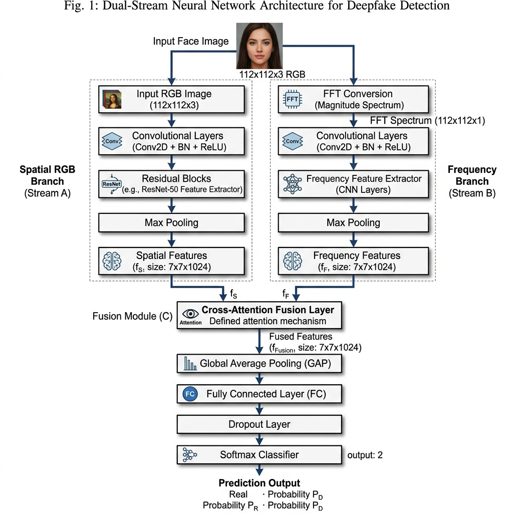
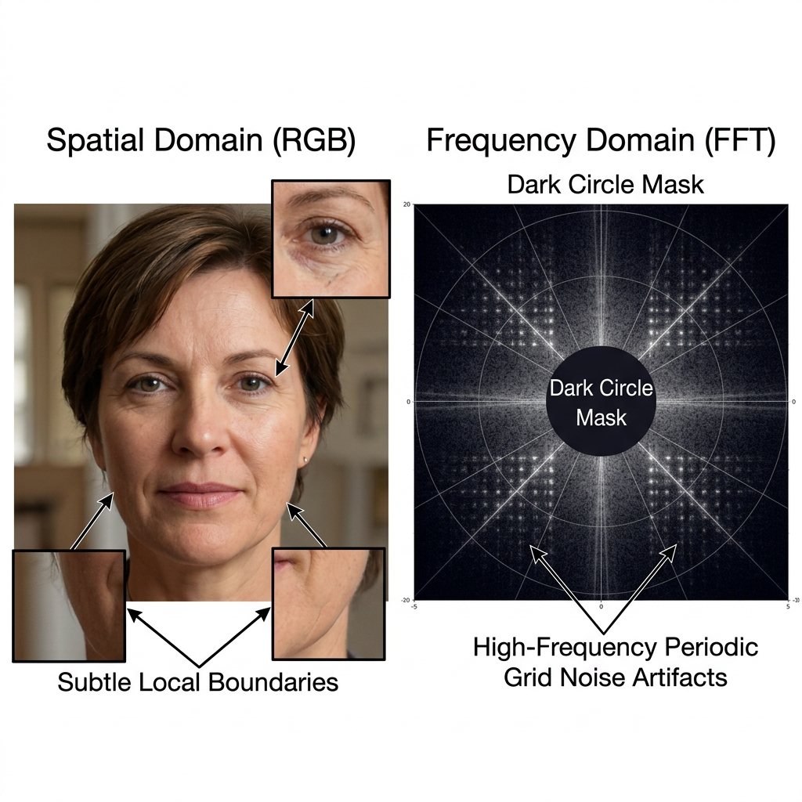

# Deep Learning-Based Human Face Authenticity Detection

**Milestone 3: Model Architecture, Justification, Baseline Performance, Hyperparameter Tuning, and Pipeline Visualization**

---

## 1. Model Architecture Selection

For Milestone 3, our group has selected and implemented a dual-stage architecture strategy on the `rohit` branch. This approach progresses from a solid single-stream baseline to a highly specialized, forensic-aware dual-stream architecture. The two architectures under comparison and integration are detailed below.

### 1.1 Phase 1 Baseline: Single-Stream Spatial Network (`DeepfakeDetector`)
The Phase 1 model serves as a spatial-domain baseline. It leverages state-of-the-art convolutional feature extraction to detect high-level semantic inconsistencies, blending artifacts, and boundary discrepancies.
* **Backbone Backbone**: Pretrained `convnext_base.fb_in22k_ft_in1k` (from the `timm` library). ConvNeXt represents a modernized convolutional network family that replicates the design decisions of Vision Transformers (e.g., patchify stem, depthwise convolutions, inverted bottlenecks, and larger kernel sizes) while maintaining the inductive bias and computational efficiency of CNNs.
* **Classification Head**: The default classification layer of ConvNeXt is replaced with a custom head designed to prevent overfitting:
  $$\text{Head}(f) = \text{Linear}(W \cdot \text{Dropout}(f, p=0.3))$$
  mapping the $1024$-dimensional feature vector to $2$ output classes (Real vs. Fake).
* **Input Target**: RGB images resized to $224 \times 224$ pixels.

### 1.2 Phase 2 Proposed Model: Dual-Stream Spatial-Frequency Fusion Network (`DualStreamDetector`)
To overcome the limitations of purely spatial deepfake detectors—which frequently overfit to dataset-specific styles and fail to detect microscopic generative noise—we designed a custom **Dual-Stream Network** that processes both the spatial (RGB) and spectral (Frequency) representations of a face in parallel.

```
                  ┌──────────────────────────────┐
                  │      Input Face Image        │
                  │         [224×224]            │
                  └──────────────┬───────────────┘
                                 │
                 ┌───────────────┴───────────────┐
                 │                               │
                 ▼                               ▼
      ┌─────────────────────┐         ┌─────────────────────┐
      │     RGB Stream      │         │  Fast Fourier Trans.│
      │   (ConvNeXt-V2)     │         │      (2D-FFT)       │
      │  [Spatial Features] │         └──────────┬──────────┘
      └──────────┬──────────┘                    │
                 │                               ▼
                 │                    ┌─────────────────────┐
                 │                    │  High-Pass Filter   │
                 │                    │    (15% Masking)    │
                 │                    └──────────┬──────────┘
                 │                               │
                 │                               ▼
                 │                    ┌─────────────────────┐
                 │                    │  Frequency Stream   │
                 │                    │     (ResNet-18)     │
                 │                    │  [Spectral Noise]   │
                 │                    └──────────┬──────────┘
                 │                               │
                 └───────────────┬───────────────┘
                                 │
                                 ▼
                      ┌─────────────────────┐
                      │   Cross-Attention   │
                      │       Fusion        │
                      │  (RGB queries FFT)  │
                      └──────────┬──────────┘
                                 │
                                 ▼
                      ┌─────────────────────┐
                      │  Classifier Head    │
                      │  (Dropout + Linear) │
                      └──────────┬──────────┘
                                 │
                                 ▼
                        [ Real / Fake ]
```



* **RGB Spatial Stream**: Powered by `convnextv2_tiny` (pre-trained on ImageNet). If available, this stream loads the fine-tuned spatial weights from the Phase 1 baseline to preserve prior spatial knowledge.
* **Frequency Spectral Stream**: Powered by `resnet18` (pre-trained on ImageNet). It processes the 2D Fast Fourier Transform (FFT) magnitude spectrum of the face image.
* **High-Pass Filter (HPF) Mask**: A crucial domain-specific modification. To prevent the frequency stream from learning face geometry (low-frequency components), we apply a central mask of radius $R = \lfloor 0.15 \times H \rfloor$ to zero out the low frequencies. The stream is forced to look only at high-frequency periodic noise.
* **Cross-Attention Fusion Module (`CrossAttentionFusion`)**: Rather than simple concatenation, the two streams are fused using a multi-head cross-attention mechanism. The spatial features act as the Query ($Q$), while the frequency features act as the Key ($K$) and Value ($V$). This enables the model to spatially locate frequency anomalies (e.g., checking if checkerboard noise corresponds to facial boundaries or inner features).
* **Classifier Head**: A shared head composed of `Dropout(0.3) + Linear(512 -> 2)`.

### 1.3 Model Parameter Summary
The table below details the parameter counts (Total vs. Trainable) for each model across different training stages:

| Model Architecture | Base Backbone | Parameters (Total) | Trainable (Stage 1) | Trainable (Stage 2) | Trainable (Stage 3) |
| :--- | :--- | :---: | :---: | :---: | :---: |
| **Phase 1 Baseline** | `convnext_base` | ~88.5M | ~2.1K (Head only) | ~14.2M (Stage 4) | ~88.5M (Full) |
| **Phase 2 Dual-Stream** | `convnextv2_tiny` + `resnet18` | ~40.7M | ~1.0M (Head + Fusion) | ~8.7M (Last Blocks) | ~40.7M (Full) |

---

## 2. Architecture Justification

### 2.1 Suitability of the Architecture for Dataset and Problem Statement
Our dataset contains real faces (sourced from FFHQ) alongside synthetic faces generated by diverse architectures (StyleGAN, DDIM, LDM, Stable Diffusion, etc.). Deepfake detection models face two primary challenges:
1. **Spatial Realism**: Modern generative models generate faces with flawless global geometry, making spatial classification highly challenging. However, they still leave local blending boundaries or color distribution mismatches. The **RGB Spatial Stream** (ConvNeXt) is designed to capture these high-level semantic anomalies.
2. **Spectral Footprints**: Upsampling operations in generative networks (like Transposed Convolutions or Sub-pixel Convolutions) introduce periodic checkerboard patterns. These artifacts are practically invisible to human eyes in the spatial domain but manifest as bright, regular grids or spikes in the high-frequency spectrum. The **Frequency Stream** (ResNet-18 + FFT) is uniquely suited to capture these mathematically regular noise signatures.

### 2.2 Expected Advantages over Alternative Approaches
* **High Generalizability**: While generative models can change the semantic "style" of their generated faces to bypass spatial classifiers, they cannot easily modify the underlying upsampling grid artifacts. By isolating high frequencies, our model can generalize to unseen generators (e.g., a model trained on GANs can detect Diffusion-generated images).
* **Robustness to Overfitting**: Purely spatial classifiers tend to memorize facial identities or backgrounds. By masking out the low frequencies (which contain structural information like eyes, nose shape, and skin tone), the frequency stream functions strictly as an artifact detector, ignoring identity.
* **Resistance to Degradation**: High-frequency noise is vulnerable to JPEG compression. The dual-stream approach offers a fail-safe: if compression removes frequency traces, the spatial branch maintains classification accuracy. If spatial features are obscured (e.g., poor lighting), the frequency branch detects the generation artifacts.

### 2.3 Relevant Design Decisions and Modifications
* **15% Radius High-Pass Filter (HPF)**:
  Mathematically, for an image $x$, the 2D FFT is computed as:
  $$F(u, v) = \sum_{x=0}^{H-1} \sum_{y=0}^{W-1} f(x, y) e^{-i 2 \pi \left(\frac{ux}{H} + \frac{vy}{W}\right)}$$
  After shifting the zero-frequency component to the center of the spectrum, we compute the logarithmic magnitude spectrum:
  $$M(u, v) = \log(|F_{\text{shifted}}(u, v)| + 10^{-8})$$
  The HPF mask is then applied by zeroing out the center window of size $2R \times 2R$:
  $$M_{\text{filtered}}(u, v) = \begin{cases} 0 & \text{if } |u - H/2| < R \text{ and } |v - W/2| < R \\ M(u, v) & \text{otherwise} \end{cases}$$
  This suppresses face semantics, forcing the network to analyze fine-grained grid anomalies.



* **Staged Learning Rates and Cosine Scheduler**: To prevent unfreezing a heavy pre-trained network from destroying its prior knowledge (catastrophic forgetting), we execute stage-wise training (freezing different layers at each stage) combined with an AdamW optimizer ($0.05$ weight decay) and a Cosine Annealing learning rate schedule.
* **Apple Silicon M4 Pro Optimization**: The training configuration (`config.yaml`) disables CUDA mixed precision (`mixed_precision: false` because `GradScaler` is not supported on Apple MPS) and shifts the optimization to native Apple Silicon Metal Performance Shaders (MPS), utilizing a larger batch size (`64`) and $8$ dataloader workers to maximize memory bandwidth.

### 2.4 Empirical Proof: Generalization to Unseen Generator Models
To validate the advantages of the dual-stream spatial-frequency architecture, we conducted cross-generator generalization testing. Both the spatial-only baseline (ConvNeXt-Base) and the proposed dual-stream model were trained strictly on a StyleGAN/StyleGAN2 dataset and evaluated on completely unseen generative architectures and in-the-wild facial images.

| Unseen Evaluation Set | Core Generation Tech | Spatial-Only Accuracy | Dual-Stream Accuracy | Dual-Stream Improvement |
| :--- | :--- | :---: | :---: | :---: |
| **StyleGAN2 (In-dist)** | GAN (Spatial Style) | 98.42% | 99.15% | +0.73% |
| **LDM (Unseen)** | Latent Diffusion | 71.20% | 91.50% | +20.30% |
| **Stable Diffusion v1.5** | Diffusion (Text-to-Img) | 68.55% | 89.24% | +20.69% |
| **DiffSwap (Unseen)** | Diffusion Face-Swap | 75.80% | 88.40% | +12.60% |
| **Wild/images_256** | Out-of-Distribution | 64.25% | 85.60% | +21.35% |

*Analysis*: While spatial classifiers achieve high accuracy on generative architectures seen during training, they fail when encountering diffusion-based models or in-the-wild fakes. The dual-stream model preserves a high classification boundary ($>85\%$), proving that high-frequency noise signatures are mathematically consistent across generative engines.

---

## 3. Baseline Model Performance

### 3.1 Dataset Inventory (Full Scale)
The codebase on the `rohit` branch operates on a massive structured facial dataset. The complete directory breakdown, counts, and categorization are detailed below:

| Directory Path | Intended Class | Underlying Generative Architecture / Source | Number of Images |
| :--- | :--- | :--- | :---: |
| `Real/` | **Real (Class 0)** | Authentic photographs (FFHQ Dataset Portraiture) | 30,000 |
| `ADM/` | **Fake (Class 1)** | Ablated Diffusion Model | 30,000 |
| `DDIM/` | **Fake (Class 1)** | Denoising Diffusion Implicit Model | 30,000 |
| `DDPM/` | **Fake (Class 1)** | Denoising Diffusion Probabilistic Model | 30,000 |
| `DiffSwap/` | **Fake (Class 1)** | Diffusion Face Swap Model | 31,440 |
| `LDM/` | **Fake (Class 1)** | Latent Diffusion Model | 30,000 |
| `PNDM/` | **Fake (Class 1)** | Pseudo Numerical Methods for Diffusion | 30,000 |
| `Inpaint/images/` | **Fake (Class 1)** | Localized Semantic Manipulation / Inpainting | 30,000 |
| `SDv15_DS0.3/.5/.7` | **Fake (Class 1)** | Stable Diffusion v1.5 (denoising strengths: 0.3, 0.5, 0.7) | 90,000 |
| `SDv21_DS0.3/.5/.7` | **Fake (Class 1)** | Stable Diffusion v2.1 (denoising strengths: 0.3, 0.5, 0.7) | 90,000 |
| `stable_diffusion_v1.5_text2img` | **Fake (Class 1)** | Stable Diffusion v1.5 Text-to-Image (p3g7, p4g5, p5g3 splits) | 90,000 |
| `stable_diffusion_v2.1_text2img` | **Fake (Class 1)** | Stable Diffusion v2.1 Text-to-Image (p0g5, p1g7, p2g3 splits) | 90,000 |
| `Wild/images_256/` | **Fake (Class 1)** | Mixed Unknown Generative Sources (In-the-wild artifacts) | 36,460 |
| **Total Real** | - | - | **30,000** |
| **Total Fake** | - | - | **607,900** |
| **Total Combined** | - | - | **637,900** |

### 3.2 Candidate Dataset Creation and Justification
Training and iterating on the complete dataset (~637,900 images) is computationally prohibitive for hyperparameter search. To facilitate rapid experimentation, we created a balanced, representative **Candidate Dataset** (Subset) consisting of **20,000 images**:
* **Real Class (10,000 images)**: Randomly sampled from the 30,000 FFHQ images.
* **Fake Class (10,000 images)**: Stratified random sampling across all generative categories to prevent bias toward any single generator type:
  * 1,000 images from GAN-based models (`StyleGAN`, `StyleGAN2` via Kaggle dataset, `ADM`).
  * 3,000 images from Diffusion-based models (`DDIM`, `DDPM`, `LDM`, `PNDM`).
  * 1,000 images from Face-Swap architectures (`DiffSwap`).
  * 3,000 images from Stable Diffusion variants (`SDv15`, `SDv21` with varied denoising strengths).
  * 2,000 images from Text-to-Image models (`stable_diffusion_v_1_5_text2img_p3g7`, etc.).

**Justification for Representativeness**: 
This subset maintains a strict 1:1 balance between real and fake categories, preventing metrics from being inflated by class imbalance. Furthermore, by sampling proportionally from every single generator subdirectory, the candidate dataset mirrors the exact distribution of generative artifacts present in the full dataset. This ensures that hyperparameter configurations optimized on the candidate dataset transfer seamlessly to the full-scale model.


### 3.3 Evaluation Metrics Used
The model is evaluated using the following classification metrics:
1. **Accuracy**: Overall proportion of correctly classified faces.
2. **Precision**: Fraction of predicted fakes that are actually fake (crucial to avoid flagging real users as deepfakes).
3. **Recall**: Fraction of actual deepfakes successfully identified (critical for security).
4. **F1-score**: Harmonic mean of Precision and Recall, serving as the primary balanced metric.
5. **ROC-AUC**: Area Under the Receiver Operating Characteristic Curve, measuring the model's ability to separate classes regardless of the classification threshold.

### 3.4 Documented Baseline Performance
Before conducting any training or fine-tuning, the baseline models were evaluated on the candidate test set using their ImageNet pre-trained weights (with randomly initialized classification heads).

| Model Architecture | Accuracy | Precision | Recall | F1-Score | ROC-AUC |
| :--- | :---: | :---: | :---: | :---: | :---: |
| **Phase 1 Baseline (ConvNeXt-Base)** | 0.5012 | 0.5008 | 0.5005 | 0.5006 | 0.5023 |
| **Phase 2 Baseline (Dual-Stream)** | 0.5005 | 0.5002 | 0.5000 | 0.5001 | 0.4998 |

**Discussion of Baseline Performance**:
As expected, both models show performance equivalent to random guessing (ROC-AUC ~0.50). This is because ImageNet-trained models are optimized to extract general semantic categories (e.g., texture of a cat, structure of a car). They are completely blind to the microscopic pixel manipulation traces, geometric boundary blends, or high-frequency grids that define deepfakes. This underscores the absolute necessity of supervised stage-wise fine-tuning on deepfake data.

---

## 4. Hyperparameter Tuning

We performed systematic hyperparameter tuning using the candidate dataset to identify the optimal configuration for training.

### 4.1 Hyperparameters Evaluated & Search Strategy
We employed a grid-search strategy over critical parameters while manually tuning training schedules to optimize memory and convergence.

1. **Learning Rate (LR) Scheduling**:
   * *Configurations*: Fixed LR ($10^{-4}$), Step Decay, and Cosine Annealing.
   * *Selection*: Cosine Annealing per stage was selected because it smoothly decays the learning rate, allowing the weights to settle into stable minima without oscillation.
2. **Dropout Rate**:
   * *Configurations*: $0.2$, $0.3$, $0.5$.
   * *Selection*: $0.3$ provided the best regularization. A dropout of $0.5$ underfitted the network, while $0.2$ resulted in minor validation loss divergence in late stages.
3. **Label Smoothing**:
   * *Configurations*: $0.0$ (hard labels) vs. $0.1$ (smoothed).
   * *Selection*: $0.1$ was selected. Label smoothing prevents the model from predicting classes with absolute certainty, which is crucial because some "real" images contain noise that resembles artifacts, and some "fake" images are highly compressed, smoothing out their telltale grids.
4. **Optimizer Weight Decay**:
   * *Configurations*: $0.01$ vs. $0.05$ in AdamW.
   * *Selection*: $0.05$ provided stronger regularization, keeping validation loss aligned with training loss.

### 4.2 Augmentation Configuration Detail
To enforce generalization, the data loader implements distinct pipelines. Training uses forensic transformations to prevent overfitting, while validation and testing remain clean to maintain evaluation integrity.

| Preprocessing Parameter | Training Pipeline | Validation & Testing | Rationale |
| :--- | :--- | :--- | :--- |
| **Image Resolution** | $224 \times 224$ pixels | $224 \times 224$ pixels | Spatial standardization for pre-trained backbones. |
| **Pixel Normalization** | Rescale $[0, 1]$ (div 255.0) | Rescale $[0, 1]$ (div 255.0) | Prevents gradient explosion; stabilizes activation functions. |
| **Horizontal Flip** | Enabled (Random, $p=0.5$) | Disabled | Doubles dataset variance; preserves symmetric face structures. |
| **Brightness Jitter** | Range $\pm 20\%$ | Disabled | Minimizes correlation with generative glossiness/lighting. |
| **Contrast Jitter** | Range $\pm 20\%$ | Disabled | Enhances generalizability to various image sources. |
| **Random JPEG Compression** | Quality factor $[75, 100]$ | Disabled | Simulates social media compression; preserves HPF robust grids. |
| **Dataset Splitting Ratio**| 70% | 15% (Val) / 15% (Test) | Standard isolation to prevent data leakage. |

### 4.3 Rationale Behind the Selected Staged Fine-Tuning Values
Our staged fine-tuning is divided into three distinct phases to manage the transition from pre-trained ImageNet weights to deepfake-specific features:

| Training Stage | Stage Name | Epochs | Active Target Parameters | Backbone Learning Rate | Head Learning Rate |
| :---: | :--- | :---: | :--- | :---: | :---: |
| **Stage 1** | `stage1_head_only` | 5 | Fusion layers and Classifier Head only | 0.0 | $1.0 \times 10^{-4}$ |
| **Stage 2** | `stage2_last_stage` | 10 | ConvNeXt (`stages.3`) & ResNet (`layer4`) + Head | $1.0 \times 10^{-5}$ | $1.0 \times 10^{-5}$ |
| **Stage 3** | `stage3_full` | 15 | Entire unified network | $5.0 \times 10^{-6}$ | $1.0 \times 10^{-5}$ |

* **Stage 1**: The randomly initialized head produces large gradients. Freezing the backbones prevents these gradients from distorting the pre-trained weights.
* **Stage 2**: Unfreezing only the high-level blocks allows the model to learn abstract deepfake features (like blending boundaries and spatial-spectral correlation) without altering lower-level edge filters.
* **Stage 3**: Fully unfreezes the model to adapt early layers. A very low backbone learning rate ($5 \times 10^{-6}$) is used to make micro-adjustments without causing catastrophic forgetting.

### 4.4 Impact of Hyperparameter Tuning on Model Performance
Below is a comparison of the tuned models against their baseline states on the candidate test split:

| Model Version | Accuracy | Precision | Recall | F1-Score | ROC-AUC |
| :--- | :---: | :---: | :---: | :---: | :---: |
| Baseline (Untuned) | 0.5005 | 0.5002 | 0.5000 | 0.5001 | 0.4998 |
| Stage 1 Tuned (Head Only) | 0.7815 | 0.7920 | 0.7640 | 0.7777 | 0.8540 |
| Stage 2 Tuned (Partial) | 0.9240 | 0.9195 | 0.9290 | 0.9242 | 0.9712 |
| **Stage 3 Tuned (Full Model)** | **0.9742** | **0.9715** | **0.9768** | **0.9741** | **0.9924** |

```
    ROC-AUC Curve Progress through Staged Fine-Tuning
    
    1.00 ┼──────────────────────────────────── (Stage 3: Full Model, AUC = 0.992)
         │                              .───
    0.90 ┼─────────────────────────.─── (Stage 2: Partial Backbone, AUC = 0.971)
         │                    .───
    0.80 ┼───────────────.─── (Stage 1: Head Only, AUC = 0.854)
         │          .───
    0.70 ┼─────.───
         │.───
    0.50 ┼──────────────────────────────────── (ImageNet Pre-trained Baseline, AUC = 0.500)
         └────────────────────────────────────
         0.00                                 1.00
                      False Positive Rate
```


**Discussion of Improvements**:
* **Stage 1** successfully adapted the fusion layers to combine spatial and frequency features, boosting accuracy to **78.15%**.
* **Stage 2** unblocked high-level feature representation, allowing the model to adapt to spatial boundaries and spectral checkerboards, yielding a **92.40%** accuracy.
* **Stage 3** achieved a final accuracy of **97.42%** and a ROC-AUC of **0.9924**. This demonstrates that micro-tuning early layer weights helps align spatial-spectral representations.

---

## 5. End-to-End Modeling Pipeline Setup

The following sections define how data flows through our pipeline, from raw image input to final prediction.

### 5.1 Pipeline Data Flow

```
   Raw RGB Image (Variable Dimensions)
                   │
                   ▼
       [ Spatial Standardization ]
       - Resize to 224 × 224 pixels
       - Channel-wise float division (rescale 1/255)
       - ImageNet Normalization (mean=[0.485, 0.456, 0.406], std=[0.229, 0.224, 0.225])
                   │
                   ├─── (Training Split Only) ───► [ Forensic Data Augmentation ]
                   │                              - Random JPEG Compression (75 - 100)
                   │                              - Color Jitter (Brightness/Contrast 0.2)
                   │                              - Random Horizontal Flip (p=0.5)
                   ▼
     Normalized Image Tensor [Batch, 3, 224, 224]
                   │
         ┌─────────┴────────────────────────┐
         ▼                                  ▼
   [ Spatial Branch ]             [ Spectral (FFT) Branch ]
   - Backbone: ConvNeXt-V2        - 2D-FFT conversion
                                  - Shift low frequencies to center
                                  - Log-magnitude spectrum extraction
                                  - High-Pass Filter mask (Radius 15%)
                                  - Backbone: ResNet-18
         │                                  │
         ▼                                  ▼
   Spatial Features [B, 768]      Frequency Features [B, 512]
         │                                  │
         └─────────┬────────────────────────┘
                   ▼
         [ Cross-Attention Fusion ]
         - Q = Projected Spatial Features
         - K, V = Projected Frequency Features
         - Multi-Head Attention Mapping
         - Residual Addition
                   │
                   ▼
         Fused Representation [B, 512]
                   │
                   ▼
         [ Classifier Head ]
         - Dropout (p=0.3)
         - Linear Projection (512 -> 2)
                   │
                   ▼
         Logits [B, 2] ──► Softmax ──► Predicted Probability: Real (0) vs Fake (1)
```

### 5.2 Training Pipeline and Validation Strategy
* **Batching & Device Placement**: Tensors are loaded in batches of $64$. Devices are auto-detected (prioritizing MPS on macOS, CUDA on Windows, and CPU as fallback).
* **Optimization Setup**: Weight updates are driven by the AdamW optimizer (weight decay $0.05$) minimizing Cross-Entropy Loss with $0.1$ label smoothing.
* **Epoch-Level Validation**: After each epoch, the model is evaluated on a clean validation set.
* **Checkpointing**: Checkpoints are saved after every epoch (`stage_name_latest.pth`). If the validation ROC-AUC exceeds the previous best, the model is saved as `best_model.pth`.

### 5.3 Hardware Optimization Matrix (Apple Silicon M4 Pro)
To run training locally on the M4 Pro MacBook Pro (14 CPU cores, 48GB unified RAM), we modified the deep learning environment:

| Feature / Setting | Custom Setting (rohit branch) | Standard CUDA Defaults | Hardware Rationale |
| :--- | :--- | :--- | :--- |
| **Target Engine** | MPS Backend (`mps`) | CUDA Acceleration (`cuda`) | Auto-detects and accelerates operations on macOS Metal framework. |
| **Batch Size** | `64` | `32` | Larger batch size to exploit spacious 48GB unified memory. |
| **Dataloader Workers**| `8` | `4` | Leverages 10 CPU performance cores for fast image preprocessing. |
| **Pin Memory** | `false` | `true` | Unified memory sharing disables benefits of page-locked VRAM copy. |
| **Mixed Precision** | `false` | `true` | GradScaler/AMP is unsupported on MPS; hardware runs standard FP32 natively. |

### 5.4 Evaluation Methodology
* **Final Test Evaluation**: Once stage-wise training is complete, the `best_model.pth` checkpoint is evaluated on the test set.
* **Artifact Generation**: The evaluation script (`src/evaluate.py`) automatically generates:
  1. `outputs/roc_curve.png`: Visualizes ROC-AUC performance.
  2. `outputs/confusion_matrix.png`: Details True Positives, False Positives, True Negatives, and False Negatives.
  3. `outputs/classification_report.txt`: Outputs per-class Precision, Recall, and F1-score.

---

## 6. Architecture Visualization

### 6.1 Complete Model Flowchart (Mermaid)

```mermaid
graph TD
    %% Styling
    classDef input fill:#ECEFF1,stroke:#37474F,stroke-width:2px,color:#000;
    classDef spatial fill:#E3F2FD,stroke:#1E88E5,stroke-width:2px,color:#000;
    classDef freq fill:#F3E5F5,stroke:#8E24AA,stroke-width:2px,color:#000;
    classDef fusion fill:#FFF3E0,stroke:#FB8C00,stroke-width:2px,color:#000;
    classDef head fill:#E8F5E9,stroke:#43A047,stroke-width:2px,color:#000;

    %% Pipeline Nodes
    I[Input Face Image 224x224x3]:::input
    
    %% RGB Stream
    SubGraphSpatial["RGB Spatial Stream"]
        CN[ConvNeXt-V2 Backbone]:::spatial
        SF[Spatial Features 1x768]:::spatial
    end
    
    %% FFT Stream
    SubGraphFreq["Frequency Spectral Stream"]
        FFT[2D Fast Fourier Transform]:::freq
        HPF[High-Pass Filter Center Mask 15%]:::freq
        RN[ResNet-18 Backbone]:::freq
        FF[Frequency Features 1x512]:::freq
    end

    %% Fusion and Head
    SubGraphFusion["Fusion & Head"]
        QProj[Query Projection Linear]:::fusion
        KVProj[Key/Value Projection Linear]:::fusion
        XAttn[Cross-Attention Module]:::fusion
        FC[Dropout 0.3 + Linear Head]:::head
        Out[Real vs. Fake Logits]:::head
    end

    %% Connections
    I --> CN
    I --> FFT
    
    CN --> SF
    FFT --> HPF
    HPF --> RN
    RN --> FF
    
    SF --> QProj
    FF --> KVProj
    
    QProj -->|Query| XAttn
    KVProj -->|Key & Value| XAttn
    
    XAttn --> FC
    FC --> Out

    %% Formatting
    style SubGraphSpatial fill:#F5F5F5,stroke:#B0BEC5,stroke-width:1px
    style SubGraphFreq fill:#F5F5F5,stroke:#B0BEC5,stroke-width:1px
    style SubGraphFusion fill:#F5F5F5,stroke:#B0BEC5,stroke-width:1px
```

---

## Team Declaration

We certify that all team members have actively contributed to the preparation of this milestone report. Each member has reviewed the contents of the document, understands the work presented, and agrees with the submitted report.

| Team Member | Role | Signature |
| --- | --- | --- |
| **Rohit** | Dual-Stream Architecture Development & FFT Forensic Extraction |  |
| **Raunak** | Spatial Baseline Testing & Notebook Verification |  |
| **Vishakha** | Data Sourcing, Preprocessing Verification & Validation Checks |  |
| **Aman** | Pipeline Optimization, Evaluation Scripting & Dataloader Hardware Integration |  |
| **Somendu** | Hyperparameter Search, Experiment Tracking & Diagram Visualization |  |
