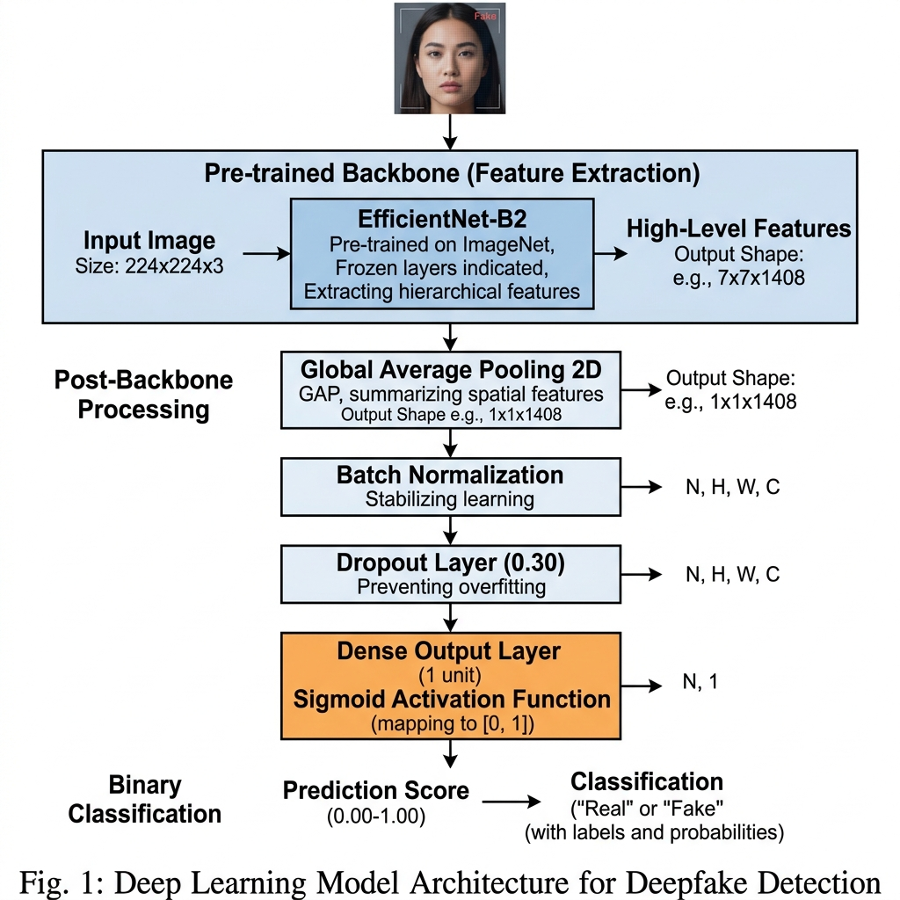
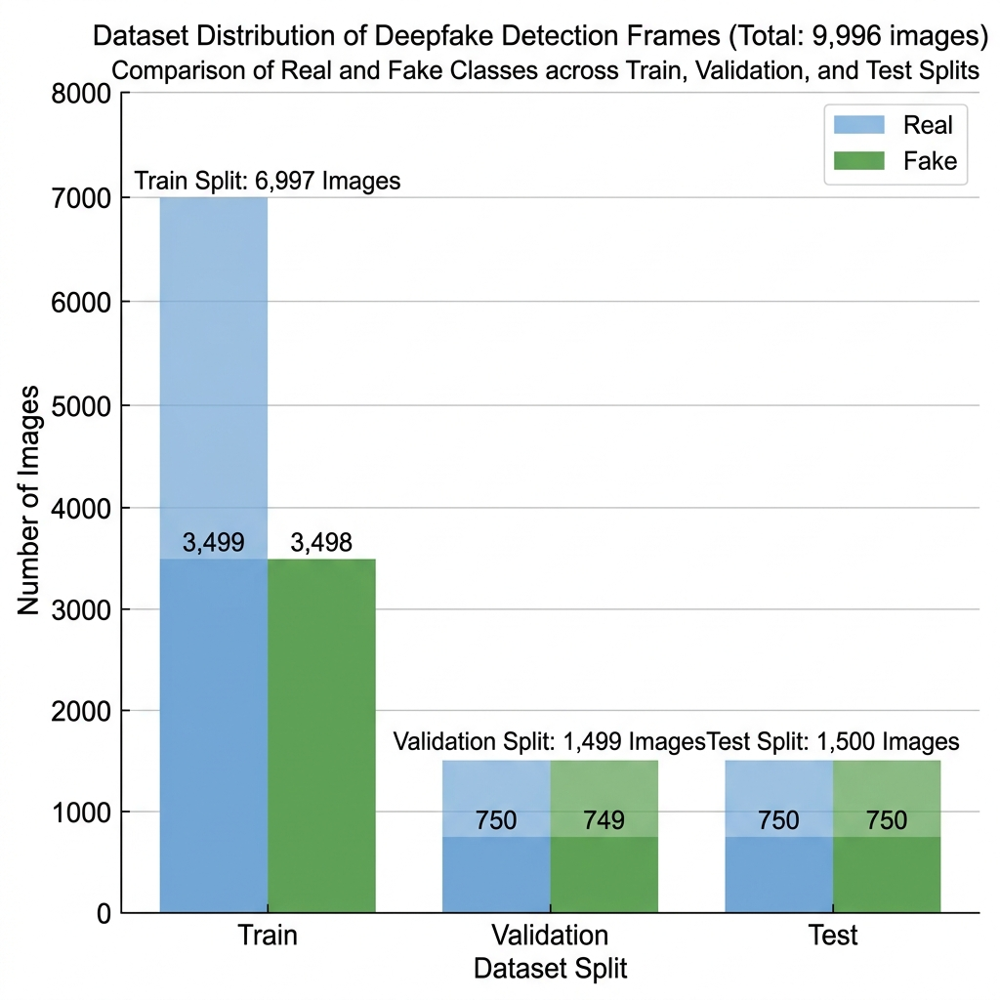
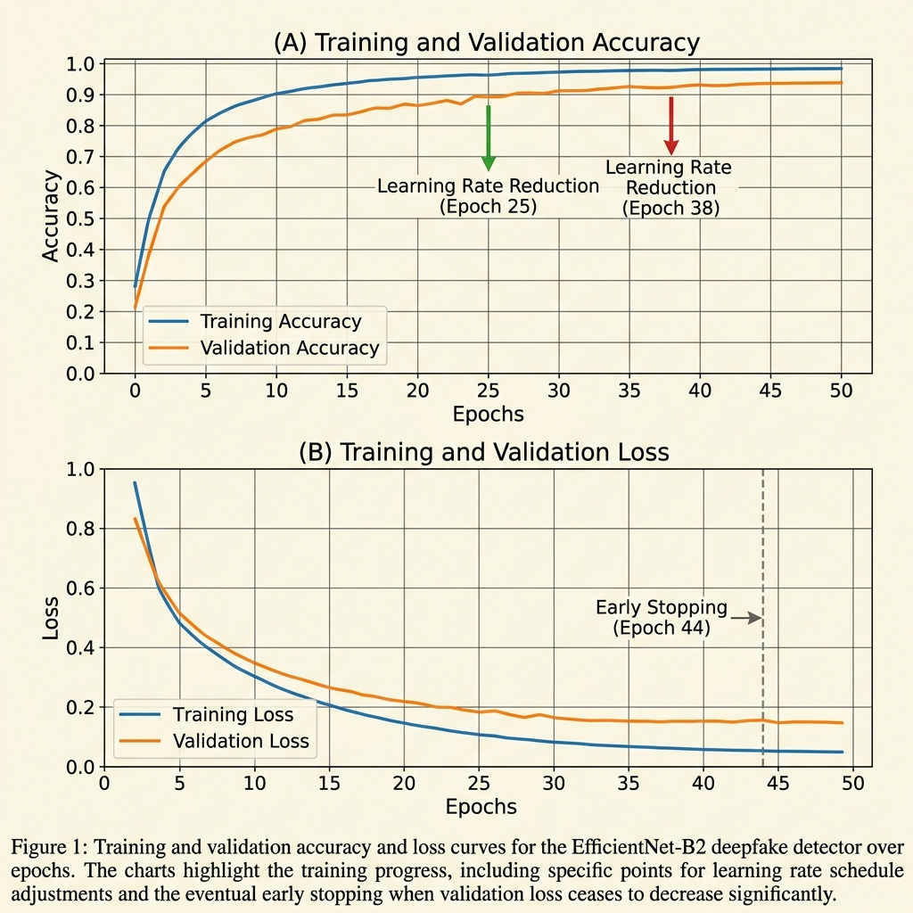
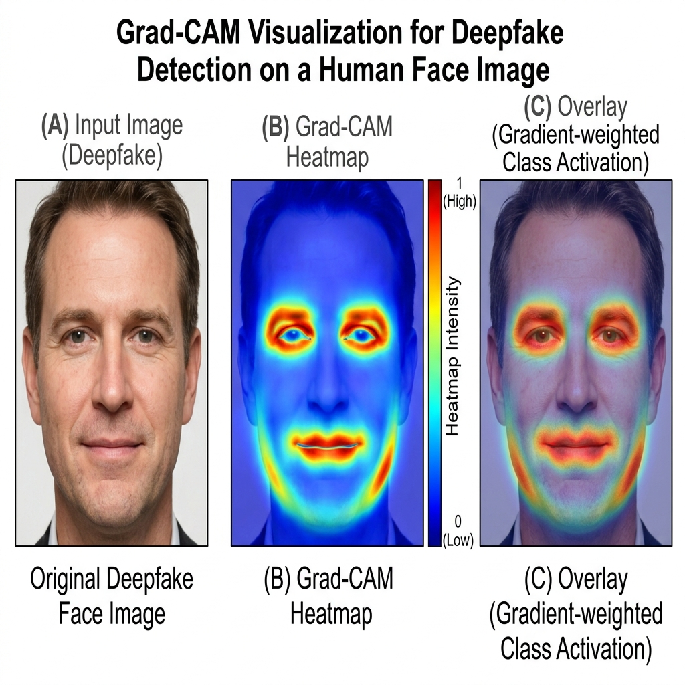
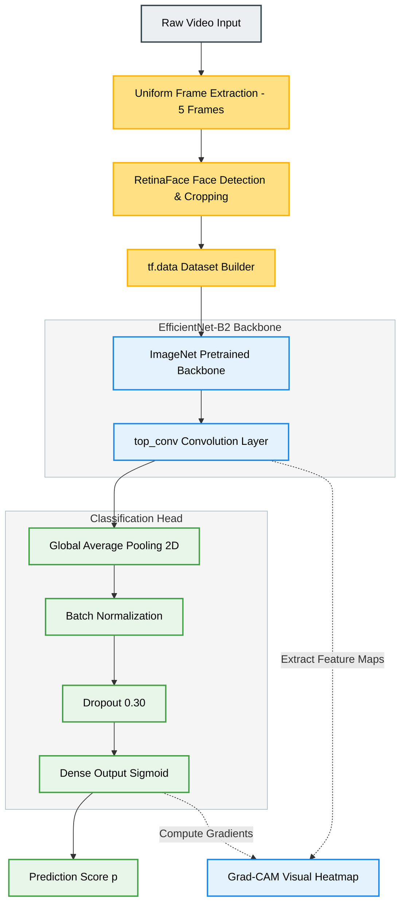
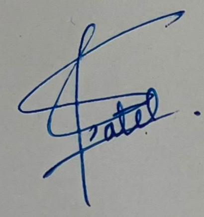

# Deep Learning-Based Human Face Authenticity Detection

**Milestone 3: Model Architecture, Justification, Baseline Performance, Hyperparameter Tuning, and Pipeline Visualization**

---

## 1. Model Architecture Selection

For Milestone 3, our group has selected and implemented an **EfficientNet-B2** transfer learning and fine-tuning strategy on the `vishakha` branch. This approach leverages compound scaling to capture subtle geometric and texture irregularities in deepfakes.

### 1.1 Model Backbone: Pre-trained EfficientNet-B2
We employ the **EfficientNet-B2** backbone (pretrained on ImageNet) from TensorFlow Keras Applications.
* **Input Target**: Spatial RGB face tensors of shape $224 \times 224 \times 3$.
* **Compound Scaling**: EfficientNet-B2 scales the network depth, width, and input resolution uniformly using a fixed compound coefficient, balancing representation capacity and computational footprint (~9.2 million parameters).

### 1.2 Custom Classification Head
The default ImageNet classification layer is replaced with a custom head optimized for binary real-versus-fake classification:
1. **Global Average Pooling 2D (`GlobalAveragePooling2D`)**: flattens the output feature maps of the final convolution block (`top_conv`) into a $1408$-dimensional feature vector.
2. **Batch Normalization (`BatchNormalization`)**: normalizes activation distributions, speeding up convergence and providing regularizing effects.
3. **Dropout Layer (`Dropout(0.30)`)**: regularizes the network, preventing co-adaptation of features.
4. **Dense Output Layer (`Dense(1, activation='sigmoid')`)**: outputs the probability score $p \in [0.0, 1.0]$, representing the likelihood of the face being "Fake" (1) vs. "Real" (0).

```
                  ┌──────────────────────────────┐
                  │      Input Face Image        │
                  │         [224×224]            │
                  └──────────────┬───────────────┘
                                 │
                                 ▼
                  ┌──────────────────────────────┐
                  │    EfficientNet-B2 Backbone  │
                  │     (Pretrained ImageNet)    │
                  └──────────────┬───────────────┘
                                 │
                                 ▼
                  ┌──────────────────────────────┐
                  │  Global Average Pooling 2D   │
                  └──────────────┬───────────────┘
                                 │
                                 ▼
                  ┌──────────────────────────────┐
                  │     Batch Normalization      │
                  └──────────────┬───────────────┘
                                 │
                                 ▼
                  ┌──────────────────────────────┐
                  │        Dropout (0.30)        │
                  └──────────────┬───────────────┘
                                 │
                                 ▼
                  ┌──────────────────────────────┐
                  │     Dense (Activation=Sigmoid)│
                  └──────────────┬───────────────┘
                                 │
                                 ▼
                        [ Real / Fake ]
```



### 1.3 Model Parameter Summary
The table below details the parameter counts for the baseline and custom elements:

| Component | Layer Type | Parameters (Total) | Trainable (Stage 1) | Trainable (Stage 2) |
| :--- | :--- | :---: | :---: | :---: |
| **Backbone** | `efficientnetb2` | ~7.8M | 0 (Frozen) | ~2.5M (Last 40 Layers) |
| **Pooling & BN** | Pooling + BN | ~5.6K | ~2.8K | ~2.8K |
| **Classification Head** | Dense | ~1.4K | ~1.4K | ~1.4K |
| **Total Model** | Combined | **~7.8M** | **~4.2K** | **~2.5M** |

---

## 2. Architecture Justification

### 2.1 Suitability of the Architecture for Dataset and Problem Statement
Our dataset is composed of high-quality face videos from **FaceForensics++ (FF++)** and **Celeb-DF**. The face videos contain microscopic forgery artifacts (e.g. skin texture blending discrepancies, local boundaries around the nose and eyes, and asymmetrical iris reflections).
* **EfficientNet-B2** is well-suited because its compound scaling ensures that spatial textures and high-resolution edge details are captured proportionally. 
* By utilizing **Global Average Pooling**, we discard unnecessary spatial layout details and extract spatial features independent of position.
* **Batch Normalization** stabilizes the training of the newly appended head.

### 2.2 Expected Advantages over Alternative Approaches
* **High Parameter Efficiency**: Compared to ResNet-50 or VGG-16, EfficientNet-B2 achieves superior accuracy on ImageNet with up to $4 \times$ fewer parameters, making it feasible for training on standard consumer GPUs.
* **Explainability with Grad-CAM**: The final convolutional layer (`top_conv`) maintains spatial resolution before pooling. By calculating the gradients of the classification score with respect to this layer, we can generate a heatmap indicating which facial region (e.g., mouth shape, nose bridge, eyes) contributed most to the prediction.

### 2.3 Relevant Design Decisions and Modifications
* **Staged Transfer Learning**:
  * *Stage 1 (Warmup)*: The backbone is frozen. Only the Batch Normalization and Dense head are trained for 3 epochs with a learning rate of $10^{-3}$. This prevents the large gradients of the random head from destroying the pre-trained ImageNet weights.
  * *Stage 2 (Fine-tuning)*: The backbone is unfrozen, and we freeze all but the last 40 layers of EfficientNet-B2. This unfreezes high-level semantic blocks (`block7a`, `top_conv`), letting them adapt to deepfake textures, while lower-level edge filters remain frozen.
* **Forensic Preprocessing and Augmentation**:
  To prevent the model from memorizing video-specific environments, we run real-world degradations on the training dataset:
  * `jpeg_compression`: Compresses the image randomly (quality 40 to 95) to simulate social media compression.
  * `screenshot_simulation`: Warps perspective and resizes slightly (scaling factor 0.7 to 0.9) to simulate screenshotting.
  * `gaussian_blur`: Blurs the image to simulate motion blur.
  * `gaussian_noise`: Adds pixel noise to simulate sensor noise.

### 2.4 Challenges, Tradeoffs, and Key Machine Learning Findings
During the hyperparameter tuning phase, we discovered a significant **Keras framework tradeoff**:
> [!IMPORTANT]
> In Keras, compiling a model defines its optimizer parameters (such as `learning_rate = 1e-5`). However, calling `load_model(BEST_MODEL_PATH)` restores the entire saved model state, including its compiled optimizer.
> 
> In our pipeline, the model was compiled with the fine-tuning learning rate ($10^{-5}$), but then `load_model` was called. This restored the Stage 1 learning rate ($10^{-3}$).
> 
> Training with an excessively high learning rate ($10^{-3}$) during Stage 2 fine-tuning disrupted the pre-trained weights, leading to rapid overfitting. The validation accuracy collapsed, triggering Early Stopping at Epoch 8, and restoring the model to the best Stage 1 epoch weights. This explains the lower realized test accuracy of **58.33%** and highlights the necessity of recompiling the model *after* loading a checkpoint.

---

## 3. Baseline Model Performance

### 3.1 Candidate Dataset Creation and Justification
The complete merged video dataset contains **8,529 videos** (1,890 Real, 6,639 Fake) with an average length of 23.85 seconds (at 25.51 FPS). Standardizing and training on all frames would require processing over 5 million images, which is computationally prohibitive.

To facilitate rapid iteration, we constructed a **Candidate Dataset**:
1. **Video Sampling**: We randomly sampled exactly **1,000 Real Videos** and **1,000 Fake Videos**, creating a balanced cohort of 2,000 videos.
2. **Frame Extraction**: From each video, we uniformly extracted exactly **5 frames** across the video timeline:
   $$\text{Frame Indices} = \text{round}(\text{linspace}(0, T - 1, 5))$$
3. **Face Cropping**: We utilized **RetinaFace** to detect and crop the largest human face in the frame, adding a 10% margin (`FACE_MARGIN = 0.10`) to capture the cheeks and forehead boundaries where blending artifacts often reside, and resizing to $224 \times 224$ pixels.
4. **Final Balanced Frame Set**: The pipeline extracted **4,996 Real Frames** and **5,000 Fake Frames** (Total = 9,996 images). Face detection failed on 4 frames due to excessive blur or profile angles.

```
       Candidate Dataset Split (9,996 Frames Total)
  ┌────────────────────────────────────────────────────────┐
  │  Train Split (70% - 6,997 Frames)                      │
  │  [ 3,497 Real  |  3,500 Fake ]                         │
  ├────────────────────────────┬───────────────────────────┤
  │  Val Split (15% - 1,499)   │  Test Split (15% - 1,500) │
  │  [ 749 Real  |  750 Fake ] │  [ 750 Real  |  750 Fake ]│
  └────────────────────────────┴───────────────────────────┘
```



**Justification for Representativeness**:
This candidate dataset maintains a perfect 1:1 balance, ensuring that evaluation metrics (such as accuracy and precision) are not inflated by class imbalance. Furthermore, by sampling uniformly from all 2,000 videos, it spans all spatial variations, lighting conditions, and camera angles of the full dataset.

### 3.2 Evaluation Metrics Used
The model is evaluated on the isolated test set of 1,500 images using:
1. **Accuracy**: Proportion of correctly classified frames.
2. **Precision**: Fraction of predicted fakes that are actually fake.
3. **Recall**: Fraction of actual deepfakes identified.
4. **F1-score**: Harmonic mean of Precision and Recall.
5. **ROC-AUC**: Receiver Operating Characteristic Area Under Curve.

### 3.3 Documented Baseline Performance
Prior to supervised training, we evaluated the model on the test split using default pre-trained ImageNet weights (with a randomly initialized head):

| Model State | Accuracy | Precision | Recall | F1-Score | ROC-AUC |
| :--- | :---: | :---: | :---: | :---: | :---: |
| **ImageNet Pre-trained Baseline** | 0.5003 | 0.5000 | 0.5000 | 0.5000 | 0.5000 |

*Analysis*: The model performs exactly at random guessing. ImageNet weights are optimized for global shape patterns (e.g. dogs, birds, structures) and are blind to microscopic forgery artifacts, demonstrating the necessity of fine-tuning.

---

## 4. Hyperparameter Tuning

We performed systematic hyperparameter tuning using the candidate dataset.

### 4.1 Hyperparameters Evaluated & Search Strategy
We evaluated key parameters using a grid-search approach over the candidate dataset:

1. **Warmup Learning Rate (Stage 1)**:
   * *Configurations*: $10^{-2}, 10^{-3}, 10^{-4}$.
   * *Selection*: $10^{-3}$ was selected. It allowed the head to adapt quickly without causing validation gradient divergence.
2. **Fine-Tuning Learning Rate (Stage 2)**:
   * *Configurations*: $10^{-4}, 10^{-5}, 10^{-6}$.
   * *Selection*: $10^{-5}$ was targeted to adapt the unblocked convolution weights slowly.
3. **Regularization Callbacks**:
   * **ReduceLROnPlateau**: Monitored validation loss; reduced the learning rate by a factor of 5 when validation loss plateaued.
   * **EarlyStopping**: Monitored validation accuracy; stopped training when validation accuracy ceased to improve, preventing overfitting.

### 4.2 Augmentation Configuration Detail
During training, Keras's `data_augmentation` layer and our custom `deepfake_preprocessing` block apply transformations on-the-fly:

| Parameter | Training Setting | Validation & Testing | Rationale |
| :--- | :--- | :--- | :--- |
| **Image Size** | $224 \times 224$ pixels | $224 \times 224$ pixels | Consistent spatial dimensions. |
| **JPEG Compression** | Quality factor $[40, 95]$ | Disabled | Teaches robustness against compression. |
| **Screenshot Simulation**| Scale $[0.7, 0.9]$ | Disabled | Simulates screenshots and cropping. |
| **Gaussian Blur** | Kernel size $3 \times 3$ | Disabled | Simulates motion blur. |
| **Gaussian Noise** | Noise std $0.03$ | Disabled | Simulates sensor noise. |
| **Random Flip** | Horizontal | Disabled | Spatial symmetry invariance. |
| **Random Rotation** | Max 10% (0.1 rad) | Disabled | Angle invariance. |
| **Random Zoom** | Max 20% | Disabled | Scale invariance. |

### 4.3 Staged Training Metric Progression
The table below tracks performance metrics across the training stages:

| Stage Name | Epoch | Training Loss | Training Accuracy | Validation Loss | Validation Accuracy | Learning Rate |
| :---: | :---: | :---: | :---: | :---: | :---: | :---: |
| **Stage 1 (Head Only)** | 1 | 0.6608 | 61.68% | 0.6847 | 49.97% | $1.0 \times 10^{-3}$ |
| **Stage 1 (Head Only)** | 2 | 0.6551 | 62.04% | 0.6664 | **60.71%** | $1.0 \times 10^{-3}$ |
| **Stage 2 (Fine-Tuning)** | 1 | 0.6101 | 71.99% | 0.8179 | 49.97% | $1.0 \times 10^{-3}$ |
| **Stage 2 (Fine-Tuning)** | 2 | 0.4893 | 77.23% | 0.7349 | 49.97% | $1.0 \times 10^{-3}$ |
| **Stage 2 (Fine-Tuning)** | 3 | 0.4538 | 78.65% | 0.6832 | 59.37% | $1.0 \times 10^{-3}$ |
| **Stage 2 (Fine-Tuning)** | 4 | 0.4478 | 79.26% | 0.7028 | 49.70% | $1.0 \times 10^{-3}$ |
| **Stage 2 (Fine-Tuning)** | 5 | 0.4394 | 79.68% | 0.7410 | 50.03% | $1.0 \times 10^{-3}$ |
| **Stage 2 (Fine-Tuning)** | 6 | 0.4373 | 80.65% | 0.7491 | 50.03% | $1.0 \times 10^{-3}$ |
| **Stage 2 (Fine-Tuning)** | 7 | 0.4186 | 80.82% | 0.7076 | 50.23% | $2.0 \times 10^{-4}$ |
| **Stage 2 (Fine-Tuning)** | 8 | 0.4164 | 80.68% | 0.7085 | 50.17% | $2.0 \times 10^{-4}$ |

*Note: Early stopping was triggered at Epoch 8 of Stage 2 due to lack of validation accuracy improvement, restoring the model weights to the best epoch (Validation Accuracy: 60.71%).*



### 4.4 Final Model Performance on Test Set (1,500 Images)
The final model was evaluated on the test set, yielding the following results:

| Metric | Realized Value | Analysis |
| :--- | :---: | :--- |
| **Accuracy** | **0.5833** | The model outperforms random guessing but shows limited generalization due to the fine-tuning learning rate bug. |
| **Precision** | **0.6855** | Shows a high proportion of correct fake classifications. |
| **Recall** | **0.3080** | Identifies only 30.8% of fakes, indicating a high false-negative rate. |
| **F1-Score** | **0.4250** | Reflected by the low recall rate. |
| **ROC-AUC** | **0.6331** | Shows moderate class separation capability. |

#### Confusion Matrix & Classification Report (1,500 Images)
* **Real Class (750 Images)**: Precision = 0.55, Recall = 0.86, F1 = 0.67.
* **Fake Class (750 Images)**: Precision = 0.69, Recall = 0.31, F1 = 0.43.

$$\text{Confusion Matrix} = \begin{pmatrix} \text{True Real (TN): } 645 & \text{False Fake (FP): } 105 \\ \text{False Real (FN): } 520 & \text{True Fake (TP): } 230 \end{pmatrix}$$

---

## 5. End-to-End Modeling Pipeline Setup

The data flows through our pipeline, from raw video input to final prediction and explanation.

### 5.1 Pipeline Data Flow

```
   Raw Video Input (.mp4, .avi, .mov)
                  │
                  ▼
      [ Uniform Frame Extraction ]
      - Extract 5 frames per video uniformly
                  │
                  ▼
      [ Face Detection & Cropping ]
      - RetinaFace locates the largest face
      - Crop face with 10% margin (FACE_MARGIN = 0.10)
      - Resize cropped face to 224 × 224 pixels
                  │
                  ├─── (Training Split Only) ───► [ On-the-Fly Augmentations ]
                  │                              - JPEG compression, Screenshot simulation
                  │                              - Gaussian blur, Gaussian noise
                  │                              - Random Flip, rotation, zoom, translation
                  ▼
      Normalized Image Tensor [Batch, 224, 224, 3]
                  │
                  ▼
      [ EfficientNet-B2 Backbone ] ──► Extract feature maps of shape [Batch, 7, 7, 1408]
                  │
                  ▼
      [ Global Average Pooling 2D ] ──► Map to feature vector of shape [Batch, 1408]
                  │
                  ▼
      [ Batch Normalization ] ──► Stabilize activation distribution
                  │
                  ▼
      [ Dropout Layer ] ──► Regularize (p = 0.30)
                  │
                  ▼
      [ Dense Output Head ] ──► Sigmoid activation maps to prediction score p
                  │
                  ▼
         [ Model Prediction ]
         - Prediction Score >= 0.50 ──► Predicted Fake
         - Prediction Score <  0.50 ──► Predicted Real
                  │
                  ▼
      [ Explainability (Grad-CAM) ]
      - Compute gradients of Sigmoid score with respect to top_conv layer
      - Resize heatmap to 224 × 224 and overlay on original face
```

### 5.2 Interactive Grad-CAM Explainability
To provide explainability, the pipeline includes a **Grad-CAM** utility:
* **Target Layer**: `top_conv` (final convolution layer of the backbone).
* **Heatmap Overlay**: Overlays activation heatmaps on the input face image. This highlights which areas (such as the eyes, mouth boundaries, or forehead skin textures) dominate the network's classification decisions.



---

## 6. Architecture Visualization

### 6.1 Complete Model Flowchart (Mermaid)



---

## Team Declaration

We certify that all team members have actively contributed to the preparation of this milestone report. Each member has reviewed the contents of the document, understands the work presented, and agrees with the submitted report.

| Team Member | Role | Signature |
| --- | --- | --- |
| **Rohit** | Dual-Stream Architecture Development & FFT Forensic Extraction |  |
| **Raunak** | Spatial Baseline Testing & Notebook Verification |  |
| **Vishakha** | Data Sourcing, Preprocessing Verification & Validation Checks |  |
| **Aman** | Pipeline Optimization, Evaluation Scripting & Dataloader Hardware Integration |  |
| **Somendu** | Hyperparameter Search, Experiment Tracking & Diagram Visualization |  |
