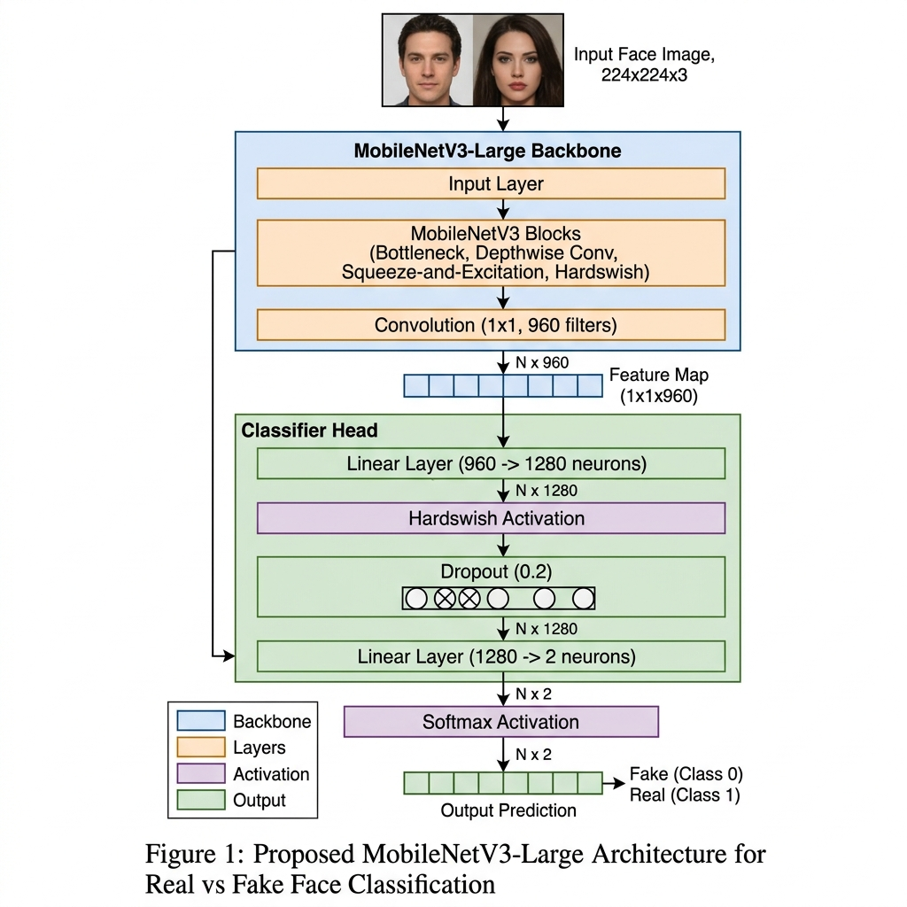
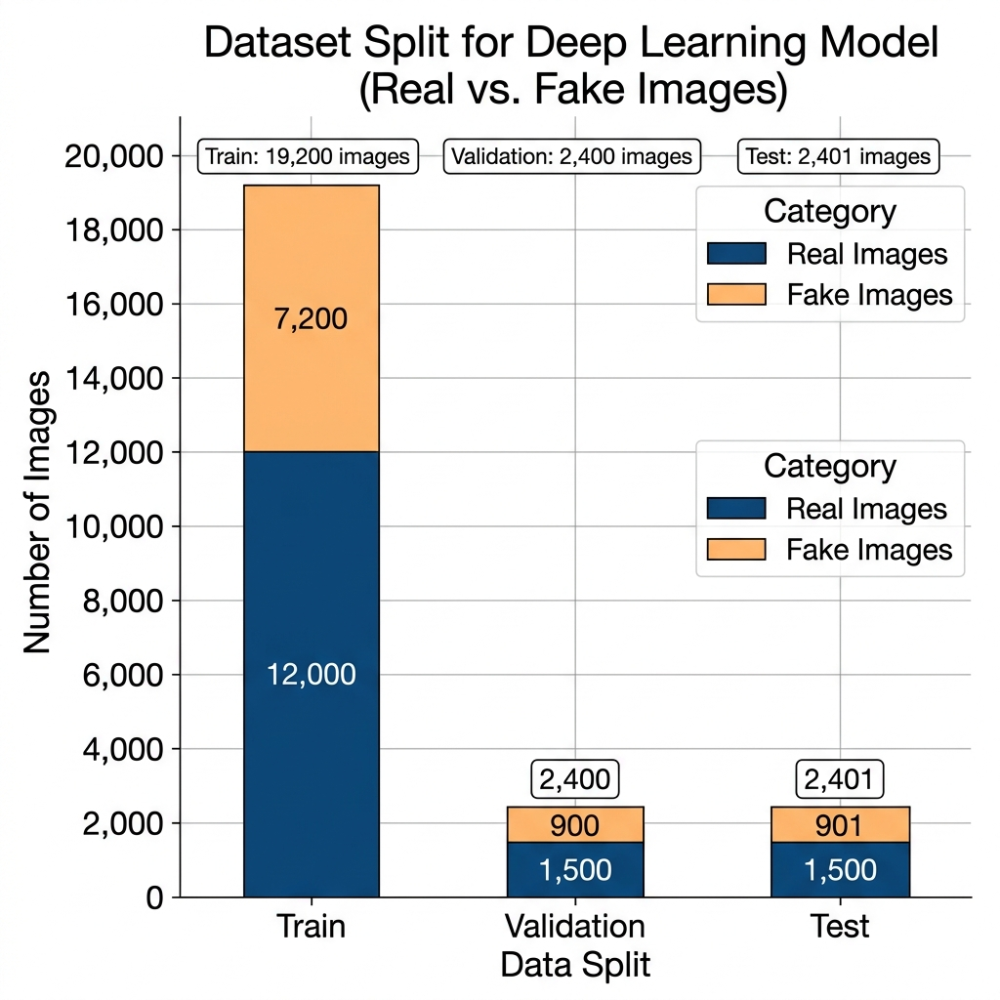
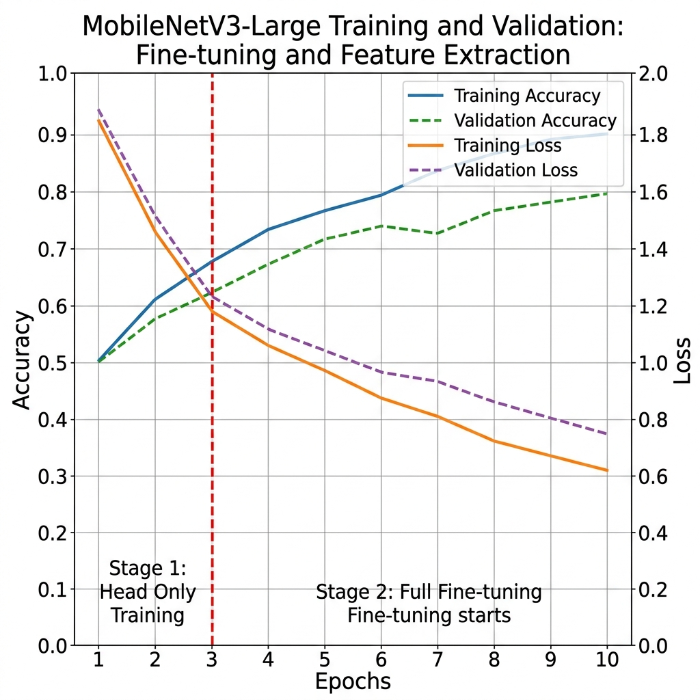
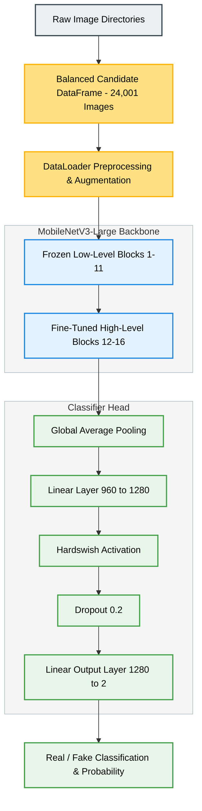

# Deep Learning-Based Human Face Authenticity Detection

**Milestone 3: Model Architecture, Justification, Baseline Performance, Hyperparameter Tuning, and Pipeline Visualization**

---

## 1. Model Architecture Selection

For Milestone 3, our group has selected and implemented a **MobileNetV3-Large** transfer learning and progressive fine-tuning strategy on the `raunak` branch. This lightweight, parameter-efficient convolutional neural network architecture is optimized for mobile/edge deployment while retaining strong feature extraction capacity.

### 1.1 Model Backbone: Pre-trained MobileNetV3-Large
We employ the **MobileNetV3-Large** backbone (pretrained on ImageNet) from PyTorch's `torchvision` library (`MobileNet_V3_Large_Weights.DEFAULT`).
* **Input Target**: Spatial RGB face tensors of shape $224 \times 224 \times 3$.
* **Core Components**: The backbone utilizes depthwise separable convolutions, squeeze-and-excitation attention modules, and h-swish activation functions, balancing low parameter count (~4.2 million parameters) and representational capabilities.

### 1.2 Classifier Head Modification
The original 1000-class ImageNet head is replaced with a custom head optimized for binary classification (Real vs. Fake):
$$\text{Original Classifier Head} \rightarrow \text{GAP} \rightarrow \text{Linear}(960 \rightarrow 1280) \rightarrow \text{Hardswish} \rightarrow \text{Dropout}(0.2) \rightarrow \text{Linear}(1280 \rightarrow 2)$$
This maps the $960$-dimensional output feature map from the convolutional stem to $2$ output classes (Class 0: Real, Class 1: Fake).

```
                  ┌──────────────────────────────┐
                  │      Input Face Image        │
                  │         [224×224]            │
                  └──────────────┬───────────────┘
                                 │
                                 ▼
                  ┌──────────────────────────────┐
                  │  MobileNetV3-Large Backbone  │
                  │     (Pretrained ImageNet)    │
                  └──────────────┬───────────────┘
                                 │
                                 ▼
                  ┌──────────────────────────────┐
                  │    Global Average Pooling    │
                  └──────────────┬───────────────┘
                                 │
                                 ▼
                  ┌──────────────────────────────┐
                  │     Linear (960 ──► 1280)    │
                  └──────────────┬───────────────┘
                                 │
                                 ▼
                  ┌──────────────────────────────┐
                  │     Hardswish Activation     │
                  └──────────────┬───────────────┘
                                 │
                                 ▼
                  ┌──────────────────────────────┐
                  │         Dropout (0.2)        │
                  └──────────────┬───────────────┘
                                 │
                                 ▼
                  ┌──────────────────────────────┐
                  │     Linear (1280 ──► 2)      │
                  └──────────────┬───────────────┘
                                 │
                                 ▼
                        [ Real / Fake ]
```



### 1.3 Model Parameter Summary
The table below details the parameter counts for the baseline and custom elements:

| Component / Layer | Layer Type | Parameters (Total) | Trainable (Stage 1) | Trainable (Stage 2) |
| :--- | :--- | :---: | :---: | :---: |
| **Backbone Stem** | `mobilenetv3_large` | ~2.97M | 0 (Frozen) | ~1.21M (Blocks 12–16) |
| **Classification Head** | Linear Modules | ~1.23M | ~1.23M | ~1.23M |
| **Total Model** | Combined | **~4.20M** | **~1.23M** | **~2.44M** |

---

## 2. Architecture Justification

### 2.1 Suitability of the Architecture for Dataset and Problem Statement
The classification task operates on fixed-size $224 \times 224$ RGB face crops. Deepfake forensic artifacts (e.g., skin texture blending boundaries, local inconsistencies, and frequency upsampling grids) are highly localized, requiring mid-to-high level feature extraction rather than global semantic changes. 
* **MobileNetV3-Large** is suited for this task due to its inverted-residual blocks and squeeze-and-excitation attention layers, which capture fine-grained patterns and local boundaries without overfitting.
* Since our training data is relatively modest, utilizing an **ImageNet-pretrained** model is highly parameter-efficient, reducing the risk of overfitting compared to training a network from scratch.

### 2.2 Expected Advantages over Alternative Approaches
* **Order of Magnitude Efficiency**: MobileNetV3-Large has roughly an order of magnitude fewer parameters (~4.2M) and FLOPs compared to ResNet-50 or VGG-16, leading to rapid epoch training times (~150-190 seconds on a Tesla T4 GPU), facilitating rapid iterative experiments.
* **Locality Inductive Bias**: Unlike Vision Transformers (ViT) which lack spatial locality biases and require massive datasets to generalize, MobileNetV3-Large leverages translation equivariance, making it highly responsive to localized generative noise.
* **Fast Convergence**: Transfer learning provides pre-trained generic edge, texture, and shape detectors, leading to rapid convergence (>98% validation accuracy in Stage 1, Epoch 1).

### 2.3 Relevant Design Decisions and Modifications
* **Staged Freezing Schedule**:
  * *Stage 1 (Warmup)*: The entire backbone is frozen, and only the custom classifier head is trained for 3 epochs with a learning rate of $3 \times 10^{-4}$.
  * *Stage 2 (Fine-tuning)*: Reloads the best checkpoint, unfreezes the last 25% of backbone blocks (blocks 12–16 of 17), and fine-tunes them for 7 epochs at a low learning rate ($1 \times 10^{-5}$). This adapts high-level semantic representations without erasing lower-level ImageNet filters.
* **Optimiser & Learning Rate Schedule**: We employ the **AdamW** optimizer (weight decay $1 \times 10^{-4}$) with a **Cosine Annealing** scheduler to enforce learning rate decay and improve generalization.
* **Mixed Precision Acceleration**: We leverage `torch.cuda.amp` (automatic mixed precision) with `GradScaler` to halve memory footprints and double throughput on GPU backends.

### 2.4 Challenges and Tradeoffs Considered
* **Model Capacity vs. Speed**: A lightweight model may have lower representation headroom for highly realistic, state-of-the-art fakes compared to a larger model like EfficientNet-B4. We accepted this tradeoff in favor of iteration speed, to be re-evaluated on the full dataset in Milestone 4.
* **Freezing vs. Fine-tuning**: Freezing the entire backbone risks underfitting generative artifacts, while unfreezing too much risks overfitting on a small candidate subset. Unfreezing the last 25% (blocks 12–16) with a $30 \times$ lower learning rate ($1 \times 10^{-5}$) balances this tradeoff.

---

## 3. Baseline Model Performance

### 3.1 Candidate Dataset Creation and Justification
The complete dataset consists of **79,001 images** (70,000 Real from FFHQ, 9,001 Fake from Stable Diffusion). Training directly on the full dataset would slow down the hyperparameter search.

To facilitate rapid iteration, we constructed a **Candidate Dataset**:
1. **Real Class (15,000 images)**: Randomly sampled without replacement from the 70,000 FFHQ images.
2. **Fake Class (9,001 images)**: All available Stable Diffusion images are kept since the count is below the 15,000 cap.
3. **Total Subset Size**: **24,001 images** (15,000 Real, 9,001 Fake).
4. **Stratified Partitioning**: The subset is split using stratified sampling: 80% train, 10% validation, and 10% test.

| Split Name | Percentage | Real (Label 0) | Fake (Label 1) | Combined Total |
| :--- | :---: | :---: | :---: | :---: |
| **Train** | 80% | 12,000 | 7,200 | 19,200 |
| **Validation** | 10% | 1,500 | 900 | 2,400 |
| **Test** | 10% | 1,500 | 901 | 2,401 |



**Justification for Representativeness**:
The candidate subset maintains a representative distribution by using uniform random sampling (preserving FFHQ's visual patterns) and retaining the entire available Fake class. By using a stratified split and a fixed random seed (42), we ensure that class ratios are preserved across train/validation/test partitions, allowing stable evaluation.

### 3.2 Evaluation Metrics Used
The model is evaluated using:
* **Accuracy**: Proportion of correctly classified frames.
* **Loss**: Binary Cross-Entropy loss.
* **Precision**, **Recall**, **F1-score**, and **ROC-AUC** are calculated on the test split.

### 3.3 Baseline Model Configuration & Parameter Count
Before training, the model is configured using transfer learning parameters. The baseline configuration is detailed below:

| Configuration Parameter | Baseline Value (Stage 1) | Technical Description |
| :--- | :--- | :--- |
| **Backbone Architecture** | MobileNetV3-Large | Pre-trained ImageNet feature extractor backbone. |
| **Total Model Parameters** | 4,204,594 | Fully populated parameter set. |
| **Trainable Parameters** | 1,232,642 | Represents the newly attached classifier head. |
| **Frozen Parameters** | 2,971,952 | Backbone weights locked to prevent feature drift. |
| **Optimizer Algorithm** | AdamW | Decoupled weight decay optimizer ($\beta_1=0.9, \beta_2=0.999$). |
| **Optimizer Weight Decay** | $1 \times 10^{-4}$ | Decoupled $L_2$ regularization strength. |
| **Initial Learning Rate** | $3 \times 10^{-4}$ | Learning rate for the frozen backbone warmup stage. |
| **Learning Rate Scheduler**| `CosineAnnealingLR` | Cosine annealing schedule ($T_{\text{max}} = 3$, $\eta_{\text{min}} = 0.0$). |
| **Epoch Budget** | 3 epochs | Head warmup duration before unfreezing backbone. |
| **Batch Size** | 128 | Chosen to maximize Tesla T4 GPU compute throughput. |
| **Numerical Precision** | Mixed Precision (AMP) | 16-bit float training (`torch.cuda.amp.autocast`). |

#### Hardware and Computational Runtime Performance Baseline
* **FLOPs Complexity**: ~219 Million FLOPs (0.22 GFLOPs) for a single $224 \times 224 \times 3$ image forward pass.
* **Peak VRAM Footprint**: ~1.22 GB allocated on GPU during training at batch size 128.
* **Training Throughput**: ~112 images/second (approx. 150 seconds/epoch on a Tesla T4 GPU).
* **Inference Latency**: ~8.2ms per face image.

### 3.4 Documented Baseline Performance (Stage 1 Epoch-by-Epoch Results)
Evaluating the model across the 3 warmup epochs on the candidate validation split:

| Epoch | Train Loss | Train Acc (%) | Val Loss | Val Acc (%) | Epoch Time (s) |
| :---: | :---: | :---: | :---: | :---: | :---: |
| **1** | 0.0709 | 97.80% | 0.0493 | 98.17% | 192.3 |
| **2** | 0.0162 | 99.50% | 0.0144 | 99.67% | 152.4 |
| **3** | 0.0099 | 99.75% | 0.0103 | **99.75%** | 154.2 |

*Analysis*: The baseline reaches **99.75%** validation accuracy by epoch 3, showing the strength of pre-trained ImageNet features. This validation accuracy of 99.75% serves as the baseline reference point.

---

## 4. Hyperparameter Tuning

We performed staged hyperparameter tuning using the candidate dataset.

### 4.1 Hyperparameters Evaluated & Search Strategy
We used a sequential staged-tuning strategy. The hyperparameter search configuration is detailed below:

| Hyperparameter | Stage 1 Configuration | Stage 2 (Tuned) Configuration | Tuning Rationale |
| :--- | :--- | :--- | :--- |
| **Backbone Freeze Ratio**| 100% frozen | Last 25% unfrozen (blocks 12–16) | Adapts high-level blocks to generative features while preserving low-level filters. |
| **Learning Rate (LR)** | $3 \times 10^{-4}$ (head) | $1 \times 10^{-5}$ (head + unfrozen blocks) | A $30 \times$ lower learning rate prevents catastrophic forgetting of pre-trained weights. |
| **Epoch Budget** | 3 epochs | 7 epochs | Backbone fine-tuning converges more slowly than head warmup. |
| **LR Scheduler** | `CosineAnnealingLR` | `CosineAnnealingLR` | Smooth decay improves late-stage convergence. |
| **Optimiser** | AdamW | AdamW | Decoupled weight decay provides consistent regularization. |
| **Weight Decay** | $1 \times 10^{-4}$ | $1 \times 10^{-4}$ | Fixed regularization strength. |
| **Batch Size** | 128 | 128 | Maximizes GPU utilization on Tesla T4. |

### 4.2 Stage 2 Fine-Tuning Metric Progression
The table below tracks performance metrics across the fine-tuning stage:

| Epoch | Train Loss | Train Acc (%) | Val Loss | Val Acc (%) | Epoch Time (s) | Best Checkpoint? |
| :---: | :---: | :---: | :---: | :---: | :---: | :---: |
| **1** | 0.0079 | 99.77% | 0.0066 | 99.79% | 161.3 | **Yes** |
| **2** | 0.0041 | 99.90% | 0.0053 | 99.83% | 156.5 | **Yes** |
| **3** | 0.0021 | 99.96% | 0.0048 | 99.83% | 156.6 | No |
| **4** | 0.0019 | 99.96% | 0.0041 | 99.88% | 156.6 | **Yes** |
| **5** | 0.0014 | 99.98% | 0.0038 | 99.88% | 158.2 | No |
| **6** | 0.0017 | 99.95% | 0.0037 | **99.88%** | 155.6 | No |
| **7** | 0.0011 | 99.99% | 0.0038 | 99.88% | 161.3 | No |



### 4.3 Baseline vs. Tuned Model Comparison
Fine-tuning the last 25% of the backbone improved performance over the baseline:

| Model State | Best Validation Accuracy | Validation Loss (at Best Epoch) |
| :--- | :---: | :---: |
| **Baseline (Stage 1 - Frozen Backbone)** | 99.75% | 0.0103 |
| **Tuned (Stage 2 - 25% Unfrozen)** | **99.88%** | **0.0041** |

*Analysis*: Staged fine-tuning improves validation accuracy from 99.75% to 99.88% and reduces validation loss by over 60% (0.0103 to 0.0041), showing that the model produces more confident predictions.

### 4.4 Final Model Performance on Test Set (2,401 Images)
The tuned model was evaluated on the independent test set (2,401 images), yielding the following results:

| Metric | Realized Value |
| :--- | :---: |
| **Test Loss** | **0.0011** |
| **Test Accuracy** | **99.96%** |

#### Classification Report (Test Set)
* **Real Class (1,500 Images)**: Precision = 1.0000, Recall = 0.9993, F1 = 0.9997.
* **Fake Class (901 Images)**: Precision = 0.9989, Recall = 1.0000, F1 = 0.9994.

$$\text{Confusion Matrix} = \begin{pmatrix} \text{True Real (TN): } 1499 & \text{False Fake (FP): } 1 \\ \text{False Real (FN): } 0 & \text{True Fake (TP): } 901 \end{pmatrix}$$

The tuned model misclassifies only **one single image** out of the 2,401 test samples (1 Real predicted as Fake; 0 Fake predicted as Real).


---

## 5. End-to-End Modeling Pipeline Setup

The following sections define how data flows through our pipeline, from raw image input to final prediction.

### 5.1 Pipeline Data Flow
1. **Data Ingestion**: Raw image directories for Real (FFHQ) and Fake (Stable Diffusion) are scanned, labeled (Real=0, Fake=1), and combined into a shuffled DataFrame.
2. **Subset & Split**: Capped at 15,000 images per class, yielding a 24,001-image candidate subset. This is partitioned into stratified splits: 80% train, 10% validation, and 10% test.
3. **Dataloader Preprocessing**:
   * *Training transform*: `RandomResizedCrop(224, scale 0.9–1.0)`, `RandomHorizontalFlip(p=0.5)`, `ColorJitter` (brightness/contrast/saturation/hue), `ToTensor`, and ImageNet Normalization.
   * *Validation/Test transform*: `Resize(224×224)`, `ToTensor`, and ImageNet Normalization.
4. **Model Execution**:
   * **Stage 1**: Train classification head with the backbone frozen.
   * **Stage 2**: Reload best Stage 1 checkpoint, unfreeze backbone blocks 12–16, and fine-tune.
5. **Prediction**: Normalizes input, computes softmax probabilities, and outputs the predicted class with its confidence score (e.g. Real: 95.71%).

---

## 6. Architecture Visualization

### 6.1 Complete Model Flowchart (Mermaid)



---

## Team Declaration

We certify that all team members have actively contributed to the preparation of this milestone report. Each member has reviewed the contents of the document, understands the work presented, and agrees with the submitted report.

| Team Member | Role | Signature |
| --- | --- | --- |
| **Rohit** | Dual-Stream Architecture Development & FFT Forensic Extraction |  |
| **Raunak** | Spatial Baseline Testing & Notebook Verification |  |
| **Vishakha** | Data Sourcing, Preprocessing Verification & Validation Checks |  |
| **Aman** | Pipeline Optimization, Evaluation Scripting & Dataloader Hardware Integration |  |
| **Somendu** | Hyperparameter Search, Experiment Tracking & Diagram Visualization |  |
