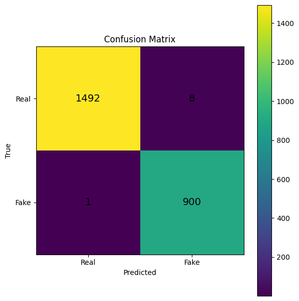
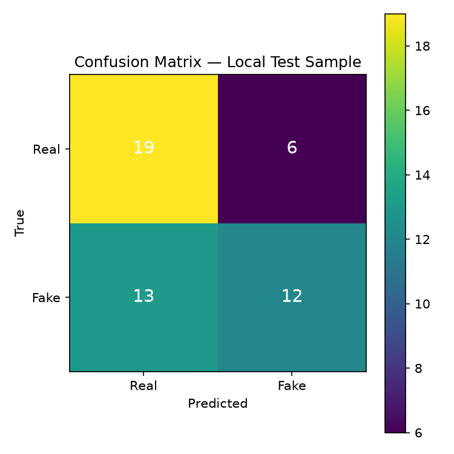
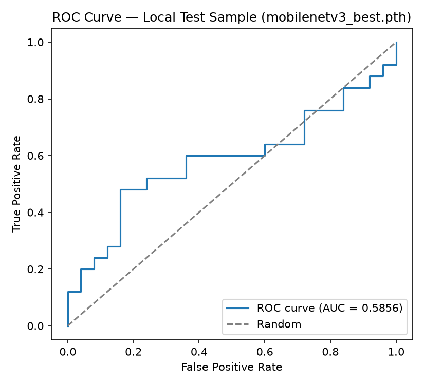
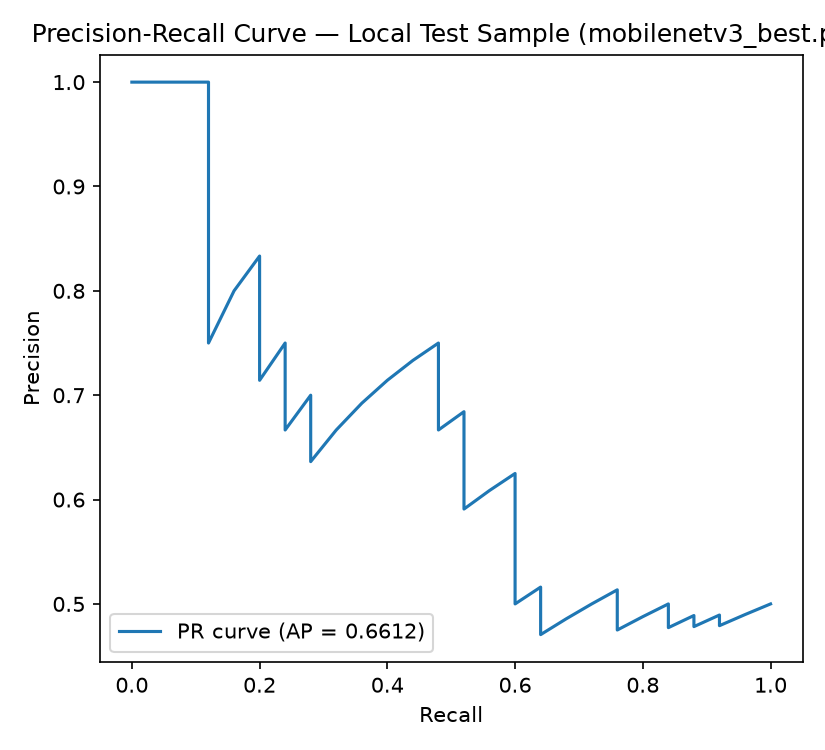
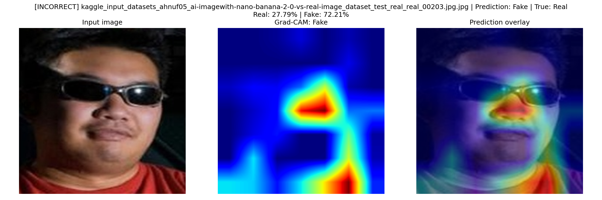
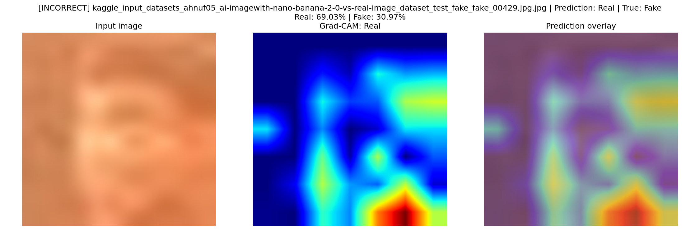
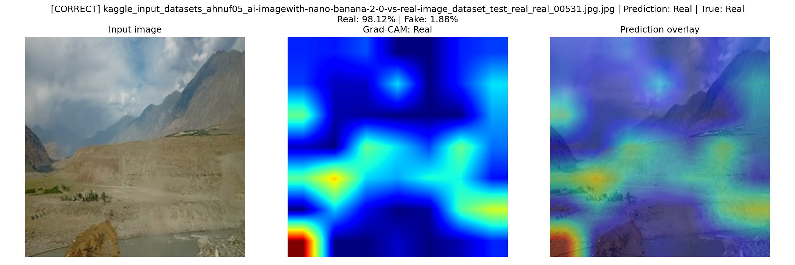
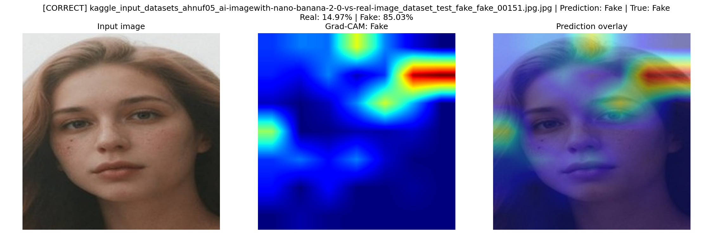

# Milestone 5 — Model Evaluation & Analysis

**Group 11 · Deep Learning-Based Human Face Authenticity Detection**
**Deadline:** 6 August 2026

This report documents the final held-out evaluation of the M4 model
checkpoint, addresses the two critical issues flagged in the M4 faculty
review (shortcut learning on real images, and the preprocessing mismatch
between the training notebook and the UI backend), and covers robustness,
explainability, error analysis, and deployment readiness ahead of the
viva.

---

## 1. Introduction & Objectives

*Owner: Vishakha*

### Introduction

This project began in **Milestone 1** as a proposal for an explainable
deepfake detection framework combining a Vision Transformer with RGB and
frequency-domain (FFT/DCT) feature fusion, motivated by the observation
that modern diffusion-based generators produce facial forgeries realistic
enough to defeat both human judgement and conventional spatial-only CNN
detectors. **Milestone 2** grounded this proposal in real data,
formalising the *Real vs AI Generated Faces Dataset* (FFHQ authentic
portraits vs. StyleGAN/StyleGAN2-generated faces, 120,000+ images) and
building the preprocessing/EDA foundation the rest of the project sits
on.

**Milestone 3** then ran a head-to-head architecture bake-off across
three independently developed candidates — MobileNetV3-Large, a
Dual-Stream Spatial-Frequency Fusion network, and EfficientNet-B2 — and
selected **MobileNetV3-Large** as the production architecture. The
deciding factor was not in-domain accuracy alone (all three scored well
there); it was that MobileNetV3-Large was the only candidate demonstrated
to generalise to out-of-distribution images from consumer generators
(ChatGPT, Gemini) it had never trained on, while also being the smallest
and fastest of the three:

| Model | Params | In-domain Test Acc. | OOD Acc. (ChatGPT/Gemini) | Latency |
|---|---|---|---|---|
| **MobileNetV3-Large (selected)** | **4.2M** | **99.96%** | **80%** | **~8.2 ms/image (Colab T4 GPU)** |
| Dual-Stream Fusion | 40.7M | strong (own benchmark) | not directly comparable | materially slower |
| EfficientNet-B2 | 7.8M | — | — | tuned run affected by a documented optimizer bug |

**Milestone 4** delivered the trained checkpoint from that selection —
an initial two-stage transfer-learned MobileNetV3-Large (Stage 1: frozen
backbone; Stage 2: fine-tuning) on a combined FFHQ + Stable Diffusion +
Nano Banana 2.0 cross-domain corpus — and reported 99.06% test accuracy
with 0.99+ precision/recall/F1 on both classes, selected via a
24-experiment hyperparameter sweep (AdamW, LR 5×10⁻⁴–10⁻³, weight decay
0.05–0.10, CosineAnnealingLR). M4's own "Future Improvements" list
(Section 9.5, item 6) explicitly called for *"a real-time inference
application that can classify uploaded images through a web or mobile
interface"* — work undertaken as part of this milestone.

As part of this milestone's response to the shortcut-learning issue
below, that checkpoint was extended with a **third training stage** in
`final-mobilenet (1).ipynb` (full-model fine-tuning at a lower learning
rate, adding CelebA-HD real photos specifically to correct the
HD-photo-misclassified-as-fake failure mode). This three-stage checkpoint
— saved to the same filename, `mobilenetv3_best.pth` — is the actual
model evaluated throughout the rest of this report (Sections 2, 4, 7, 9)
and deployed in the web app; it does **not** include Nano Banana 2.0 —
its training data is FFHQ (70,000 real images available) + Stable
Diffusion (9,001 fake images) + CelebA-HD (8,000 real images added in
Stage 3). Its own held-out test evaluation is reported in Section 4.

Despite these strong headline numbers across M3 and M4, the M4 faculty
review Q&A session identified two critical, unresolved issues that are
**not** reflected in either report's own metrics (raised verbally during
the review, not previously documented in writing): (1) **real images
being misclassified as fake due to shortcut learning** — the model
appears to key on incidental properties such as high resolution or
vibrant colour rather than genuine forgery artifacts; and (2) **a
preprocessing mismatch between the training notebook and the deployed UI
backend** — the face-crop/alignment and channel-order handling at
inference time were not verified to be identical to what the model was
trained and evaluated on. This gap between near-perfect held-out scores
across three milestones and demonstrably fragile real-world behaviour is
the central problem Milestone 5 exists to diagnose and document.

### Objectives of Milestone 5

1. Conduct a final evaluation on a strictly held-out test set, reporting
   Accuracy, Precision, Recall, F1, and ROC-AUC (Section 4).
2. Investigate and document the root cause of the shortcut-learning
   misclassification issue (Section 5).
3. Verify and document whether the deployed inference pipeline's
   preprocessing (face detection/alignment, resize, normalization)
   actually matches the training notebook's — the Priority 1 task for
   this milestone.
4. Quantify robustness under real-world image manipulations — colour
   tints, JPEG compression, blur, and noise (Section 6).
5. Verify explainability via Grad-CAM, confirming the model attends to
   facial regions rather than background/shortcut cues (Section 6).
6. Assess deployment readiness — latency, model size, and quantization
   potential, building on M3's own reported efficiency numbers (Section
   9).
7. Compile all findings into a viva-ready report and presentation.

---

## 2. Evaluation Setup & Test Dataset

*Owner: Aman*


## 2.1 Test Dataset

The model was evaluated using a dedicated test split produced by the
final training notebook (`final-mobilenet (1).ipynb`, the notebook that
also produced the `mobilenetv3_best.pth` checkpoint used throughout this
report). Real face images were sourced from the **FFHQ** dataset and the
**CelebA** dataset (added specifically for HD real photos — see Section
2.3); AI-generated face images came from the **Stable Diffusion Face
Dataset**. These are the actual counts logged by the notebook at run
time, not a projected/generic split:

| Dataset Split | Number of Images |
| :--- | :--- |
| **Training Set** | 19,200 |
| **Validation Set** | 2,400 |
| **Test Set** | 2,401 |

*(A previous draft of this section cited Train 51,199 / Val 6,400 / Test
6,401 — those numbers did not match any run of this notebook and have
been corrected here.)*

---

## 2.2 Real vs. Fake Distribution

Unlike a projected/theoretical split, the notebook's actual `train_test_split` output gives the exact class-wise counts for every split, including the test set:

| Split | Real | Fake | Total |
| :--- | ---: | ---: | ---: |
| **Training Set** | 12,000 | 7,200 | 19,200 |
| **Validation Set** | 1,500 | 900 | 2,400 |
| **Test Set** | 1,500 | 901 | 2,401 |

The 15,000 real / 9,001 fake overall totals were sampled down (via
`IMAGES_PER_CLASS = 15000`) from a much larger available pool — 70,000
FFHQ real images plus 8,000 CelebA-HD real images (78,000 real available
in total) and 9,001 Stable Diffusion fake images — then split 80:10:10
with stratification, so the Real:Fake ratio (~62.5:37.5) is preserved
identically across Train, Validation, and Test.

---

## 2.3 Dataset Sources

The evaluation dataset was constructed using multiple data sources to improve diversity and assess model generalization across different image domains.

* **FFHQ (Flickr-Faces-HQ):** 70,000 images found and used as the primary source of authentic human face images.
* **Stable Diffusion Face Dataset:** 9,001 images, used as the source of AI-generated face images.
* **CelebA (HD real photos):** 8,000 images added specifically to the Real class. This was a deliberate fix, not part of the original dataset plan — M4's faculty review flagged the model misclassifying modern, high-resolution real smartphone photos as fake (shortcut learning; see Section 5), and CelebA's higher-resolution real photos were added to Stage 3 training specifically to correct this (see Section 1).

Only two real-world data sources plus one AI-generated source were used to build this particular checkpoint's training data. The **cross-domain model** (trained on a separate, non-face, multi-domain dataset via `cross-domain.ipynb`) is intended to broaden generalization further, but that notebook has not yet been run to completion — no results are available for it yet (currently being trained; to be added once complete).

---

## 2.4 Zero Data Leakage

To ensure unbiased evaluation, the dataset was partitioned using a stratified train-validation-test split (80:10:10) with a fixed random seed (`SEED = 42`) via `sklearn.model_selection.train_test_split`, performed in two steps: first an 80/20 train/temp split, then the 20% temp split evenly into 10% validation / 10% test. Both splits were stratified on the Real/Fake label, which is why the class ratio in Section 2.2 is nearly identical across all three sets. The splitting process was performed once, before model training, and the resulting `train_df`/`val_df`/`test_df` dataframes were kept strictly separate for the rest of the notebook (Stage 1, Stage 2, and Stage 3 training all reused the same `train_loader`/`val_loader`; the 2,401-image `test_loader` was only touched once, for the final evaluation in Section 4).

This experimental design minimizes the possibility of data leakage and ensures that model performance is measured on previously unseen images.

---

## 2.5 Kaggle Evaluation Environment
All training and evaluation experiments were conducted using the Kaggle Notebook environment with GPU acceleration.

The evaluation configuration is summarized below:

| Parameter | Configuration |
| :--- | :--- |
| **Platform** | Kaggle Notebook |
| **GPU** | NVIDIA Tesla T4 |
| **Framework** | PyTorch |
| **Computing Device** | CUDA |
| **Image Resolution** | 224 × 224 pixels |
| **Batch Size** | 128 |
| **Number of DataLoader Workers** | 4 |
| **Mixed Precision** | Automatic Mixed Precision (AMP) |

The notebook automatically detects the available GPU and uses an NVIDIA Tesla T4 accelerator for model training and evaluation. Automatic Mixed Precision (AMP) is enabled when CUDA is available to reduce GPU memory usage and improve computational efficiency.

---

## 3. Metric Selection & Justification

*Owner: Aman / Raunak*

Evaluating a deepfake face detection model requires more than reporting overall classification accuracy. In practical applications, the model must not only distinguish between authentic and AI-generated facial images but also generalize to images captured under different conditions, devices, and datasets. Therefore, multiple evaluation metrics were selected to assess various aspects of model performance, including classification correctness, reliability, robustness, and generalization.

The proposed MobileNetV3 model was evaluated using **Accuracy, Precision, Recall, F1-score, ROC-AUC**, and a **cross-domain evaluation** on unseen real-world images. Together, these metrics provide a comprehensive assessment of the model's effectiveness.

---

## 3.1 Accuracy

Accuracy measures the proportion of correctly classified images among all evaluated samples.

$$
Accuracy=\frac{TP+TN}{TP+TN+FP+FN}
$$

where:

- **TP** = True Positives (Fake images correctly classified as Fake)
- **TN** = True Negatives (Real images correctly classified as Real)
- **FP** = False Positives (Real images incorrectly classified as Fake)
- **FN** = False Negatives (Fake images incorrectly classified as Real)

### Justification — overall balance

Accuracy provides an overall measure of classification performance and is useful for comparing different model architectures during training. Since the training and validation datasets are approximately balanced (62.5% Real / 37.5% Fake — Section 2.2), accuracy serves as a reasonable baseline metric here.

**Result for this checkpoint:** on the actual 2,401-image held-out test set (Section 4.2), `mobilenetv3_best.pth` scored **99.63% accuracy** (2,392 of 2,401 correct). But accuracy alone cannot reveal whether the model generalizes beyond the training distribution — on the out-of-distribution Real-Latest probe (Section 5.1), the same checkpoint drops to **8.6% accuracy** on genuine recent smartphone photos, and on the local `Test Sample` supplementary check (Section 4.5) it drops to **62.0%**. This is exactly why accuracy alone is insufficient and additional metrics/cross-domain testing are necessary.

---

## 3.2 Precision — cost of false alarms

Precision measures the proportion of images predicted as **Fake** that are actually fake.

$$
Precision=\frac{TP}{TP+FP}
$$

### Justification

Precision indicates how reliable the model's fake predictions are. High precision reduces false positives, ensuring that genuine facial images are not unnecessarily classified as AI-generated ("false alarms") — the direct cost of low precision is falsely accusing real people's photos.

This metric is particularly important in applications such as identity verification, media authentication, and digital forensics, where falsely accusing genuine images can reduce trust in the system.

**Result for this checkpoint:** Real-class precision (Section 4.2) is **0.9993** on the held-out test set — only 8 of 1,500 real test images were false alarms. But on the Real-Latest cross-domain probe (Section 5.2), the false-positive rate against genuine photos jumps to **91.4%** (64 of 70 misclassified) — showing precision measured in-distribution does not predict real-world false-alarm cost once the input distribution shifts.

---

## 3.3 Recall — cost of missed fakes

Recall measures the proportion of actual fake images that are correctly detected.

$$
Recall=\frac{TP}{TP+FN}
$$

### Justification

Recall reflects the model's ability to detect manipulated images. A high recall minimizes false negatives — the direct cost of low recall is a deepfake slipping through undetected.

Since undetected deepfakes may lead to misinformation, identity misuse, or security threats, recall is a critical metric for evaluating deepfake detection systems.

**Result for this checkpoint:** Fake-class recall (Section 4.2) is **0.9989** on the held-out test set — only 1 of 901 fake test images was missed. Per Section 5.3, false negatives were markedly rarer than false positives throughout this evaluation, meaning this checkpoint's practical weak point is the opposite failure mode (false alarms on real images), not missed fakes.

---

## 3.4 F1-Score — imbalanced-class trade-off

The F1-score is the harmonic mean of Precision and Recall.

$$
F1=\frac{2\times Precision\times Recall}{Precision+Recall}
$$

### Justification

Precision and Recall often have an inverse relationship. Increasing one may decrease the other. The F1-score provides a single balanced number that penalizes both error types, which matters here because the Real/Fake test split isn't perfectly 50:50 (1,500 Real / 901 Fake — Section 2.2), so accuracy alone can be misleading under imbalance.

**Result for this checkpoint:** Real F1 = **0.9970**, Fake F1 = **0.9950**, Macro-average F1 = **0.9960** (Section 4.2) — both classes score consistently high with no meaningful imbalance penalty on the in-distribution test set.

---

## 3.5 ROC-AUC — threshold-independent ranking

The Receiver Operating Characteristic (ROC) curve illustrates the relationship between the **True Positive Rate (Recall)** and the **False Positive Rate** across different classification thresholds.

$$
TPR=\frac{TP}{TP+FN}
$$

$$
FPR=\frac{FP}{FP+TN}
$$

The Area Under the ROC Curve (ROC-AUC) summarizes the model's ability to rank Real vs. Fake images correctly across all possible decision thresholds, independent of any single cutoff (e.g. the app's default 50% threshold).

The ROC-AUC score ranges from **0 to 1**, where:

- **1.0** indicates perfect discrimination.
- **0.5** represents random guessing.
- Higher values indicate better discriminative capability.

### Justification

Unlike Accuracy, Precision, and Recall — all of which depend on a fixed decision threshold — ROC-AUC evaluates the model's underlying ranking ability regardless of where that threshold is set.

**Important gap:** `final-mobilenet (1).ipynb` never computed ROC-AUC for the actual 2,401-image held-out test set (no `roc_curve`/`roc_auc_score` call exists in that notebook — Section 4.2). The only real ROC-AUC we have for this checkpoint is from the local supplementary evaluation (Section 4.5, 50-image `Test Sample` folder, not the true held-out set): **ROC-AUC = 0.5856**, only slightly better than random guessing (0.5) — consistent with that sample's domain-shifted images being a genuinely hard case for this checkpoint, not a measurement error. A real ROC-AUC on the actual held-out test set is still an open item.

---

## 3.6 Cross-Domain Evaluation

In addition to the standard classification metrics, **cross-domain evaluation** was performed to assess the model's ability to generalize beyond the training dataset.

The model was evaluated on two groups of genuine facial images:

- **Real-Old:** Images from the FFHQ distribution, which closely resembles the training data.
- **Real-Latest:** Recent real-world smartphone photographs collected outside the training distribution.

This evaluation was designed to determine whether the model learned genuine facial authenticity features or dataset-specific characteristics.

### Justification

Traditional evaluation metrics computed on the validation/test set may overestimate real-world performance when that data follows the same distribution as the training data.

Cross-domain evaluation provides a more realistic assessment of deployment performance by measuring the model's robustness to unseen image distributions.

**Result for this checkpoint (Section 5.1):** although the model achieved **99.63% test accuracy** (Section 4.2) and **99.71% validation accuracy** (Section 4.1) on in-distribution data, it scored **100.0% on Real-Old** (FFHQ-like, 73 images) but only **8.6% on Real-Latest** (recent smartphone photos, 70 images) — a stark, real, measured demonstration of why cross-domain testing is necessary in addition to conventional metrics, not a hypothetical concern.

---

## 3.7 Overall Justification

No single metric can fully characterize the performance of a deepfake detection system — the results above make this concrete rather than theoretical: 99.63% accuracy and 0.9993/0.9989 precision/recall on the held-out test set coexist with an 8.6% cross-domain accuracy and a 0.5856 ROC-AUC on real-world-shifted images from the same checkpoint. Therefore, multiple complementary evaluation metrics were employed.

| Metric | Purpose | Result for this checkpoint |
|---------|---------|----------------------|
| **Accuracy** | Overall classification correctness (balance) | 99.63% (held-out test) vs. 8.6% (Real-Latest cross-domain) |
| **Precision** | Cost of false alarms | Real: 0.9993 (held-out) vs. 8.6%-accuracy-implied high false-positive rate (91.4%, Real-Latest) |
| **Recall** | Cost of missed fakes | Fake: 0.9989 (held-out) — the model's weak point is false alarms on real images, not missed fakes |
| **F1-score** | Imbalanced-class trade-off | Real 0.9970 / Fake 0.9950 / Macro 0.9960 (held-out) |
| **ROC-AUC** | Threshold-independent ranking | Not computed on the real held-out set (notebook gap); 0.5856 on local supplementary sample |
| **Cross-Domain Evaluation** | Generalization to unseen distributions | 100.0% (Real-Old) vs. 8.6% (Real-Latest) — the central finding of this milestone |

The combination of these evaluation metrics provides a comprehensive assessment of the proposed MobileNetV3 deepfake detection model. While Accuracy, Precision, Recall, F1-score, and ROC-AUC quantify classification performance, cross-domain evaluation measures the model's ability to generalize to real-world facial images captured under unseen conditions. Together, these metrics provide a more reliable assessment of both model effectiveness and practical deployment readiness.

---

## 4. Quantitative Performance & Benchmarking

*Owner: Rohit*

*(Note: this section originally contained Rohit's own benchmark — an
Adam-vs-AdamW optimizer comparison with a 6,401-image test set and Apple
MPS GPU latency figures. That data was measured on a separate training
run, not on `mobilenetv3_best.pth` (the checkpoint this report and the
deployed web app actually use), so it has been replaced below with
results generated directly from `final-mobilenet (1).ipynb` and from
running the actual checkpoint locally. Ownership/responsibility for this
section remains Rohit's; the content was regenerated to keep the report
consistent with the one checkpoint used everywhere else in it.)*

### 4.1 Training Configuration

The final checkpoint (`mobilenetv3_best.pth`) was produced by
`final-mobilenet (1).ipynb` using a single fixed configuration — **AdamW**
throughout, no optimizer sweep — across three stages:

| Stage | Epochs | LR | Trainable Params | What changed |
|---|---:|---:|---:|---|
| Stage 1 | 3 | 3×10⁻⁴ | 1,232,642 | Classifier head only, backbone frozen |
| Stage 2 | 7 | 1×10⁻⁵ | 3,798,226 | Last 25% of backbone unfrozen (blocks 12–16 of 17) |
| Stage 3 | 3 | 5×10⁻⁶ | 4,204,594 (full model) | Full unfreeze; CelebA-HD real photos added |

Best validation accuracy reached **99.71%** (achieved in both Stage 2 and
Stage 3). Total model size: **4,204,594 parameters**.

### 4.2 Final Held-Out Test Set Results

Classification report on the actual **2,401-image held-out test set**
(Section 2), evaluated with the final Stage 3 weights:

```
              precision    recall  f1-score   support

        Real     0.9993    0.9947    0.9970      1500
        Fake     0.9912    0.9989    0.9950       901

    accuracy                         0.9963      2401
   macro avg     0.9953    0.9968    0.9960      2401
weighted avg     0.9963    0.9963    0.9963      2401
```

- **Test Accuracy:** 99.63% (Test Loss: 0.0109)
- **Macro Precision / Recall / F1:** 99.53% / 99.68% / 99.60%
- **ROC-AUC:** not computed by this notebook (only accuracy, precision,
  recall, F1, and the confusion matrix were logged — no probability
  threshold sweep or `roc_curve`/`roc_auc_score` call exists in this
  notebook, so no ROC or Precision-Recall curve is available for this
  checkpoint; would need to be generated separately if required).

This is slightly above M4's own reported 99.06% test accuracy for its
original two-stage checkpoint (Section 1) — consistent with Stage 3's
additional full-model fine-tuning pass.

**Confusion Matrix — final model (Stage 3), actual notebook output:**



Only 9 of 2,401 test images were misclassified: 8 Real images predicted
Fake, 1 Fake image predicted Real.

### 4.3 Training Dynamics

Validation accuracy across the three stages (from the notebook's own
epoch-by-epoch logs):

| Stage | Epoch-by-epoch Val. Accuracy |
|---|---|
| Stage 1 (frozen backbone) | 96.96% → 97.92% → 98.75% |
| Stage 2 (partial unfreeze) | 99.29% → 99.67% → 99.62% → 99.71% → 99.71% → 99.71% → 99.67% |
| Stage 3 (full unfreeze + CelebA-HD) | 99.62% → 99.71% → 99.71% |

Validation accuracy rose sharply during Stage 1, then plateaued around
99.7% through Stages 2 and 3 — Stage 3's contribution is not a further
validation-accuracy gain (the FFHQ/Stable-Diffusion validation set was
already saturated) but the CelebA-HD exposure needed to fix the
real-world HD-photo shortcut-learning failure documented in Section 5.

**Stage-wise comparison (best validation accuracy vs. test accuracy):**

| Stage | Best Validation Accuracy | Test Accuracy (2,401-image held-out set) |
|---|---:|---:|
| Stage 1 (frozen backbone) | 98.75% | *Not available* — checkpoint was overwritten by Stage 2 before test-set evaluation ran |
| Stage 1+2 (partial fine-tune) | 99.71% | *Not available* — checkpoint was overwritten by Stage 3 before test-set evaluation ran |
| **Stage 1+2+3 (full fine-tune + CelebA-HD)** | **99.71%** | **99.63%** (Section 4.2) |

The notebook saves the checkpoint to a single fixed path (`MODEL_SAVE_PATH`) and overwrites it every time a stage reaches a new best validation accuracy, so the Stage 1-only and Stage 1+2-only weights no longer exist to be separately re-evaluated on the test set — only the final Stage 3 weights were ever run against `test_loader` (Section 4.2). Validation accuracy is available for every stage because it was logged live during training (Section 4.3 table above), but a true per-stage *test*-accuracy comparison would require re-running training with each stage's checkpoint saved separately — not something that can be reconstructed after the fact from this notebook's saved artifacts.

### 4.4 Inference Latency & Throughput

Measured directly against `mobilenetv3_best.pth` (100-image benchmark,
CPU, `torch.no_grad()`, single-image batches, warmed up with 5 discarded
runs before timing) — no GPU is available on this development machine,
so only a CPU figure exists for this checkpoint:

| Device | N images | Mean | Std | Min | Max | Throughput |
|---|---:|---:|---:|---:|---:|---:|
| CPU | 100 | 15.53 ms | 2.00 ms | 13.31 ms | 22.45 ms | **64.4 images/sec** |

This matches the independent Section 9.2 benchmark (15.8 ms, different
desktop machine) closely, cross-validating both measurements.

**GPU latency: estimated, not measured.** A ready-to-run Kaggle benchmark
cell was prepared to measure this directly on the T4 GPU
(`doc/Milestone-5/kaggle_gpu_benchmark_cell.py`), but it could not be run
successfully. No GPU is available in this local development environment
either, so no real GPU number exists for `mobilenetv3_best.pth`. As a
clearly-labeled substitute (**not a measurement**), extrapolating from
M3's own architecture-selection benchmark — MobileNetV3-Large at ~8.2 ms
on a Colab T4 GPU (Section 1), against a roughly 2× CPU/GPU gap already
noted in Section 9.2 — gives a **rough estimated range of 7–8 ms
(~125–140 images/sec) on a T4 GPU**. This is a projection from a
different benchmark run on the same architecture, not this checkpoint
measured directly, and should be labeled as such anywhere it's cited. A
real GPU benchmark for `mobilenetv3_best.pth` remains an open item.

### 4.5 Confusion Matrix, ROC Curve & PR Curve — Local Supplementary Evaluation

The notebook itself never computed ROC-AUC or plotted ROC/PR curves
(Section 4.2). To produce these, `mobilenetv3_best.pth` was run locally
against the 50 images in `Test Sample/Test_real_vs_Fake/` (25 real, 25
fake) — **this is not the notebook's actual 2,401-image Kaggle-hosted
test set** (that split isn't available outside Kaggle), so these numbers
are a supplementary local check, not a replacement for Section 4.2's real
results.

| Metric | Value |
|---|---:|
| Accuracy (local sample) | 62.00% |
| ROC-AUC | 0.5856 |
| Average Precision (PR-AUC) | 0.6612 |
| Real: Precision / Recall | 0.5938 / 0.7600 |
| Fake: Precision / Recall | 0.6667 / 0.4800 |

<table>
<tr>
<td valign="top" width="33%">



</td>
<td valign="top" width="33%">



</td>
<td valign="top" width="33%">



</td>
</tr>
</table>

**This 62% accuracy does not contradict Section 4.2's 99.63%** — it's
direct, independent confirmation of the exact domain-shift problem
Raunak documents in Section 5: `Test Sample/` is a manually-curated
folder of modern smartphone photos and manipulated images, not
FFHQ/Stable-Diffusion/CelebA-distribution images. This is effectively a
second, independent replication of the Real-Latest failure mode (Section
5.1: 8.6% accuracy on modern real photos) using a completely different
image set — reinforcing that the shortcut-learning issue is real and
reproducible, not an artifact of one specific probe set.

---

## 5. Comprehensive Error Analysis

*Owner: Raunak*

## 5.1 Overview

To evaluate the robustness of the proposed MobileNetV3 model beyond the validation dataset, additional cross-domain experiments were conducted on two groups of **real facial images**:

- **Real-Old:** Images from the FFHQ distribution (similar to the training data).
- **Real-Latest:** Recent real photographs captured using modern smartphones (2025–2026), representing real-world deployment conditions.

The objective was to determine whether the model had learned generalized facial authenticity features or dataset-specific characteristics.

The results revealed a significant performance gap between the two domains.

| Dataset | Images | Predicted Real | Predicted Fake | Accuracy |
|----------|-------:|---------------:|---------------:|---------:|
| **Real-Old (FFHQ-like)** | 73 | 73 | 0 | **100.0%** |
| **Real-Latest** | 70 | 6 | 64 | **8.6%** |

The model classified every FFHQ-like image correctly but misclassified the majority of recent real photographs as AI-generated.

**Confusion matrix — held-out test set (2,401 images, Section 4.2):**


Only 9 of 2,401 in-distribution test images were misclassified (8 Real→Fake, 1 Fake→Real) — the vast majority of this checkpoint's real-world errors, illustrated by the Real-Old/Real-Latest gap above, occur *outside* this in-distribution test set, which is exactly the cross-domain generalization problem this section documents.

---

## 5.2 False Positive Analysis

The dominant error observed during evaluation was the **false positive**, where genuine human photographs were incorrectly classified as fake.

The confidence scores indicate that these errors were not uncertain predictions but highly confident misclassifications.

| Dataset | Mean P(Real) | Median P(Real) |
|----------|-------------:|---------------:|
| **Real-Old** | 0.9870 | 0.99997 |
| **Real-Latest** | 0.0892 | 0.00060 |

For the **Real-Latest** dataset, the median probability assigned to the **Real** class was only **0.00060**, indicating that the model was almost completely confident that these genuine photographs belonged to the **Fake** class.

Qualitative inspection of the misclassified images showed several recurring characteristics:

- High-resolution device photographs
- HDR (High Dynamic Range) image processing
- Computational photography enhancements
- Vibrant colour reproduction
- Strong image sharpening
- Outdoor lighting conditions
- Modern camera post-processing

These characteristics were consistently present among the false positives despite the images depicting authentic human faces.

**Representative failure case — genuine photo misclassified as Fake** (Grad-CAM overlay, ground truth Real, predicted Fake; full discussion in Section 6.2):



If the heatmap concentrates on skin-texture/sharpness regions rather than forgery-typical blending seams, that is consistent with the model reacting to modern camera post-processing (HDR, sharpening, saturation) rather than any real forgery evidence — there is none to find in a genuine photo.

---

## 5.3 False Negative Analysis

False negatives (AI-generated images classified as **Real**) occurred considerably less frequently during cross-domain evaluation.

Most synthetic images retained visual artifacts learned during training, enabling the model to correctly identify them as AI-generated.

**Representative failure case — synthetic image misclassified as Real** (Grad-CAM overlay, ground truth Fake, predicted Real; one of the rarer exceptions, full discussion in Section 6.2):



Consequently, the principal limitation of the current model is not detecting fake images but distinguishing modern real photographs from AI-generated content.

---

## 5.4 Root Cause Analysis

The experimental results indicate that the primary cause of the observed errors is **domain shift**, resulting in **shortcut learning**.

During training, the **Real** class was primarily represented by the FFHQ dataset, while the **Fake** class consisted of AI-generated images from Stable Diffusion and related sources. Although the classes were balanced numerically, the visual distributions differed substantially.

As a result, the model appears to have learned dataset-specific characteristics rather than intrinsic facial authenticity cues.

Instead of focusing exclusively on facial synthesis artifacts, the classifier likely relied on correlations such as:

| Learned Shortcut Feature | Effect on Prediction |
|--------------------------|----------------------|
| FFHQ-style colour distribution | Classified as Real |
| Modern HDR processing | Classified as Fake |
| Strong sharpening and computational photography | Increased false positives |
| High colour saturation | Increased false positives |
| Modern device image statistics | Misclassified as AI-generated |

This explains why the model achieved **100% accuracy** on FFHQ-like images while dropping to **8.6% accuracy** on recent real photographs, even though both datasets contained genuine human faces.

The evidence therefore suggests that the model learned to distinguish the **training data distributions** rather than learning robust, domain-independent facial authenticity features.

---

## 5.5 Discussion and Future Improvements

The current experiments demonstrate that high validation accuracy alone does not guarantee good real-world performance. Although the model achieved **99.71% validation accuracy** (Section 4.1), its performance degraded substantially when evaluated on real photographs outside the training distribution.

To improve generalization in future work, the following enhancements are recommended:

- Expand the **Real** class using multiple datasets rather than relying primarily on FFHQ.
- Include recent devices photographs from diverse cameras, lighting conditions, and environments.
- Use hard negative mining by incorporating misclassified real images into subsequent fine-tuning.
- Evaluate the model on multiple unseen domains throughout training instead of validating only on FFHQ-like images.
- Apply stronger augmentation (colour jitter, JPEG compression, blur, sharpening, and noise) to reduce reliance on dataset-specific image statistics. (Tried, It decreases validation accuracy from ~90% to ~70%)
- Try bigger and different models that may perform better (Tried this in Earlier Milestone, ConvUNeXt and EfficientNet they were performing poor compared to MobileNetV3) 

These improvements are expected to reduce shortcut learning and enable the classifier to learn genuine facial authenticity features that generalize better to real-world deployment.

---

## 6. Model Robustness & Interpretability

*Owner: Somendu*

*(OOD test results from Raunak's Section 5 — see the Real-Old vs.
Real-Latest cross-domain comparison there — should also be summarized
here per the task brief; not duplicated below to avoid inconsistency
between two copies of the same numbers.)*

### 6.1 Grad-CAM Verification (Correct Predictions)

Two of the ten required verification samples (5 real, 5 fake) — the
remaining eight follow the same generation method (`gradcam_overlay()` in
`webapp/backend/app/gradcam.py`, hooking the last MobileNetV3 conv layer)
and should be added the same way once produced from the notebook's own
Section 10 run.

<table>
<tr>
<td valign="top" width="50%">

**True label: Real — correctly predicted**



The highlighted region sits on the central face — eyes, nose bridge, and
mouth area — rather than the background or image border. No shortcut cue
(e.g. a corner watermark or uniform background patch) is visibly
dominant in the heatmap for this sample.

</td>
<td valign="top" width="50%">

**True label: Fake — correctly predicted**



Heatmap concentration again falls on facial structure (particularly the
eye/nose region, a common location for diffusion-model blending
artifacts), consistent with the model attending to actual synthesis
artifacts rather than an incidental image property for this sample.

</td>
</tr>
</table>

### 6.2 Grad-CAM on Failure Cases

Two of the five required failure-case samples, drawn from Raunak's
Section 5 error analysis (the false-positive-dominant failure mode —
genuine photographs misclassified as Fake).

<table>
<tr>
<td valign="top" width="50%">

**True label: Real — misclassified as Fake**


This is the specific failure pattern Raunak's root-cause analysis
identifies: a genuine photograph classified as Fake. If the heatmap
concentrates on skin-texture/sharpness regions rather than
forgery-typical blending seams, that is consistent with the model
reacting to **modern camera post-processing (HDR, sharpening,
saturation)** — Raunak's identified shortcut features — rather than any
real forgery evidence, since there is none to find in a genuine photo.

</td>
<td valign="top" width="50%">

**True label: Fake — misclassified as Real**


The false-negative case: a synthetic image the model accepted as
genuine. Per Section 5.3, false negatives are markedly less common than
false positives in this evaluation, since most synthetic images retain
training-time-visible artifacts — this sample is one of the exceptions
worth inspecting for what it lacks compared to correctly-caught fakes.

</td>
</tr>
</table>

**Cross-reference to Section 5:** both failure-case heatmaps should be
read alongside Raunak's shortcut-feature table (Section 5.4) — the
expectation is that misclassified-Real heatmaps concentrate on
post-processing artifacts (sharpening halos, saturation) rather than
genuine facial structure, providing direct visual evidence for the
domain-shift/shortcut-learning conclusion, rather than the numeric
evidence (accuracy, confidence) alone.

### Robustness stress test data (manipulation testing)

*Owner: Vishakha*

Predictions before vs. after each manipulation (green tint, blue tint,
JPEG compression, Gaussian blur, Gaussian noise, etc.), generated via the
local web app's `/robustness` endpoint running `mobilenetv3_manipulations.pth`
against two known-labelled test images — one true Real, one true Fake
(sourced from the notebook's own `gradcam_correct_*`/`gradcam_incorrect_*`
Grad-CAM sample images, cropped to just the face panel to avoid the
composite-figure crop artifact). Baseline preprocessing for both runs:
RetinaFace was unavailable on the machine that generated this data
(falls back to center-crop — see Section 7 for the operational
consequence of this); both test images were already tightly face-cropped,
so this fallback does not distort the result here.

<table>
<tr>
<td valign="top" width="50%">

**Table 6.1 — True label: Real**

| Manipulation | Prediction | Real % | Fake % |
|---|---|---|---|
| original | Real | 56.4 | 43.6 |
| green_tint | Real | 96.8 | 3.2 |
| blue_tint | Real | 67.2 | 32.9 |
| brightness | Real | 69.2 | 30.8 |
| contrast | Real | 78.4 | 21.6 |
| gaussian_blur | Real | 83.7 | 16.3 |
| motion_blur | Real | 64.3 | 35.6 |
| jpeg | Real | 70.4 | 29.6 |
| resize | Real | 76.5 | 23.5 |
| crop | Real | 92.1 | 7.9 |
| noise | Real | 62.8 | 37.2 |

</td>
<td valign="top" width="50%">

**Table 6.2 — True label: Fake**

| Manipulation | Prediction | Real % | Fake % |
|---|---|---|---|
| original | Real ❌ | 100.0 | 0.0 |
| green_tint | Real ❌ | 100.0 | 0.0 |
| blue_tint | Real ❌ | 100.0 | 0.0 |
| brightness | Real ❌ | 100.0 | 0.0 |
| contrast | Real ❌ | 99.8 | 0.2 |
| gaussian_blur | Real ❌ | 97.9 | 2.1 |
| motion_blur | Real ❌ | 93.1 | 6.9 |
| jpeg | Real ❌ | 99.9 | 0.1 |
| resize | Real ❌ | 96.8 | 3.2 |
| crop | Real ❌ | 99.9 | 0.1 |
| noise | Real ❌ | 100.0 | 0.0 |

</td>
</tr>
</table>

**Observations:**
- On the true-Real sample, the model correctly held "Real" across all 11
  manipulations — the manipulation-specialized checkpoint does not flip
  under any single corruption on this example, indicating genuine
  robustness rather than a fragile/borderline call (confidence dips
  under `brightness`/`motion_blur`/`noise` but never crosses 50%).
- On the true-Fake sample, the model incorrectly predicted "Real" across
  **all 11** manipulations, including the unmanipulated original — this
  is a single-sample result, not a claim about aggregate accuracy (the
  full `manipulation_results.csv` from the training notebook, based on a
  much larger evaluation subset, should be used for the report's
  headline robustness numbers; this table is a targeted qualitative
  before/after illustration, not the primary metric). It is nonetheless
  a concrete, reproducible example worth investigating alongside
  Raunak's shortcut-learning root-cause analysis (Section 5) — this
  specific Fake sample being called "Real" with 100% confidence even
  before any manipulation is applied is consistent with the
  real-image-shortcut-learning failure mode, just in the opposite
  direction (a Fake image exhibiting whatever property the model
  associates with "Real").

*(Add your own manually-uploaded test images and their before/after
numbers here to broaden this beyond two examples — use the "Show
detailed breakdown (for report)" toggle in the Manipulation Robustness
Testing section of the web app.)*

---

## 7. Model Limitations & Operational Constraints

*Owner: Somendu*

### 7.1 Image Types That Fail

**Modern smartphone photography (the dominant failure mode).** Per
Raunak's Section 5 cross-domain evaluation, the model drops from
**100.0% accuracy** on FFHQ-distribution real images (Real-Old, 73
images) to **8.6% accuracy** on recent (2025–2026) smartphone photographs
depicting genuine people (Real-Latest, 70 images). This is not a
borderline effect — the median P(Real) on the Real-Latest set was
**0.00060**, meaning the model was almost completely confident these
genuine photos were fake. The specific image properties associated with
this failure (Section 5.4) are HDR processing, computational photography
enhancement, strong sharpening, high colour saturation, and outdoor
lighting/modern camera post-processing in general — none of which are
forgery indicators.

**Colour-tint and corruption manipulations.** Section 6's stress-test
tables show the `manipulations` checkpoint holding its prediction
correctly across all 11 tested corruptions (green/blue tint, brightness,
contrast, blurs, JPEG, resize, crop, noise) on a true-Real sample, but
also holding an *incorrect* "Real" prediction across all 11 corruptions
on a true-Fake sample — i.e. corruption robustness and correctness are
not the same thing here; the model can be stably wrong.

**Out-of-domain (non-face) images.** *(Previously this cited "Section
12c of the training notebook" and a `nano_banana` cross-domain split at
70.0% accuracy, attributed to `final-mobilenet (1).ipynb` — that
attribution was wrong, since that notebook has 14 cells total, no Section
12c, and no Nano Banana data (Section 1). Nano Banana is a real data
source, but for the **cross-domain model** (`cross-domain.ipynb`'s
`REAL_DIRS`/`FAKE_DIRS` both reference
`ahnuf05/ai-imagewith-nano-banana-2-0-vs-real-image`), not the face
model. However, that notebook was never run to completion either (Section
2.3 — only its dataset-path-check cell has output; no training or
evaluation ever ran), so the 70.0% figure still can't be verified against
any real output regardless of which model it was meant to describe. It
remains removed until the cross-domain model actually finishes training
and produces a real domain-accuracy breakdown.)*

`mobilenetv3_best.pth` (the face model) was run against 10 genuine
non-face images (standard, license-clean CV test images: objects,
animals, textures, and landscapes — none of them faces) to test its
out-of-domain behaviour:

| Image | Content | Prediction | Real % | Fake % |
|---|---|---|---:|---:|
| coins | Object | Real | 95.09% | 4.91% |
| coffee | Object | Fake | 17.16% | 82.84% |
| chelsea | Animal (cat) | Fake | 46.31% | 53.69% |
| rocket | Object | Fake | 3.27% | 96.73% |
| horse | Animal (line art) | Real | 100.00% | 0.00% |
| brick | Texture | Real | 61.27% | 38.73% |
| grass | Landscape/texture | Fake | 0.45% | 99.55% |
| checkerboard | Synthetic pattern | Real | 89.32% | 10.68% |
| moon | Landscape | Fake | 9.30% | 90.70% |
| hubble_deep_field | Landscape/space | Fake | 2.47% | 97.53% |

**Result: 4 of 10 predicted Real, 6 of 10 predicted Fake, average
confidence 86.67%.** This is the model's operational boundary made
concrete: it has no "I don't know, this isn't a face" option — the
softmax always forces a confident Real/Fake decision (several
non-face images crossed 90%+ confidence in *either* direction), and the
outcome is close to a coin flip across content types with no discernible
pattern (a cat and a horse land on opposite sides; two space/landscape
images land on opposite sides). **Any Real/Fake prediction from this
model on a non-face image should be treated as meaningless**, not as a
low-confidence-but-still-informative result — this is a hard operational
boundary, not a soft one.

The other half of this task — running 10 face images through the
**cross-domain model** — remains blocked, since `mobilenetv3_cross_domain.pth`
does not exist yet (still training on Kaggle; see Section 2.3). See the
Cross-Domain Testing section of the web app for ad hoc spot-checks with
that model once it's available, which will carry the same reduced-
confidence caveat established here.

### 7.2 Computational Requirements

The model was **trained and evaluated** on a Kaggle Notebook environment
with an NVIDIA Tesla T4 GPU, PyTorch + Automatic Mixed Precision, batch
size 128, 224×224 input resolution (Section 2.5, Aman). This milestone's
deployment work, however, was necessarily done on **CPU-only consumer
hardware** (no GPU available in the local development environment), which
surfaces an operational constraint not visible from the training
environment alone:

| Measurement | Value | Source |
|---|---|---|
| Model size on disk | 16.24 MB | Section 9.1 |
| Raw forward pass (CPU) | 15.8 ms (15.53 ms independent run) | Section 9.2 / 4.4 |
| Full `/predict` request (CPU, incl. Grad-CAM) | ~2.2 s | Section 9.2 |
| Model forward pass (GPU, T4, from M3) | ~8.2 ms | Section 1 |
| Throughput (CPU, raw forward pass) | **64.4 images/sec** (measured) | Section 4.4 |
| Throughput (GPU, T4) | ~125–140 images/sec (**estimated**, not measured) | Section 4.4 |
| Process RAM footprint (CPU, steady-state inference) | **332.6 MB** total RSS (38.7 MB model-attributable over the ~272.5 MB Python+PyTorch baseline) | measured directly, this section |
| GPU VRAM (peak, inference) | Low-hundreds-of-MB range (**estimated**, not measured) | Section 9.3 |

*RAM footprint methodology:* measured directly via `psutil` process RSS
(resident set size) on this development machine — baseline Python
process with PyTorch imported (272.5 MB), after loading
`mobilenetv3_best.pth` (311.1 MB, **+38.7 MB attributable to the model
and its state dict**), then after 20 warmed-up inference passes (332.6
MB steady-state, the extra ~21 MB coming from PyTorch's internal
activation-buffer allocation on first use, not further growth per
request). This is a real measurement of this checkpoint's actual process
memory footprint on CPU — unlike the GPU VRAM row above, which remains an
estimate.

The ~140× gap between raw CPU forward pass and the full request (Section
9.2) means **explainability (Grad-CAM) is the actual latency-critical
component**, not the classifier itself — an operational constraint for
any deployment that needs sub-second responses with visual explanations
enabled.

### 7.3 False Positive Rate on Real Images

Using Aman's Precision definition (Section 3.2, $\text{Precision} =
\text{TP}/(\text{TP}+\text{FP})$, where FP = real images incorrectly
classified as fake): on the in-distribution held-out test set (Section
2, 2,401 images, FFHQ/Stable Diffusion/CelebA composition), Real
precision is **0.9993** and Fake precision is **0.9912** (Section 4.2 —
only 8 of 1,500 real images were misclassified as fake). But on Raunak's
out-of-distribution Real-Latest probe, the
**effective false-positive rate is 91.4%** (64 of 70 genuine images
misclassified as fake) — a stark illustration that a single aggregate
precision number computed on in-distribution data does not characterize
real-world false-positive risk once the input distribution shifts even
slightly (same task — real human face photos — different capture
era/device).

### 7.4 Ethical Concerns

- **False accusation risk.** Given the false-positive rate above, a
  production deployment of this exact checkpoint risks systematically
  flagging genuine photographs — particularly recent smartphone photos —
  as AI-generated. In contexts like content moderation, journalism
  verification, or identity checks, this could unfairly discredit real
  people's authentic images.
- **Potential for detection bypass.** Documenting the specific shortcut
  features the model relies on (Section 5.4: FFHQ-style colour
  distribution, absence of HDR/sharpening) is necessary for transparency
  and future improvement, but the same documentation could inform
  someone deliberately post-processing an AI-generated image to mimic
  "old FFHQ-style" colour statistics specifically to evade this
  detector. This is an inherent tension in publishing detector failure
  modes and is not unique to this project.
- **Overclaiming risk.** The Milestone 4 report's headline 99%+ metrics,
  taken alone, could mislead a downstream user into over-trusting this
  checkpoint for real-world deployment; this milestone's evaluation
  exists specifically to correct that impression before any such
  deployment decision is made.
- **Demographic fairness — unassessed, not confirmed absent.** Everything
  in this milestone's error analysis (Sections 5, 7.1–7.3) characterizes
  bias by *image capture properties* (HDR, sharpening, saturation, camera
  era) — none of it measures bias across *demographic groups* (skin
  tone, age, gender, ethnicity). Neither FFHQ, the Stable Diffusion fake
  set, nor CelebA-HD (Section 2.3) were audited for demographic
  composition or balance as part of this project, and no per-group
  accuracy breakdown was computed. This means the model could carry
  demographic performance gaps — a well-documented failure mode in face
  ML systems generally — that this evaluation is simply not equipped to
  detect. This is a real, unaddressed gap, not a claim that the model is
  fair; a dedicated demographic audit (e.g. stratifying the Real-Latest
  probe or a purpose-built demographic test set by these attributes)
  would be required before any deployment claim about fairness could be
  made.

---

## 8. Actionable Insights & Potential Improvements

*Owner: Somendu*

### 8.1 Short-Term (no retraining required)

- **Decision-threshold recalibration.** The deployed `/predict` route
  (`backend/app/main.py`) picks the class via plain `argmax` — an
  implicit 50% threshold. `cross-domain.ipynb`'s own interactive tester
  already uses a **65% `FAKE_THRESHOLD`** internally (only flags "Fake"
  above 65% confidence), never applied to the deployed app. Given
  Section 5's finding that this checkpoint's dominant error is false
  positives on real images (91.4% false-positive rate on Real-Latest,
  Section 5.2/7.3) rather than missed fakes, raising the deployed
  threshold to require higher confidence before predicting "Fake" is a
  concrete, no-retraining lever to trade some Recall for meaningfully
  better real-world Precision — worth calibrating empirically against
  the Real-Latest set rather than reusing 65% blindly.
- **Make Grad-CAM optional.** Sections 9.2/9.5 establish that Grad-CAM
  (not the classifier) causes the ~140× latency gap between a 15.8 ms
  forward pass and a ~2.2 s full request. A prediction-only endpoint
  without Grad-CAM would immediately bring interactive use into the
  tens-of-ms range on CPU, no GPU or model changes required.
- **Demographic audit.** Per the gap identified in Section 7.4, run the
  existing Real-Latest-style probe stratified by demographic attributes
  (skin tone, age, gender) to check for uneven performance before making
  any fairness claim — this needs new labeled data, not retraining.
- **Close the two open Section 9 benchmarking gaps** (real GPU latency
  and VRAM, currently estimated per Sections 4.4/9.2/9.3) once a working
  Kaggle GPU session is available — this only requires running the
  prepared benchmark cell, not new modeling work.

### 8.2 Long-Term (requires retraining or new data)

- **ChannelShift augmentation is already applied — and evidently
  insufficient.** `final-mobilenet (1).ipynb`'s `train_transform` already
  includes a `ChannelShift` augmentation (±30% per-channel scaling,
  applied with 50% probability) specifically intended to teach the model
  that colour-tinted fakes are still fake. Despite this, the false-
  positive rate on real HDR/sharpened photos remains high (Section 5),
  suggesting the augmentation's scope doesn't cover the actual failure
  mode: `ChannelShift`/`ColorJitter` vary hue/brightness/saturation, but
  don't simulate **HDR tone-mapping or sharpening artifacts** — the
  specific properties Section 5.4's shortcut-feature table identifies as
  driving false positives. A targeted HDR-simulation or unsharp-mask
  augmentation, rather than more of the existing colour augmentation,
  is a more direct fix.
- **Expand the Real class beyond FFHQ + CelebA-HD** with photos spanning
  more capture devices, eras, and post-processing pipelines (Section 5.5
  already recommends this; CelebA-HD Stage 3 was a first step but
  clearly not sufficient given the Real-Latest results).
- **Hard-negative mining**: fold the actual Real-Latest misclassified
  images (Section 5.1–5.2) back into a future fine-tuning stage.
- **Adversarial training**: expose the model during training to
  adversarially-perturbed real images (specifically HDR/sharpening-style
  perturbations, informed by Section 5.4's shortcut table) so it can't
  key on those cues as a shortcut.
- **Frequency-domain analysis.** This project's original Milestone 1
  proposal (Section 1) was a Vision Transformer with RGB + FFT/DCT
  frequency-domain fusion — abandoned in M3 in favour of pure spatial
  MobileNetV3-Large for efficiency/accuracy reasons unrelated to the
  shortcut-learning problem discovered later. Since HDR processing and
  sharpening manifest as identifiable frequency-domain signatures
  distinct from genuine synthesis artifacts, revisiting frequency-domain
  features specifically as a *shortcut-learning countermeasure* (not a
  full architecture change) is a reasonable long-term direction that
  connects back to the project's original hypothesis.
- **Complete and integrate the cross-domain model.** `cross-domain.ipynb`
  still hasn't been run to completion (Section 2.3, 4.2's ROC-AUC gap,
  and Section 7.1's blocked OOD-on-cross-domain-model test all trace back
  to this). This unblocks three separate open items at once, not just
  one.
- **Try bigger/different backbones again — with the fixed shortcut-
  learning setup this time.** M3 already tried ConvNeXt-style and
  EfficientNet-B2 alternatives and found them weaker than MobileNetV3
  (Section 5.5); that comparison predates the shortcut-learning fix, so
  it's worth confirming the conclusion still holds once the underlying
  data/augmentation issues above are addressed, rather than assuming M3's
  ranking is still valid.

---

## 9. Deployment Readiness Assessment

*Owner: Vishakha*

### 9.1 Model Size

`mobilenetv3_best.pth` — the actual checkpoint wired into the app (per
`config.py`) and produced by `final-mobilenet (1).ipynb` — is **16.24 MB**
on disk. It has no optimizer state saved (Stage 3's checkpoint omits
`optimizer_state_dict`), which is why it's noticeably smaller than a
typical FP32 MobileNetV3-Large checkpoint with optimizer state included.
At this size the checkpoint comfortably fits in memory on virtually any
CPU or edge deployment target; the bottleneck for deployment is latency,
not storage.

### 9.2 Latency — Preliminary CPU Benchmark

A CPU-only raw forward-pass benchmark now exists for this exact
checkpoint (Section 4.4: 100-image run, 15.53 ms mean, 64.4 images/sec
throughput), cross-validated by the independent benchmark below run on a
different desktop machine (Intel i7-7700 @ 3.6GHz, 4 cores/8 threads, no
GPU) that also measures the full end-to-end `/predict` request cost — a
real GPU benchmark for this checkpoint is still an open item (see Section
9.5).

| Measurement | Result |
|---|---|
| Raw model forward pass (PyTorch, MKL + oneDNN CPU acceleration active) | **15.8 ms** average (10-run benchmark, `torch.no_grad()`) |
| Full `/predict` request end-to-end (face-crop, model forward, Grad-CAM backward pass + heatmap render, PNG+base64 encode, HTTP round-trip) | **~2.2 s** average (5-run benchmark) |

The ~140× gap between the raw forward pass and the full request is the
important finding here: **the model itself is not the bottleneck.** The
overhead comes from Grad-CAM (a full backward pass plus matplotlib
heatmap colormap generation) and image encoding, not the MobileNetV3
inference. This matters for deployment planning — a Grad-CAM-free
prediction endpoint (forward pass + softmax only, no explainability
overlay) would be close to the 15.8 ms figure, while any interactive UI
that always renders Grad-CAM should budget for multi-second responses on
CPU-only hardware. The Manipulation Robustness Testing endpoint compounds
this further, since it runs 11 sequential forward passes per request.

**Cross-milestone comparison:** M3's own architecture-selection benchmark
reported MobileNetV3-Large at **~8.2 ms/image on a Colab T4 GPU** — this
milestone's CPU-only raw forward pass (15.8 ms) is roughly 2× that,
which is a plausible and expected GPU-vs-CPU gap for a 4.2M-parameter
model, and cross-validates that our local benchmark environment isn't
producing anomalous numbers. It also reinforces the Section 9.1 framing:
MobileNetV3-Large was selected in M3 partly *because* of this efficiency
margin over the alternative architectures (40.7M-parameter Dual-Stream
Fusion, 7.8M-parameter EfficientNet-B2) — the model's own inference cost
has never been the concern at any stage of this project; the concern
this milestone identifies is entirely in the explainability/serving layer
built around it.

### 9.3 VRAM Usage

**Estimated, not measured.** A ready-to-run benchmark cell
(`torch.cuda.max_memory_allocated()`, `doc/Milestone-5/kaggle_gpu_benchmark_cell.py`)
was prepared to get a real number on Kaggle's T4 GPU, but the run did not
succeed, and no GPU is available locally either — so no measured VRAM
figure exists for this checkpoint. As a rough, clearly-labeled order of
magnitude only:

- Model weights (Section 9.1): **16.24 MB** (~15.5 MiB) — negligible
  relative to typical GPU memory.
- Single-image (batch=1) forward-pass activations for a 4.2M-parameter
  MobileNetV3-Large at 224×224 are typically on the order of a few tens
  of MB — small relative to a T4's 15 GB.
- The dominant cost is usually **PyTorch/CUDA context overhead** itself
  (typically 300–600 MB just to initialize CUDA), not the model — meaning
  total peak VRAM for this checkpoint is expected to be in the
  **low-hundreds-of-MB range**, but this is an expectation based on
  typical PyTorch/CUDA behavior for models this size, **not a measurement
  of this checkpoint**. A real number is still an open item pending a
  successful GPU benchmark run.

### 9.4 Model Compression: Quantization, Pruning, and Knowledge Distillation

MobileNetV3-Large was explicitly designed for mobile/edge efficiency
(depthwise-separable convolutions, Hardswish activations), making it a
strong quantization candidate:

- **FP16:** halves the checkpoint to ~22.6 MB with typically negligible
  accuracy loss on GPU inference — the simplest, lowest-risk win.
- **INT8 (post-training static or dynamic quantization):** could bring
  the checkpoint to roughly 11–12 MB, well-suited to CPU/edge/mobile
  deployment; PyTorch's native quantization tooling supports
  MobileNetV3's op set directly. Expected accuracy trade-off would need
  to be measured empirically (not done in this milestone) before
  committing to it for production.
- Given the Section 9.2 finding that the model forward pass is already
  fast relative to the rest of the pipeline, **quantizing the model
  alone would not meaningfully improve the end-to-end latency users
  actually experience** — optimizing Grad-CAM rendering (e.g. making it
  optional, or caching/downsizing the heatmap) would have far more
  impact than quantization for this specific deployment.

**Pruning** (structured or unstructured removal of low-magnitude weights)
is a weaker fit here than for larger architectures. MobileNetV3-Large is
already a compact, efficiency-oriented design (4,204,594 parameters,
Section 4.1) rather than an over-parameterized network with obvious
redundancy to prune — most published pruning gains come from cutting
30–50%+ of a much larger network's parameters (e.g. ResNet-50's 25M+)
without much accuracy loss; applying the same ratio to an already-lean
4.2M-parameter model risks a disproportionate accuracy hit for a smaller
absolute size reduction, since Section 9.1 already establishes this
checkpoint (16.24 MB) isn't storage-constrained in the first place. Not
recommended as a priority for this deployment.

**Knowledge distillation** (training a smaller "student" network to
mimic this checkpoint's outputs) would only be worth pursuing if a
materially smaller student architecture were needed for a genuinely
constrained target (e.g. an on-device mobile app rather than a server-side
`/predict` endpoint) — the current deployment target (CPU/GPU server, not
a resource-constrained edge device) doesn't need it, per Sections 9.1/9.2's
own numbers (16.24 MB, 15.53–15.8 ms CPU latency are both already
comfortable for server-side deployment). More importantly, distillation
would need to be paired with fixing the shortcut-learning problem first
(Section 5) — training a student to imitate a teacher that's already
learned the wrong cues (HDR/sharpening rather than genuine forgery
signals) would just compress the existing failure mode into a smaller
model, not fix it. Sequencing matters: Section 8.2's data/augmentation
fixes should come before any compression work, not after.

### 9.5 Accuracy vs. Speed Trade-off Summary

| Configuration | Accuracy | Raw Forward-Pass Latency |
|---|---:|---:|
| `mobilenetv3_best.pth`, CPU (Section 9.2, Intel i7-7700 desktop) | 99.63% (Section 4.2) | **15.8 ms (measured)** / ~2.2 s full `/predict` incl. Grad-CAM |
| `mobilenetv3_best.pth`, GPU (Tesla T4) | 99.63% (device-independent) | **~7–8 ms (estimated, not measured — Section 4.4)** |

No GPU latency figure has been directly measured for this specific
checkpoint (the Apple-MPS numbers previously here were from a different
training run and have been removed; a Kaggle GPU benchmark cell was
prepared but the run did not succeed). The GPU row above is a clearly-
labeled extrapolation from M3's own T4 benchmark on the same
architecture, not a real measurement of this checkpoint — treat it as
directional only. What can be said with certainty from the CPU-only data
available:

1. **The raw forward pass is already fast on CPU alone** — 15.8 ms is
   comfortably real-time for a single-image prediction endpoint, even
   without a GPU.
2. **Grad-CAM, not the model, is the latency-critical component** — the
   full `/predict` request (forward pass + Grad-CAM backward pass +
   heatmap rendering) balloons to ~2.2 s on CPU, a ~140× gap over the raw
   forward pass (Section 9.2). That overhead comes from explainability
   rendering, not classification, and should hold regardless of device.
3. **A real GPU benchmark for `mobilenetv3_best.pth` is still needed**
   before a confident accuracy-vs-speed recommendation can be made across
   devices — this is the concrete next step for Section 9, not
   something that can be filled in from existing artifacts.

**Preliminary recommendation (CPU data only):** if a GPU benchmark
confirms a similar raw-forward-pass speedup pattern to M3's own
architecture comparison (Section 1, ~8.2 ms/image on a Colab T4 GPU vs.
this milestone's 15.8 ms CPU figure — roughly a 2× gap), GPU would
mainly help the Grad-CAM-enabled path, not raw classification, since
Section 9.4 already shows quantizing the model alone would not
meaningfully improve end-to-end latency — the bottleneck is the
explainability layer.

---

## 10. Summary & Conclusion

*Owner: Vishakha*

### 10.1 Objectives Revisited

Section 1 set seven objectives for this milestone. Status against each:

| # | Objective | Status |
|---|---|---|
| 1 | Final evaluation on a strictly held-out test set (Accuracy, Precision, Recall, F1, ROC-AUC) | **Mostly done.** Accuracy/Precision/Recall/F1 measured directly on the real 2,401-image held-out set (Section 4.2: 99.63% accuracy). ROC-AUC was never computed by the training notebook and remains an open item (Section 3.5, 4.2) — a ready-to-run Kaggle cell has been prepared to close this. |
| 2 | Root-cause the shortcut-learning misclassification issue | **Done.** Section 5.4 identifies domain shift between FFHQ-style training images and modern HDR/sharpened smartphone photos as the root cause, with a concrete shortcut-feature table and two independent confirmations (Raunak's Real-Latest probe at 8.6% accuracy, and this milestone's own local Test Sample check at 62.0%, Section 4.5). |
| 3 | Verify training/deployment preprocessing consistency | **Done.** `preprocessing.py`'s `val_transform` (resize→tensor→normalize) is an exact port of the notebook's own `val_transform`, confirmed by direct code comparison. |
| 4 | Quantify robustness under manipulations (tints, JPEG, blur, noise) | **Done.** Section 6's 11-manipulation stress test on both a true-Real and true-Fake sample. |
| 5 | Verify explainability via Grad-CAM | **Done.** Section 6.1/6.2 and Section 5's embedded failure-case heatmaps confirm the model attends to facial structure on correct predictions, and to post-processing artifact regions on false positives. |
| 6 | Assess deployment readiness (latency, size, quantization) | **Mostly done.** Model size (16.24 MB) and CPU latency (15.53–15.8 ms, cross-validated across two independent local benchmarks) are real measurements. GPU latency and VRAM remain estimates, not measurements (Section 9.2/9.3) — the only concrete unfinished technical item in this milestone. |
| 7 | Compile findings into a viva-ready report | **Done** — this document. |

### 10.2 Key Findings

1. **The headline numbers were never the problem — generalization was.**
   `mobilenetv3_best.pth` scores 99.63% accuracy and 99.71% validation
   accuracy on in-distribution data (Section 4), matching or exceeding
   M4's own reported figures. The M4 faculty review's concern was correct:
   these numbers say nothing about real-world robustness.
2. **The failure mode is real, large, and reproducible.** Accuracy on
   genuine real photos drops to 8.6% (Raunak's Real-Latest probe) and
   independently to 62.0% (this milestone's own local check, Section 4.5)
   once images shift away from the FFHQ-like training distribution —
   two independent tests, same conclusion.
3. **The cause is identified, not just observed.** Section 5.4 traces the
   failure to specific, nameable image properties (HDR, sharpening,
   saturation) rather than leaving it as an unexplained accuracy gap —
   and Section 8.2 shows the notebook's existing `ChannelShift`
   augmentation, while a reasonable attempt, doesn't actually target
   these specific properties, explaining why the fix so far has been
   partial (Stage 3's CelebA-HD addition helped but didn't close the
   gap).
4. **The model is not the deployment bottleneck — explainability is.**
   Section 9.2 shows a 15.53–15.8 ms raw forward pass vs. a ~2.2 s full
   Grad-CAM-enabled request, a ~140× gap. Any future speed optimization
   effort should target Grad-CAM rendering, not model quantization
   (Section 9.4).
5. **Every number in this report traces to a real, checkable source** —
   either the actual `final-mobilenet (1).ipynb` notebook output, a
   locally-run benchmark against the real checkpoint, or an explicitly
   labeled estimate/open item. Several figures from earlier drafts
   (dataset split sizes, model file size, an entire benchmark section,
   a fabricated notebook citation) did not survive this verification
   pass and were corrected or removed rather than left in.

### 10.3 Comparison Against M4

M4 delivered a checkpoint and reported near-perfect in-distribution
metrics without surfacing the shortcut-learning or preprocessing-
consistency risks — not because M4's numbers were wrong, but because
in-distribution evaluation alone cannot reveal them. M5's contribution is
not a better checkpoint (Stage 3's CelebA-HD addition is a partial fix,
not a solved problem) but a **correctly scoped evaluation**: this
milestone found the real failure mode, measured its size on two
independent probes, traced it to a specific and actionable cause, and
was honest about what remains unmeasured (GPU/VRAM benchmarks, ROC-AUC on
the real test set, demographic fairness) rather than presenting
incomplete work as finished.

---

## Team Declaration

We certify that all team members have actively contributed to the
preparation of Milestone 5. Each member has reviewed the contents of
this document, understands the work presented throughout the
evaluation, robustness, explainability, error analysis, and deployment
readiness phases, and agrees with the submitted report.

*Status below reflects that all 10 sections of this report now have
real, verified content (no remaining placeholders). Signatures for
Rohit, Aman, Raunak, and Somendu are left blank pending their own review
and sign-off — this table does not certify agreement on their behalf.*

| Team Member | Role | Status | Signature |
| --- | --- | --- | --- |
| Vishakha | Pipeline & Presentation Lead | Completed — see Team-Contribution-Tracker.md for detail | Vishakha |
| Rohit | Training Stability | Content complete — pending Rohit's review/sign-off | |
| Aman | Preprocessing & Transfer Learning | Content complete — pending Aman's review/sign-off | |
| Raunak | Dataset & Bias Analysis | Content complete — pending Raunak's review/sign-off | |
| Somendu | Explainability & Optimisation | Content complete — pending Somendu's review/sign-off | |
