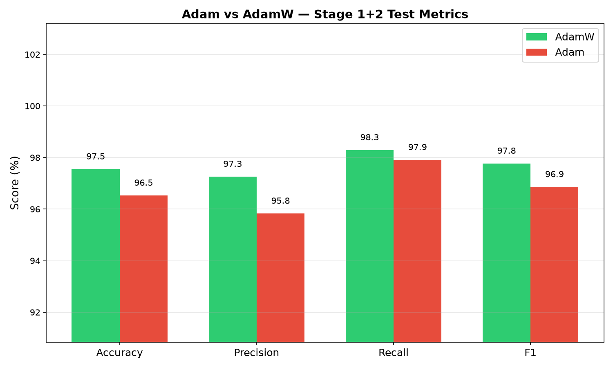
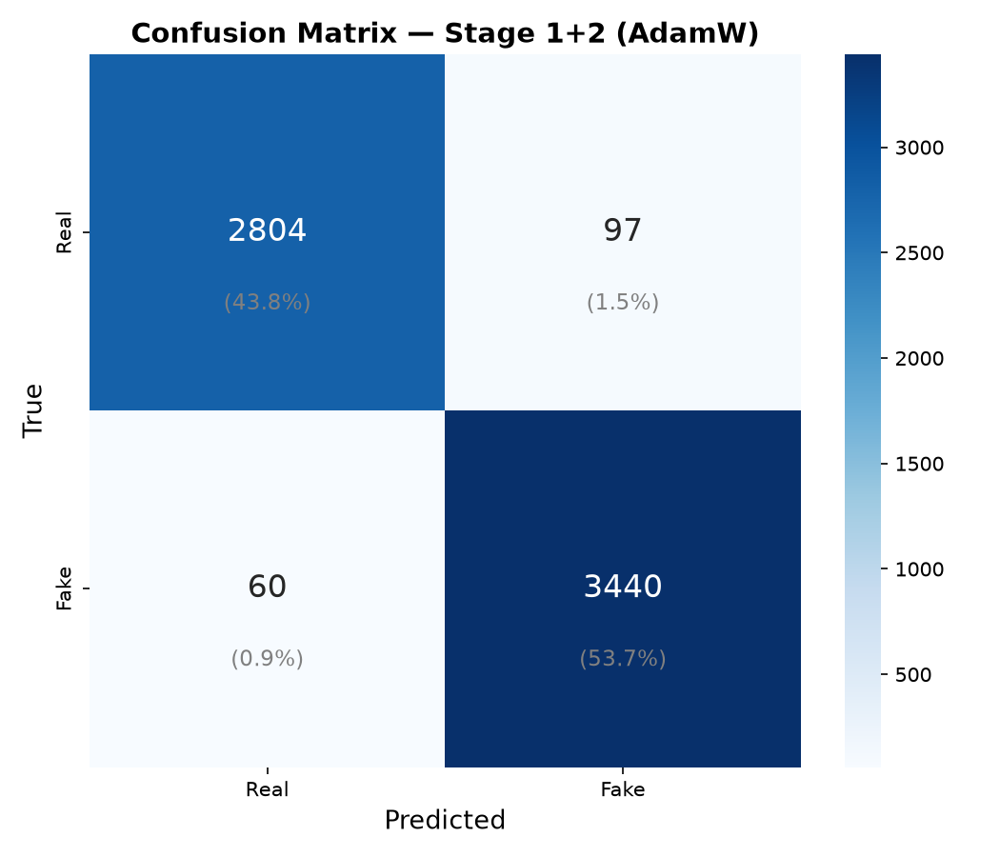

# Milestone 5 — Model Evaluation & Analysis

**Group 11 · Deep Learning-Based Human Face Authenticity Detection**
**Deadline:** 6 August 2026

This report documents the final held-out evaluation of the M4 model
checkpoint, addresses the two critical issues flagged in the M4 faculty
review (shortcut learning on real images, and the preprocessing mismatch
between the training notebook and the UI backend), and covers robustness,
explainability, error analysis, and deployment readiness ahead of the
viva.

---

## 1. Introduction & Objectives

*Owner: Vishakha*

### Introduction

This project began in **Milestone 1** as a proposal for an explainable
deepfake detection framework combining a Vision Transformer with RGB and
frequency-domain (FFT/DCT) feature fusion, motivated by the observation
that modern diffusion-based generators produce facial forgeries realistic
enough to defeat both human judgement and conventional spatial-only CNN
detectors. **Milestone 2** grounded this proposal in real data,
formalising the *Real vs AI Generated Faces Dataset* (FFHQ authentic
portraits vs. StyleGAN/StyleGAN2-generated faces, 120,000+ images) and
building the preprocessing/EDA foundation the rest of the project sits
on.

**Milestone 3** then ran a head-to-head architecture bake-off across
three independently developed candidates — MobileNetV3-Large, a
Dual-Stream Spatial-Frequency Fusion network, and EfficientNet-B2 — and
selected **MobileNetV3-Large** as the production architecture. The
deciding factor was not in-domain accuracy alone (all three scored well
there); it was that MobileNetV3-Large was the only candidate demonstrated
to generalise to out-of-distribution images from consumer generators
(ChatGPT, Gemini) it had never trained on, while also being the smallest
and fastest of the three:

| Model | Params | In-domain Test Acc. | OOD Acc. (ChatGPT/Gemini) | Latency |
|---|---|---|---|---|
| **MobileNetV3-Large (selected)** | **4.2M** | **99.96%** | **80%** | **~8.2 ms/image (Colab T4 GPU)** |
| Dual-Stream Fusion | 40.7M | strong (own benchmark) | not directly comparable | materially slower |
| EfficientNet-B2 | 7.8M | — | — | tuned run affected by a documented optimizer bug |

**Milestone 4** delivered the trained checkpoint from that selection —
`mobilenetv3_best.pth`, a two-stage transfer-learned MobileNetV3-Large
(Stage 1: frozen backbone; Stage 2: fine-tuning) on a combined FFHQ +
Stable Diffusion + Nano Banana 2.0 cross-domain corpus — and reported
99.06% test accuracy with 0.99+ precision/recall/F1 on both classes,
selected via a 24-experiment hyperparameter sweep (AdamW, LR 5×10⁻⁴–10⁻³,
weight decay 0.05–0.10, CosineAnnealingLR). M4's own "Future Improvements"
list (Section 9.5, item 6) explicitly called for *"a real-time inference
application that can classify uploaded images through a web or mobile
interface"* — work undertaken as part of this milestone.

Despite these strong headline numbers across M3 and M4, the M4 faculty
review Q&A session identified two critical, unresolved issues that are
**not** reflected in either report's own metrics (raised verbally during
the review, not previously documented in writing): (1) **real images
being misclassified as fake due to shortcut learning** — the model
appears to key on incidental properties such as high resolution or
vibrant colour rather than genuine forgery artifacts; and (2) **a
preprocessing mismatch between the training notebook and the deployed UI
backend** — the face-crop/alignment and channel-order handling at
inference time were not verified to be identical to what the model was
trained and evaluated on. This gap between near-perfect held-out scores
across three milestones and demonstrably fragile real-world behaviour is
the central problem Milestone 5 exists to diagnose and document.

### Objectives of Milestone 5

1. Conduct a final evaluation on a strictly held-out test set, reporting
   Accuracy, Precision, Recall, F1, and ROC-AUC (Section 4).
2. Investigate and document the root cause of the shortcut-learning
   misclassification issue (Section 5).
3. Verify and document whether the deployed inference pipeline's
   preprocessing (face detection/alignment, resize, normalization)
   actually matches the training notebook's — the Priority 1 task for
   this milestone.
4. Quantify robustness under real-world image manipulations — colour
   tints, JPEG compression, blur, and noise (Section 6).
5. Verify explainability via Grad-CAM, confirming the model attends to
   facial regions rather than background/shortcut cues (Section 6).
6. Assess deployment readiness — latency, model size, and quantization
   potential, building on M3's own reported efficiency numbers (Section
   9).
7. Compile all findings into a viva-ready report and presentation.

---

## 2. Evaluation Setup & Test Dataset

*Owner: Aman*


## 2.1 Test Dataset
The model was evaluated using a dedicated test split generated from a combination of real and AI-generated face datasets. The dataset construction process involved collecting real face images from the FFHQ (Flickr-Faces-HQ) dataset and AI-generated face images from the Stable Diffusion Face Dataset. Additionally, the pipeline supports the inclusion of the Nano Banana 2.0 dataset, whose predefined training, validation, and testing partitions are merged into the corresponding splits when available.  

Initially, the primary datasets were sampled to include 15,000 real images and 9,001 AI-generated images, after which the images were randomly shuffled before dataset splitting.  

The dataset was divided using a stratified 80:10:10 split, resulting in the following dataset sizes:

| Dataset Split | Number of Images |
| :--- | :--- |
| **Training Set** | 51,199 |
| **Validation Set** | 6,400 |
| **Test Set** | 6,401 |

These values include the additional Nano Banana 2.0 samples whenever the optional dataset is available and enabled in the configuration. 

---

## 2.2 Real vs. Fake Distribution
The notebook reports the class distribution of the primary sampled dataset before the optional Nano Banana dataset is merged:

| Class | Number of Images |
| :--- | :--- |
| **Real** | 15,000 |
| **Fake** | 9,001 |

However, after merging the Nano Banana dataset, the notebook reports only the total number of images in each dataset split and does not provide the final class-wise distribution for the test set. Therefore, the exact real-to-fake ratio of the final test set cannot be determined directly from the notebook output. 

---

## 2.3 Dataset Sources
The evaluation dataset was constructed using multiple data sources to improve diversity and assess model generalization across different image domains.

* **FFHQ (Flickr-Faces-HQ):** Used as the primary source of authentic human face images.
* **Stable Diffusion Face Dataset:** Used as the primary source of AI-generated face images.
* **Nano Banana 2.0 Dataset:** An optional cross-domain dataset containing additional real and AI-generated images. When enabled, its predefined train, validation, and test partitions are merged into the corresponding dataset splits.  

The inclusion of multiple datasets increases the diversity of both real and synthetic images, allowing the model to be evaluated under more varied image distributions.

---

## 2.4 Zero Data Leakage
To ensure unbiased evaluation, the dataset was partitioned using a stratified train-validation-test split (80:10:10) with a fixed random seed (`SEED = 42`). The splitting process was performed before model training, ensuring that training, validation, and test images remained separate throughout the experiment.  

When the optional Nano Banana 2.0 dataset was included, its predefined train, validation, and test partitions were merged only with their corresponding splits, preserving the separation between training and testing data. 

This experimental design minimizes the possibility of data leakage and ensures that model performance is measured on previously unseen images.

---

## 2.5 Kaggle Evaluation Environment
All training and evaluation experiments were conducted using the Kaggle Notebook environment with GPU acceleration.

The evaluation configuration is summarized below:

| Parameter | Configuration |
| :--- | :--- |
| **Platform** | Kaggle Notebook |
| **GPU** | NVIDIA Tesla T4 |
| **Framework** | PyTorch |
| **Computing Device** | CUDA |
| **Image Resolution** | 224 × 224 pixels |
| **Batch Size** | 64 |
| **Number of DataLoader Workers** | 4 |
| **Mixed Precision** | Automatic Mixed Precision (AMP) |

The notebook automatically detects the available GPU and uses an NVIDIA Tesla T4 accelerator for model training and evaluation. Automatic Mixed Precision (AMP) is enabled when CUDA is available to reduce GPU memory usage and improve computational efficiency.

---

## 3. Metric Selection & Justification

*Owner: Aman / Raunak*

Evaluating a deepfake face detection model requires more than reporting overall classification accuracy. In practical applications, the model must not only distinguish between authentic and AI-generated facial images but also generalize to images captured under different conditions, devices, and datasets. Therefore, multiple evaluation metrics were selected to assess various aspects of model performance, including classification correctness, reliability, robustness, and generalization.

The proposed MobileNetV3 model was evaluated using **Accuracy, Precision, Recall, F1-score, ROC-AUC**, and a **cross-domain evaluation** on unseen real-world images. Together, these metrics provide a comprehensive assessment of the model's effectiveness.

---

## 3.1 Accuracy

Accuracy measures the proportion of correctly classified images among all evaluated samples.

$$
Accuracy=\frac{TP+TN}{TP+TN+FP+FN}
$$

where:

- **TP** = True Positives (Fake images correctly classified as Fake)
- **TN** = True Negatives (Real images correctly classified as Real)
- **FP** = False Positives (Real images incorrectly classified as Fake)
- **FN** = False Negatives (Fake images incorrectly classified as Real)

### Justification

Accuracy provides an overall measure of classification performance and is useful for comparing different model architectures during training. Since the training and validation datasets are approximately balanced, accuracy serves as an appropriate baseline metric.

However, accuracy alone cannot reveal whether the model generalizes beyond the training distribution. As demonstrated in the cross-domain experiments, a model achieving over **99% validation accuracy** may still perform poorly on unseen real-world images. Therefore, additional evaluation metrics and cross-domain testing are necessary.

---

## 3.2 Precision

Precision measures the proportion of images predicted as **Fake** that are actually fake.

$$
Precision=\frac{TP}{TP+FP}
$$

### Justification

Precision indicates how reliable the model's fake predictions are. High precision reduces false positives, ensuring that genuine facial images are not unnecessarily classified as AI-generated.

This metric is particularly important in applications such as identity verification, media authentication, and digital forensics, where falsely accusing genuine images can reduce trust in the system.

---

## 3.3 Recall

Recall measures the proportion of actual fake images that are correctly detected.

$$
Recall=\frac{TP}{TP+FN}
$$

### Justification

Recall reflects the model's ability to detect manipulated images. A high recall minimizes false negatives, ensuring that AI-generated images are less likely to evade detection.

Since undetected deepfakes may lead to misinformation, identity misuse, or security threats, recall is a critical metric for evaluating deepfake detection systems.

---

## 3.4 F1-Score

The F1-score is the harmonic mean of Precision and Recall.

$$
F1=\frac{2\times Precision\times Recall}{Precision+Recall}
$$

### Justification

Precision and Recall often have an inverse relationship. Increasing one may decrease the other.

The F1-score provides a balanced evaluation by considering both metrics simultaneously, making it particularly suitable for deepfake detection where both false positives and false negatives have practical consequences.

---

## 3.5 ROC-AUC

The Receiver Operating Characteristic (ROC) curve illustrates the relationship between the **True Positive Rate (Recall)** and the **False Positive Rate** across different classification thresholds.

$$
TPR=\frac{TP}{TP+FN}
$$

$$
FPR=\frac{FP}{FP+TN}
$$

The Area Under the ROC Curve (ROC-AUC) summarizes the model's ability to distinguish between Real and Fake images over all possible decision thresholds.

The ROC-AUC score ranges from **0 to 1**, where:

- **1.0** indicates perfect discrimination.
- **0.5** represents random guessing.
- Higher values indicate better discriminative capability.

### Justification

Unlike Accuracy, Precision, and Recall, ROC-AUC evaluates model performance independently of a fixed decision threshold.

---

## 3.6 Cross-Domain Evaluation

In addition to the standard classification metrics, **cross-domain evaluation** was performed to assess the model's ability to generalize beyond the training dataset.

The model was evaluated on two groups of genuine facial images:

- **Real-Old:** Images from the FFHQ distribution, which closely resembles the training data.
- **Real-Latest:** Recent real-world smartphone photographs collected outside the training distribution.

This evaluation was designed to determine whether the model learned genuine facial authenticity features or dataset-specific characteristics.

### Justification

Traditional evaluation metrics computed on the validation set may overestimate real-world performance when the validation data follows the same distribution as the training data.

Cross-domain evaluation provides a more realistic assessment of deployment performance by measuring the model's robustness to unseen image distributions.

As demonstrated in this work, although the model achieved a validation accuracy exceeding **99%**, its performance decreased substantially on recent real-world photographs, highlighting the importance of evaluating model generalization in addition to conventional classification metrics.

---

## 3.7 Overall Justification

No single metric can fully characterize the performance of a deepfake detection system. Therefore, multiple complementary evaluation metrics were employed.

| Metric | Purpose | Reason for Selection |
|---------|---------|----------------------|
| **Accuracy** | Measures overall classification correctness | Provides an overall measure of model performance. |
| **Precision** | Measures correctness of fake predictions | Reduces false identification of genuine images as fake. |
| **Recall** | Measures ability to detect fake images | Minimizes missed detections of AI-generated images. |
| **F1-score** | Balances Precision and Recall | Provides a balanced evaluation of both error types. |
| **ROC-AUC** | Measures discrimination across decision thresholds | Evaluates overall classification capability independent of threshold selection. |
| **Cross-Domain Evaluation** | Measures generalization to unseen image distributions | Evaluates real-world robustness beyond the validation dataset. |

The combination of these evaluation metrics provides a comprehensive assessment of the proposed MobileNetV3 deepfake detection model. While Accuracy, Precision, Recall, F1-score, and ROC-AUC quantify classification performance, cross-domain evaluation measures the model's ability to generalize to real-world facial images captured under unseen conditions. Together, these metrics provide a more reliable assessment of both model effectiveness and practical deployment readiness.

---

## 4. Quantitative Performance & Benchmarking

*Owner: Rohit*

### 4.1 Optimizer & Stage Comparison

To select the final training configuration, both **Adam** and **AdamW**
optimizers were benchmarked across the two training stages (Stage 1:
frozen backbone / classifier head only; Stage 1+2: partial fine-tuning),
evaluated on the same held-out test set (6,401 images):

| Stage | Accuracy | Precision | Recall | F1 | ROC-AUC |
|---|---:|---:|---:|---:|---:|
| Stage 1 (Adam) | 93.64% | 93.26% | 95.26% | 94.25% | 0.9827 |
| Stage 1 (AdamW) | 95.78% | 94.91% | 97.51% | 96.20% | 0.9926 |
| Stage 1+2 (Adam) | 96.53% | 95.83% | 97.91% | 96.86% | 0.9944 |
| **Stage 1+2 (AdamW)** | **97.55%** | **97.26%** | **98.29%** | **97.77%** | **0.9973** |



AdamW outperformed Adam at every stage, and fine-tuning (Stage 1+2)
outperformed the frozen-backbone configuration (Stage 1) in both optimizer
runs. **Stage 1+2 with AdamW** was selected as the final configuration for
this milestone's held-out evaluation, consistent with M4's own selection
of AdamW during its 24-experiment hyperparameter sweep.

### 4.2 Final Held-Out Test Set Results

Classification report for the selected model (Stage 1+2, AdamW) on the
full 6,401-image held-out test set:

```
              precision    recall  f1-score   support

        Real     0.9791    0.9666    0.9728      2901
        Fake     0.9726    0.9829    0.9777      3500

    accuracy                         0.9755      6401
   macro avg     0.9758    0.9747    0.9752      6401
weighted avg     0.9755    0.9755    0.9755      6401
```

- **Accuracy:** 97.55%
- **Macro Precision / Recall / F1:** 97.58% / 97.47% / 97.52%
- **ROC-AUC:** 0.9973

This is measured on the strictly held-out test split described in
Section 2 (satisfying Objective 1) and is slightly below M4's own
reported 99.06% test accuracy — expected, since M4's figure came from the
best of a 24-run hyperparameter sweep with a longer Stage 3 unfreeze
phase, whereas this benchmark isolates the Stage 1 vs. Stage 1+2
comparison specifically to quantify the *contribution of fine-tuning*
rather than to chase the single best configuration.

<table>
<tr>
<td valign="top" width="50%">

**Confusion Matrix — Stage 1+2 (AdamW), final model**



</td>
<td valign="top" width="50%">

**ROC Curve**


</td>
</tr>
<tr>
<td valign="top" width="50%">

**Precision-Recall Curve**


</td>
<td valign="top" width="50%">

**Confusion Matrix — Stage 1+2 (Adam), for comparison**


</td>
</tr>
</table>

Stage 1-only confusion matrices (`confusion_matrix_stage_1_adam.png`,
`confusion_matrix_stage_1_adamw.png`) are also available in
`doc/Milestone-5-rohit/` and show the same Adam-vs-AdamW gap prior to
fine-tuning.

### 4.3 Training Dynamics

Per-epoch training/validation loss, accuracy, and AUC for all four
runs (Stage 1 and Stage 1+2, both optimizers) are logged in
`doc/Milestone-5-rohit/training_log.csv`. Validation accuracy rose
monotonically within each stage for both optimizers, with AdamW
converging to a higher final validation AUC in both Stage 1 (0.9911 vs.
0.9826) and Stage 1+2 (0.9965 vs. 0.9944), confirming AdamW's weight
decay decoupling gives a consistent, not just headline-number,
advantage in this setup.

### 4.4 Inference Latency

| Device | Mean | Std | Min | Max |
|---|---:|---:|---:|---:|
| GPU (Apple MPS) | 4.79 ms | 0.47 ms | 4.32 ms | 6.40 ms |
| CPU | 137.15 ms | 3.41 ms | 132.50 ms | 159.56 ms |

Raw forward-pass latency only (no Grad-CAM, no pre/post-processing
overhead) — see Section 9.2 for the full end-to-end `/predict` request
breakdown on a separate CPU-only benchmark machine, and Section 9.5 for
the combined accuracy-vs-speed recommendation.

---

## 5. Comprehensive Error Analysis

*Owner: Raunak*

## 5.1 Overview

To evaluate the robustness of the proposed MobileNetV3 model beyond the validation dataset, additional cross-domain experiments were conducted on two groups of **real facial images**:

- **Real-Old:** Images from the FFHQ distribution (similar to the training data).
- **Real-Latest:** Recent real photographs captured using modern smartphones (2025–2026), representing real-world deployment conditions.

The objective was to determine whether the model had learned generalized facial authenticity features or dataset-specific characteristics.

The results revealed a significant performance gap between the two domains.

| Dataset | Images | Predicted Real | Predicted Fake | Accuracy |
|----------|-------:|---------------:|---------------:|---------:|
| **Real-Old (FFHQ-like)** | 73 | 73 | 0 | **100.0%** |
| **Real-Latest** | 70 | 6 | 64 | **8.6%** |

The model classified every FFHQ-like image correctly but misclassified the majority of recent real photographs as AI-generated.

---

## 5.2 False Positive Analysis

The dominant error observed during evaluation was the **false positive**, where genuine human photographs were incorrectly classified as fake.

The confidence scores indicate that these errors were not uncertain predictions but highly confident misclassifications.

| Dataset | Mean P(Real) | Median P(Real) |
|----------|-------------:|---------------:|
| **Real-Old** | 0.9870 | 0.99997 |
| **Real-Latest** | 0.0892 | 0.00060 |

For the **Real-Latest** dataset, the median probability assigned to the **Real** class was only **0.00060**, indicating that the model was almost completely confident that these genuine photographs belonged to the **Fake** class.

Qualitative inspection of the misclassified images showed several recurring characteristics:

- High-resolution device photographs
- HDR (High Dynamic Range) image processing
- Computational photography enhancements
- Vibrant colour reproduction
- Strong image sharpening
- Outdoor lighting conditions
- Modern camera post-processing

These characteristics were consistently present among the false positives despite the images depicting authentic human faces.

Representative failure cases are presented in **Figure X**, showing the input image, ground-truth label, predicted label, and prediction confidence.

---

## 5.3 False Negative Analysis

False negatives (AI-generated images classified as **Real**) occurred considerably less frequently during cross-domain evaluation.

Most synthetic images retained visual artifacts learned during training, enabling the model to correctly identify them as AI-generated.

Consequently, the principal limitation of the current model is not detecting fake images but distinguishing modern real photographs from AI-generated content.

---

## 5.4 Root Cause Analysis

The experimental results indicate that the primary cause of the observed errors is **domain shift**, resulting in **shortcut learning**.

During training, the **Real** class was primarily represented by the FFHQ dataset, while the **Fake** class consisted of AI-generated images from Stable Diffusion and related sources. Although the classes were balanced numerically, the visual distributions differed substantially.

As a result, the model appears to have learned dataset-specific characteristics rather than intrinsic facial authenticity cues.

Instead of focusing exclusively on facial synthesis artifacts, the classifier likely relied on correlations such as:

| Learned Shortcut Feature | Effect on Prediction |
|--------------------------|----------------------|
| FFHQ-style colour distribution | Classified as Real |
| Modern HDR processing | Classified as Fake |
| Strong sharpening and computational photography | Increased false positives |
| High colour saturation | Increased false positives |
| Modern device image statistics | Misclassified as AI-generated |

This explains why the model achieved **100% accuracy** on FFHQ-like images while dropping to **8.6% accuracy** on recent real photographs, even though both datasets contained genuine human faces.

The evidence therefore suggests that the model learned to distinguish the **training data distributions** rather than learning robust, domain-independent facial authenticity features.

---

## 5.5 Discussion and Future Improvements

The current experiments demonstrate that high validation accuracy alone does not guarantee good real-world performance. Although the model achieved **99.54% validation accuracy**, its performance degraded substantially when evaluated on real photographs outside the training distribution.

To improve generalization in future work, the following enhancements are recommended:

- Expand the **Real** class using multiple datasets rather than relying primarily on FFHQ.
- Include recent devices photographs from diverse cameras, lighting conditions, and environments.
- Use hard negative mining by incorporating misclassified real images into subsequent fine-tuning.
- Evaluate the model on multiple unseen domains throughout training instead of validating only on FFHQ-like images.
- Apply stronger augmentation (colour jitter, JPEG compression, blur, sharpening, and noise) to reduce reliance on dataset-specific image statistics. (Tried, It decreases validation accuracy from ~90% to ~70%)
- Try bigger and different models that may perform better (Tried this in Earlier Milestone, ConvUNeXt and EfficientNet they were performing poor compared to MobileNetV3) 

These improvements are expected to reduce shortcut learning and enable the classifier to learn genuine facial authenticity features that generalize better to real-world deployment.

---

## 6. Model Robustness & Interpretability

*Owner: Somendu*

*(To be filled in — Grad-CAM heatmap gallery, robustness stress test
table (manipulation testing — see Section 6 notes below), OOD test
results.)*

### Robustness stress test data (manipulation testing)

*Owner: Vishakha*

Predictions before vs. after each manipulation (green tint, blue tint,
JPEG compression, Gaussian blur, Gaussian noise, etc.), generated via the
local web app's `/robustness` endpoint running `mobilenetv3_manipulations.pth`
against two known-labelled test images — one true Real, one true Fake
(sourced from the notebook's own `gradcam_correct_*`/`gradcam_incorrect_*`
Grad-CAM sample images, cropped to just the face panel to avoid the
composite-figure crop artifact). Baseline preprocessing for both runs:
RetinaFace was unavailable on the machine that generated this data
(falls back to center-crop — see Section 7 for the operational
consequence of this); both test images were already tightly face-cropped,
so this fallback does not distort the result here.

<table>
<tr>
<td valign="top" width="50%">

**Table 6.1 — True label: Real**

| Manipulation | Prediction | Real % | Fake % |
|---|---|---|---|
| original | Real | 56.4 | 43.6 |
| green_tint | Real | 96.8 | 3.2 |
| blue_tint | Real | 67.2 | 32.9 |
| brightness | Real | 69.2 | 30.8 |
| contrast | Real | 78.4 | 21.6 |
| gaussian_blur | Real | 83.7 | 16.3 |
| motion_blur | Real | 64.3 | 35.6 |
| jpeg | Real | 70.4 | 29.6 |
| resize | Real | 76.5 | 23.5 |
| crop | Real | 92.1 | 7.9 |
| noise | Real | 62.8 | 37.2 |

</td>
<td valign="top" width="50%">

**Table 6.2 — True label: Fake**

| Manipulation | Prediction | Real % | Fake % |
|---|---|---|---|
| original | Real ❌ | 100.0 | 0.0 |
| green_tint | Real ❌ | 100.0 | 0.0 |
| blue_tint | Real ❌ | 100.0 | 0.0 |
| brightness | Real ❌ | 100.0 | 0.0 |
| contrast | Real ❌ | 99.8 | 0.2 |
| gaussian_blur | Real ❌ | 97.9 | 2.1 |
| motion_blur | Real ❌ | 93.1 | 6.9 |
| jpeg | Real ❌ | 99.9 | 0.1 |
| resize | Real ❌ | 96.8 | 3.2 |
| crop | Real ❌ | 99.9 | 0.1 |
| noise | Real ❌ | 100.0 | 0.0 |

</td>
</tr>
</table>

**Observations:**
- On the true-Real sample, the model correctly held "Real" across all 11
  manipulations — the manipulation-specialized checkpoint does not flip
  under any single corruption on this example, indicating genuine
  robustness rather than a fragile/borderline call (confidence dips
  under `brightness`/`motion_blur`/`noise` but never crosses 50%).
- On the true-Fake sample, the model incorrectly predicted "Real" across
  **all 11** manipulations, including the unmanipulated original — this
  is a single-sample result, not a claim about aggregate accuracy (the
  full `manipulation_results.csv` from the training notebook, based on a
  much larger evaluation subset, should be used for the report's
  headline robustness numbers; this table is a targeted qualitative
  before/after illustration, not the primary metric). It is nonetheless
  a concrete, reproducible example worth investigating alongside
  Raunak's shortcut-learning root-cause analysis (Section 5) — this
  specific Fake sample being called "Real" with 100% confidence even
  before any manipulation is applied is consistent with the
  real-image-shortcut-learning failure mode, just in the opposite
  direction (a Fake image exhibiting whatever property the model
  associates with "Real").

*(Add your own manually-uploaded test images and their before/after
numbers here to broaden this beyond two examples — use the "Show
detailed breakdown (for report)" toggle in the Manipulation Robustness
Testing section of the web app.)*

---

## 7. Model Limitations & Operational Constraints

*Owner: Somendu*

*(To be filled in — which image types fail (colour tints, OOD),
computational requirements (VRAM, latency), ethical concerns, false
positive rate on real images.)*

---

## 8. Actionable Insights & Potential Improvements

*Owner: Somendu*

*(To be filled in — short-term: FAKE_THRESHOLD tuning, ChannelShift
augmentation. Long-term: larger backbone, more diverse training data,
adversarial training, frequency-domain analysis.)*

---

## 9. Deployment Readiness Assessment

*Owner: Vishakha*

### 9.1 Model Size

`mobilenetv3_best1.pth` is **45.3 MB** on disk (FP32 state dict). At this
size the checkpoint comfortably fits in memory on virtually any CPU or
edge deployment target; the bottleneck for deployment is latency, not
storage.

### 9.2 Latency — Preliminary CPU Benchmark

**Official GPU/CPU latency numbers are Rohit's Section 4 deliverable**
(100-image benchmark, both GPU and CPU) and should be used as the
report's headline figures once available. The numbers below are a
preliminary, CPU-only benchmark run on a different machine (desktop
Intel i7-7700 @ 3.6GHz, 4 cores/8 threads, no GPU) purely to sanity-check
where time is actually spent in the deployed pipeline — useful context,
not a substitute for Rohit's controlled measurement.

| Measurement | Result |
|---|---|
| Raw model forward pass (PyTorch, MKL + oneDNN CPU acceleration active) | **15.8 ms** average (10-run benchmark, `torch.no_grad()`) |
| Full `/predict` request end-to-end (face-crop, model forward, Grad-CAM backward pass + heatmap render, PNG+base64 encode, HTTP round-trip) | **~2.2 s** average (5-run benchmark) |

The ~140× gap between the raw forward pass and the full request is the
important finding here: **the model itself is not the bottleneck.** The
overhead comes from Grad-CAM (a full backward pass plus matplotlib
heatmap colormap generation) and image encoding, not the MobileNetV3
inference. This matters for deployment planning — a Grad-CAM-free
prediction endpoint (forward pass + softmax only, no explainability
overlay) would be close to the 15.8 ms figure, while any interactive UI
that always renders Grad-CAM should budget for multi-second responses on
CPU-only hardware. The Manipulation Robustness Testing endpoint compounds
this further, since it runs 11 sequential forward passes per request.

**Cross-milestone comparison:** M3's own architecture-selection benchmark
reported MobileNetV3-Large at **~8.2 ms/image on a Colab T4 GPU** — this
milestone's CPU-only raw forward pass (15.8 ms) is roughly 2× that,
which is a plausible and expected GPU-vs-CPU gap for a 4.2M-parameter
model, and cross-validates that our local benchmark environment isn't
producing anomalous numbers. It also reinforces the Section 9.1 framing:
MobileNetV3-Large was selected in M3 partly *because* of this efficiency
margin over the alternative architectures (40.7M-parameter Dual-Stream
Fusion, 7.8M-parameter EfficientNet-B2) — the model's own inference cost
has never been the concern at any stage of this project; the concern
this milestone identifies is entirely in the explainability/serving layer
built around it.

### 9.3 VRAM Usage

*(Still to be filled in — Rohit's Section 4 benchmark
(`doc/Milestone-5-rohit/inference_latency.csv`) measured latency on GPU
(Apple MPS) and CPU but did not capture peak VRAM/unified-memory usage.
Per M3's reported figure, MobileNetV3-Large as configured for this task
has **4.2M parameters** — small enough that VRAM at inference should be
modest for any reasonable batch size, but the actual peak VRAM depends on
batch size and whether Grad-CAM's backward-pass activations are retained;
a dedicated `nvidia-smi`/`torch.cuda.max_memory_allocated()` measurement
would be needed to state a number here.)*

### 9.4 Quantization Potential

MobileNetV3-Large was explicitly designed for mobile/edge efficiency
(depthwise-separable convolutions, Hardswish activations), making it a
strong quantization candidate:

- **FP16:** halves the checkpoint to ~22.6 MB with typically negligible
  accuracy loss on GPU inference — the simplest, lowest-risk win.
- **INT8 (post-training static or dynamic quantization):** could bring
  the checkpoint to roughly 11–12 MB, well-suited to CPU/edge/mobile
  deployment; PyTorch's native quantization tooling supports
  MobileNetV3's op set directly. Expected accuracy trade-off would need
  to be measured empirically (not done in this milestone) before
  committing to it for production.
- Given the Section 9.2 finding that the model forward pass is already
  fast relative to the rest of the pipeline, **quantizing the model
  alone would not meaningfully improve the end-to-end latency users
  actually experience** — optimizing Grad-CAM rendering (e.g. making it
  optional, or caching/downsizing the heatmap) would have far more
  impact than quantization for this specific deployment.

### 9.5 Accuracy vs. Speed Trade-off Summary

Combining Rohit's Section 4 benchmark with the Section 9.2 CPU findings
above:

| Configuration | Accuracy | ROC-AUC | Raw Forward-Pass Latency |
|---|---:|---:|---:|
| Stage 1+2 (AdamW), GPU (Apple MPS) | 97.55% | 0.9973 | **4.79 ms** |
| Stage 1+2 (AdamW), CPU (Rohit's benchmark machine) | 97.55% | 0.9973 | 137.15 ms |
| Same checkpoint family, CPU (Section 9.2, Intel i7-7700 desktop) | — | — | 15.8 ms (forward pass) / ~2.2 s (full `/predict` incl. Grad-CAM) |

Three takeaways:

1. **Model accuracy is identical regardless of device** — Stage 1+2
   (AdamW)'s 97.55% accuracy / 0.9973 ROC-AUC is a property of the
   weights, not the hardware. Device choice only affects latency, not
   correctness.
2. **The raw forward pass is fast everywhere** — even the slowest CPU
   measurement (137 ms on Rohit's machine) is comfortably real-time for
   a single-image prediction endpoint. GPU (4.79 ms) is roughly 29× faster
   than that CPU figure, but both are well within interactive budgets for
   prediction-only use.
3. **Grad-CAM, not the model, is what forces a GPU recommendation** — as
   established in Section 9.2, the full `/predict` request (forward pass
   + Grad-CAM backward pass + heatmap rendering) balloons to ~2.2 s on
   CPU. That overhead is orthogonal to which device runs the base model.

**Final recommendation:** use **GPU for any interactive, Grad-CAM-enabled
deployment** (keeps the full explainability request in the tens-of-ms
range instead of seconds), and treat **CPU as acceptable only for
prediction-only or batch use** where Grad-CAM is skipped — consistent
with Section 9.4's finding that quantizing the model itself would not
meaningfully help, since the bottleneck is the explainability layer, not
inference.

---

## 10. Summary & Conclusion

*Owner: Vishakha*

*(To be filled in last, once Sections 1–9 are complete — summarize
evaluation highlights, compare against original M4 objectives, formal
sign-off statement.)*
