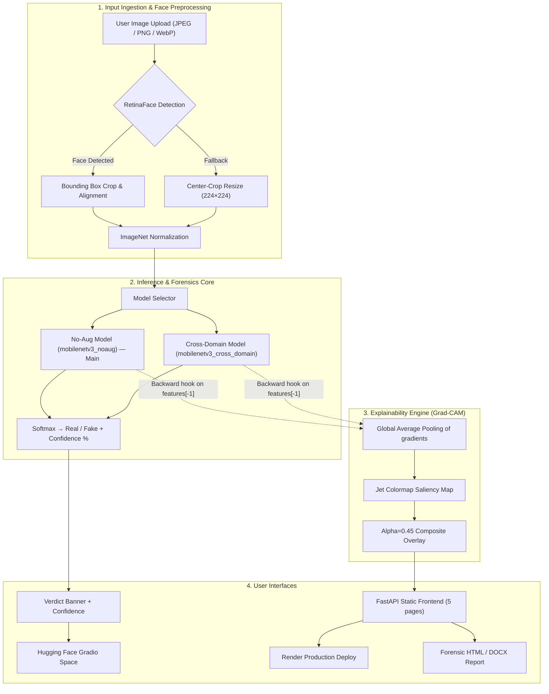
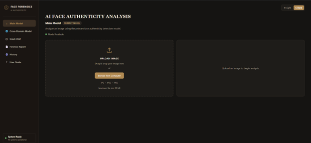
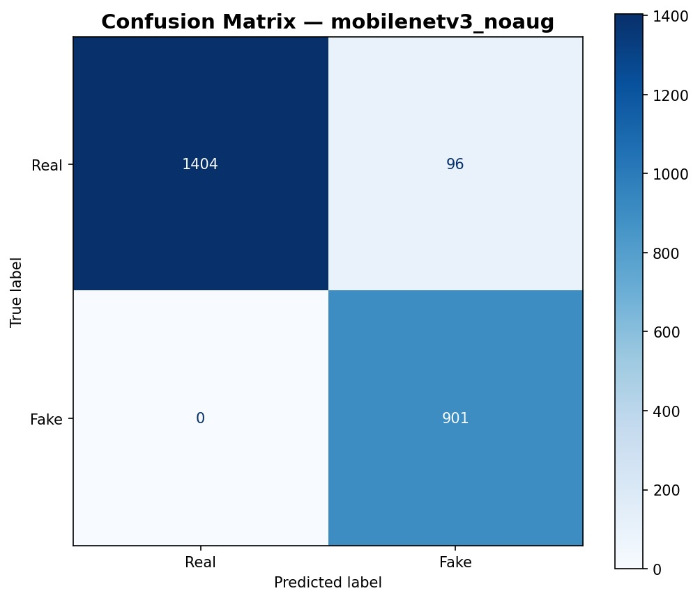
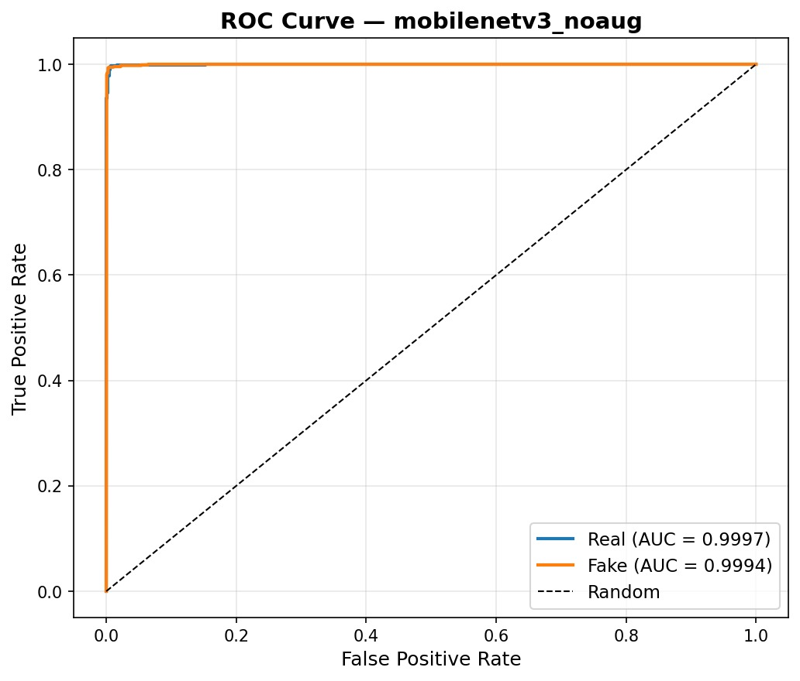
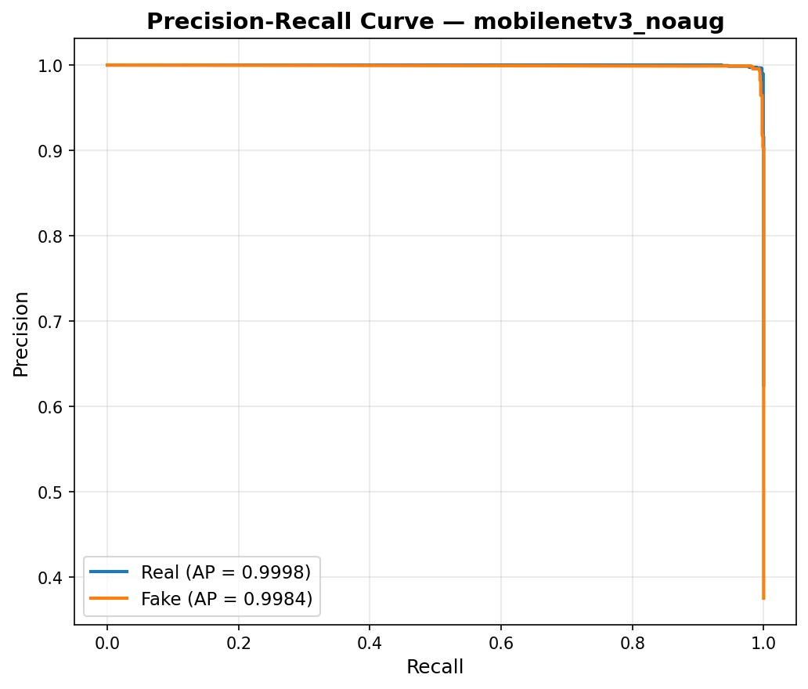
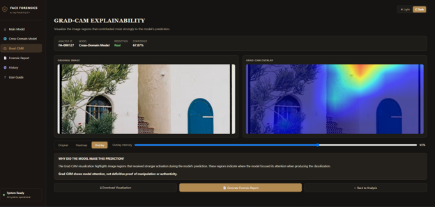

# DSAI PROJECT — MILESTONE 6

## Deployment & Documentation

**Project:** Deep Learning-Based Human Face Authenticity Detection & Explainability System

**Team:** Group 11 — Vishakha · Rohit · Aman · Raunak · Somendu

**Course:** DS & AI Lab Project

**Submission Date:** August 2026

---

## Table of Contents

1. [Overview](#overview)
2. [Deployment](#1-deployment)
3. [Comprehensive Documentation](#2-comprehensive-documentation)
4. [Individual Contributions](#3-individual-contributions)
5. [Appendix — Data Required for This Report](#appendix--data-required-for-this-report)

---

# Overview

Milestone 6 transforms our deep learning face-authenticity detection project from a research prototype into a deployed, documented, and reproducible system. This report covers three key deliverables:

1. **Deployment** — production on Render from **`main`** (Docker, 2 models), optional HF Gradio demo, local FastAPI
2. **Comprehensive Documentation** — technical, user-facing, and API documentation
3. **Final Project Summary** — academic-style coverage of training, evaluation, explainability, and known limitations

---

# 1. Deployment

## 1.1 What Is Deployed

| Component | Technology | Platform | Access |
|---|---|---|---|
| **Production Web Application** | FastAPI + Docker + Uvicorn | **Render** (branch **`main`**) | **[group-11-ds-and-ai-lab-project.onrender.com](https://group-11-ds-and-ai-lab-project.onrender.com/)** |
| Deployed checkpoints | PyTorch `.pth` via Git LFS | Baked into Docker image | **`mobilenetv3_noaug.pth`** (Main), **`mobilenetv3_cross_domain.pth`** (Cross-Domain) |
| Deepfake Detector (Gradio demo) | Gradio SDK + PyTorch | Hugging Face Spaces | [huggingface.co/spaces/somendu007/deepfake-detection](https://huggingface.co/spaces/somendu007/deepfake-detection) |
| Full development app | FastAPI + static HTML/JS | Local (`main` branch) | `http://localhost:8000` |
| Training Notebooks | PyTorch + Kaggle GPU | `main` branch | `../../notebooks/final-mobilenet (1).ipynb`, `../../notebooks/cross-domain.ipynb` |
| Simple deploy guide | Markdown | `main` branch | **`../../doc/READMEdeployment.md`** |

## 1.2 Deployment Architecture



> **On the live Render deployment, the "Fallback" branch is always taken.**
> `retina-face`/`opencv-python` are commented out of
> `requirements-docker.txt` ("not on Render free tier") because importing
> TensorFlow alone costs ~292 MB RSS (measured) - more than the ~202 MB of
> headroom left after the 512 MB limit and the ~310 MB the two loaded
> PyTorch models already use. Production always uses center-crop; real
> RetinaFace detection only runs where those packages are installed
> locally. See §B.9/B.10 below.

## 1.3 How to Run Locally

```bash
# 1. Clone the repository
git clone https://github.com/Vishakharoy1/Group-11-DS-and-AI-Lab-Project.git
cd Group-11-DS-and-AI-Lab-Project

# 2. Create and activate a virtual environment
python -m venv .venv
source .venv/bin/activate          # Windows: .\.venv\Scripts\Activate.ps1

# 3. Install dependencies
cd webapp/backend
pip install -r requirements.txt
pip install torch torchvision --index-url https://download.pytorch.org/whl/cpu

# 4. Ensure checkpoints exist in webapp/output/

# 5. Start the FastAPI server
uvicorn app.main:app --port 8000
# Open: http://localhost:8000
```

**Production deployment (recommended):** [https://group-11-ds-and-ai-lab-project.onrender.com/](https://group-11-ds-and-ai-lab-project.onrender.com/) — built from **`main`** via `render.yaml` + `webapp/backend/Dockerfile`. Docker ships **`noaug`** + **`cross_domain`** only (`webapp/.dockerignore` excludes other checkpoints). See **`../../doc/READMEdeployment.md`**.

**Public Gradio demo (alternative):** [huggingface.co/spaces/somendu007/deepfake-detection](https://huggingface.co/spaces/somendu007/deepfake-detection)

### Production deployment on Render (`main` branch)

| File | Purpose |
|---|---|
| `render.yaml` | Render Blueprint — Docker web service, branch `main` |
| `webapp/backend/Dockerfile` | `python:3.11-slim`, CPU PyTorch, port **10000** |
| `webapp/backend/requirements-docker.txt` | Python deps for Docker build |
| `webapp/.dockerignore` | Excludes `best` / `manipulations` / `tuned` from production image |
| `.gitattributes` | Git LFS for `webapp/output/*.pth` |

**Build flow:** push to `main` → Render clones repo → Docker build (2 models
only) → loads checkpoints at startup → live on port 10000.

**Not in production image** (RAM): `mobilenetv3_best.pth`,
`mobilenetv3_manipulations.pth`. Full local dev can load all checkpoints
from `webapp/output/`.

### Optional: Hugging Face Docker (root Dockerfile, port 7860)

Root **`Dockerfile`** on `main` targets HF Docker Spaces — **not** the
primary Render setup. Production uses **`webapp/backend/Dockerfile`**.

## 1.4 Inputs and Outputs

### Web-App Inputs

| Input Type | Description |
|---|---|
| Custom Upload | Drag-and-drop face image (JPEG, PNG, WebP; max 10 MB) |
| Preset Examples | Built-in sample Real / Fake / Cross-domain images |
| Model Selection | Main Model (`noaug` on production; Model 1/2 toggle locally with `best`), Cross-Domain |

### Web-App Outputs

- **Verdict & Confidence:** REAL or FAKE with split confidence percentages
- **Grad-CAM Heatmap & Overlay:** Saliency visualization on the cropped 224×224 face
- **Forensic Report:** Printable HTML and downloadable `.docx` case report
- **Analysis History:** Last 15 analyses persisted in browser `localStorage`



---

# 2. Comprehensive Documentation

## A. Overview — Problem Statement and Architecture

### Problem Statement

Generative AI produces synthetic facial images that are visually indistinguishable from authentic photographs. Deep learning detectors often learn **shortcut features** — HDR tone-mapping, saturation, sharpening, or dataset-specific compression — rather than true forgery artifacts. Our system addresses this with a **MobileNetV3-Large** classifier trained via three-stage transfer learning, **Grad-CAM explainability**, multi-checkpoint evaluation, and an honest cross-domain probe documenting where the model fails.

### Final System Architecture

**Layer 1 — MobileNetV3-Large Classifier (4.2M params)**
Three-stage progressive unfreezing: frozen backbone → partial unfreeze (blocks 12–16) → full unfreeze with CelebA-HD real photos added in Stage 3.

**Layer 2 — Explainability Engine (Grad-CAM)**
Standard Grad-CAM on `model.features[-1]` with backward hooks, GAP weighting, jet colormap, and 0.45 alpha overlay. See [Section B.6](#b6-explainability--grad-cam-development) for the Layer-CAM upgrade roadmap.

**Layer 3 — User Interfaces**
- **FastAPI Web App:** Multi-page static frontend (Main Model, Cross-Domain, Manipulation Robustness, Model Comparison, Training Results, Forensic Report)
- **Hugging Face Gradio Space:** Public zero-setup demo

### Key Design Decisions

| Decision | Rationale |
|---|---|
| MobileNetV3-Large over EfficientNet-B2 / Dual-Stream Fusion | Best OOD generalization at 4.2M params vs. 7.8M–40.7M alternatives (Milestone 3 bake-off) |
| Three-stage transfer learning + CelebA-HD | Counter shortcut learning on HD real smartphone photos |
| RetinaFace + center-crop fallback | Matches training preprocessing when detection available; **always** falls back to center-crop in production (RetinaFace deliberately not installed on Render - 512MB RAM budget), and also degrades gracefully on Windows N locally |
| Grad-CAM on `features[-1]` | Immediate saliency without retraining; runs on every `/predict` call today |
| Multiple checkpoint roles | Separates in-domain accuracy, cross-domain probes, manipulation robustness, and ablation |
| Honest dual reporting | 99.63% in-distribution accuracy coexists with 8.6% Real-Latest probe accuracy |

---

## B. Technical Documentation

### B.1 Environment Setup

| Requirement | Value |
|---|---|
| Python | 3.11+ |
| PyTorch | CPU wheels (`whl/cpu`) or CUDA if GPU available |
| RAM | 16 GB minimum for local multi-checkpoint loading |
| OS | Linux (recommended for Docker/HF), Windows, macOS |

**Core dependencies:** `torch`, `torchvision`, `fastapi`, `uvicorn`, `pillow`, `numpy`, `matplotlib`, `pydantic`, `python-docx`, `python-multipart`

Install: `pip install -r webapp/backend/requirements.txt`

### B.2 Data Pipeline

| Dataset | Role | Approx. Count |
|---|---|---|
| FFHQ | Real training faces | ~15,000 used |
| Stable Diffusion Face Dataset | Fake training faces | 9,001 |
| CelebA-HD | Stage 3 HD real photos | 8,000 added |
| Held-out test set | Final evaluation | **2,401** (1,500 Real + 901 Fake) |

**Preprocessing:** RGB conversion → RetinaFace crop (or center-crop fallback) → resize 224×224 → ImageNet normalization (`mean=[0.485,0.456,0.406]`, `std=[0.229,0.224,0.225]`).

**Split:** Stratified 80/10/10 train/val/test, `random_state=42`.

### B.3 Model Architecture

| Component | Detail |
|---|---|
| Backbone | MobileNetV3-Large (ImageNet pre-trained) |
| Head | Linear binary classifier (Real=0, Fake=1) |
| Parameters | 4,204,594 (all trainable in Stage 3) |
| Input size | 224 × 224 × 3 |

### B.4 Training Summary

| Stage | Epochs | Learning Rate | Trainable Params | Val Accuracy |
|---|---:|---|---:|---:|
| Stage 1 (frozen backbone) | 3 | 3×10⁻⁴ | 1,232,642 | 98.75% |
| Stage 2 (partial unfreeze) | 7 | 1×10⁻⁵ | 3,798,226 | 99.71% |
| Stage 3 (full + CelebA-HD) | 3 | 5×10⁻⁶ | 4,204,594 | 99.71% |

Checkpoint saved as `mobilenetv3_best.pth` (~17 MB).

### B.5 Evaluation Summary

> **Deployed vs. research checkpoints:** The web app exposes two models — **Main Model (`mobilenetv3_noaug.pth`, default)** and **Cross-Domain Model (`mobilenetv3_cross_domain.pth`)**. All M6 ROC/PR/confusion plots in `Images/` are for **`noaug`**, matching the deployed Main Model. The 3-stage **`mobilenetv3_best.pth`** checkpoint (from `../../notebooks/final-mobilenet (1).ipynb`) is documented in Milestone 5 for academic comparison (99.63% in-distribution accuracy).

#### B.5.1 Primary Deployed Model — `mobilenetv3_noaug.pth` (held-out test set, 2,401 images)

The Main Model page defaults to **`noaug`** (`webapp/backend/app/static/app.js`: `mainPageModelKey = "noaug"`). M6 evaluation curves in `Images/` were generated on the full held-out test set for this checkpoint.

**Confusion matrix — mobilenetv3_noaug:**



| Cell | Count | Meaning |
|---|---:|---|
| True Real → Pred Real | 1,404 | Correctly identified authentic faces |
| True Real → Pred Fake | 96 | False alarms on real images |
| True Fake → Pred Real | 0 | Missed fakes (zero false negatives) |
| True Fake → Pred Fake | 901 | Correctly identified synthetic faces |
| **Accuracy** | **95.98%** | (1,404 + 901) / 2,401 |

**ROC Curve — mobilenetv3_noaug:**



| Class | ROC-AUC |
|---|---:|
| Real | **0.9997** |
| Fake | **0.9994** |

**Precision-Recall Curve — mobilenetv3_noaug:**



| Class | Average Precision (AP) |
|---|---:|
| Real | **0.9998** |
| Fake | **0.9984** |

**Interpretation:** The deployed Main Model achieves **100% fake recall** (zero missed fakes) with ROC-AUC > 0.99 on the in-distribution held-out set. The trade-off is **96 false positives** on real images (visible in the confusion matrix).

#### B.5.2 Research Checkpoint — `mobilenetv3_best.pth` (3-stage + CelebA-HD, M5 evaluation)

Trained via `../../notebooks/final-mobilenet (1).ipynb` (Stage 1 frozen → Stage 2 partial unfreeze → Stage 3 full + CelebA-HD). Documented in depth in `doc/Milestone-5/Milestone5.md` §4.2 — **not the default deployed Main Model**, but the primary academic evaluation target for shortcut-learning analysis.

```
              precision    recall  f1-score   support
        Real     0.9993    0.9947    0.9970      1500
        Fake     0.9912    0.9989    0.9950       901
    accuracy                         0.9963      2401
```

| Metric | Value |
|---|---:|
| Test Accuracy | **99.63%** (2,392 / 2,401) |
| Misclassifications | 8 Real→Fake, 1 Fake→Real |


#### B.5.3 Cross-Domain Model — `mobilenetv3_cross_domain.pth`

Trained via `../../notebooks/cross-domain.ipynb` on multi-domain synthetic corpora. Powers the **Cross-Domain Model** page in the web app. Checkpoint: `webapp/output/mobilenetv3_cross_domain.pth`.

#### B.5.4 Domain-Shift Probe — Where Models Fail (Real-Latest)

| Probe Set | Images | Accuracy (best checkpoint) | Key Finding |
|---|---:|---:|---|
| Held-out test — **noaug** (deployed) | 2,401 | 95.98% | 100% fake recall; 96 real false alarms |
| Held-out test — **best** (M5 research) | 2,401 | 99.63% | Strong in-distribution baseline |
| Real-Latest (smartphone photos) | 70 | **8.6%** | Shortcut learning on HDR/sharpening |
| Local Test Sample (supplementary) | 50 | 62.0% | ROC-AUC = 0.5856 (domain-shifted) |

**Critical insight:** Even strong in-distribution metrics do **not** translate to real-world reliability on modern smartphone photographs. The Real-Latest probe (8.6%) applies to the **`best`** checkpoint evaluated in M5; treat any high headline accuracy with caution.

#### B.5.5 Evaluation Metrics Summary

| Metric | **noaug (deployed Main)** | best (M5 research) | Real-Latest |
|---|---|---|---|
| Accuracy | 95.98% | 99.63% | 8.6% |
| Fake Recall | 1.0000 (0 FN) | 0.9989 | — |
| ROC-AUC (Real / Fake) | 0.9997 / 0.9994 | Not plotted | — |
| PR-AUC (Real / Fake) | 0.9998 / 0.9984 | Not plotted | — |

### B.6 Explainability & Grad-CAM Development

#### B.6.1 Current Production Implementation

File: `webapp/backend/app/gradcam.py`

The deployed backend implements **standard Grad-CAM (Selvaraju et al., 2017)** on the final convolutional block (`model.features[-1]`):

1. **Forward pass** → softmax probabilities
2. **Backward pass** on the predicted class score
3. **Global Average Pooling (GAP)** of gradients across spatial dimensions to compute channel weights:
   $$w_k^c = \frac{1}{H \times W} \sum_{i,j} \frac{\partial Y^c}{\partial A_{i,j}^k}$$
4. **Weighted sum + ReLU** → heatmap normalized to [0, 1]
5. **Jet colormap** + **alpha=0.45** overlay on the 224×224 input

```python
# Simplified from gradcam.py
gc = GradCAM(model, model.features[-1])
heatmap, explained_class, probabilities = gc(input_tensor)
overlay = Image.blend(display_img, heatmap_img, alpha=0.45)
```



**Latency impact:** MobileNetV3 forward pass ≈ **15.8 ms** (CPU); Grad-CAM backward pass ≈ **2.0 s** — explainability dominates end-to-end `/predict` latency (~2–3 s total).

#### B.6.2 Diagnosed Limitations (Research Review)

| Limitation | Effect on Deepfake Detection |
|---|---|
| GAP dilutes spatial gradients | Blending seams and micro-artifacts (< 5% of pixels) spread into broad blobs |
| Single layer (`features[-1]`) only | Misses mid-level blending boundaries (`features[11]`) and low-level noise (`features[6]`) |
| Jet colormap | Non-perceptually uniform — creates artificial visual boundaries |
| Uniform alpha = 0.45 | Dims non-saliency regions with dark blue background clutter |
| Hardswish + SE saturation | Gradients can vanish in MobileNetV3's final blocks |

#### B.6.3 Layer-CAM Research & Upgrade Roadmap

The **deployed** backend (`webapp/backend/app/gradcam.py`) runs **standard Grad-CAM** today. The following **Layer-CAM** enhancements were researched and documented for a future production upgrade (Somendu — M6):

**Layer-CAM (Jiang et al., 2021)** — element-wise spatial weighting without GAP:

$$w_{i,j}^k = \text{ReLU}\left(\frac{\partial Y^c}{\partial A_{i,j}^k}\right), \quad M = \text{ReLU}\left(\sum_k w_{i,j}^k \cdot A_{i,j}^k\right)$$

**Multi-scale fusion** across MobileNetV3 layers:

| Layer | Role |
|---|---|
| `features[6]` | Low-level frequency / compression artifacts |
| `features[11]` | Mid-level blending boundaries |
| `features[-1]` | High-level semantic inconsistencies |

**Visual improvements:**
- Replace `jet` with **`turbo`** perceptually uniform colormap
- **Adaptive alpha masking:** transparent below threshold 0.15, scaling to 0.75 at peak activation
- Optional **confidence drop %** metric: measure how much fake probability falls when top saliency pixels are masked

**Implementation status:**

| Feature | Status |
|---|---|
| Grad-CAM on `features[-1]` (jet, α=0.45) | ✅ **Deployed** in `gradcam.py` |
| Layer-CAM element-wise weighting | 📋 Researched & documented; not yet in `gradcam.py` |
| Multi-layer fusion (11 + -1) | 📋 Researched & documented |
| Turbo colormap + adaptive alpha | 📋 Researched & documented |
| On-demand Grad-CAM (latency fix) | 📋 Planned — separate UI trigger |

### B.7 Deployment Details

**Production URL (Render):** [https://group-11-ds-and-ai-lab-project.onrender.com/](https://group-11-ds-and-ai-lab-project.onrender.com/)

| Endpoint | Method | Description |
|---|---|---|
| `/health` | GET | Loaded models + face alignment method |
| `/predict?model=noaug` | POST | Classification + Grad-CAM + JSON response (default `noaug`) |
| `/robustness` | POST | 11 manipulation modes via `manipulations` checkpoint |
| `/compare?mode=augmentation` | POST | Side-by-side `best` vs `noaug` |
| `/report` | POST | Printable HTML forensic report |
| `/api/training-results` | GET | Pre-computed CSV/PNG evaluation artifacts |

**Swagger UI:** `http://localhost:8000/docs` (local) · `https://group-11-ds-and-ai-lab-project.onrender.com/docs` (Render)

### B.8 System Design Considerations

- **Graceful degradation:** Missing optional checkpoints skipped at startup; UI shows "Model not loaded"
- **Separation of concerns:** `ModelRegistry`, `preprocessing`, `gradcam`, `report` are independent modules
- **Client-side history:** No backend database required — last 15 analyses in `localStorage`
- **Production path:** Gunicorn multi-worker + optional Celery queue for async Grad-CAM

### B.9 Error Handling

| Edge Case | Handling |
|---|---|
| Missing checkpoint | HTTP 503 with path hint |
| Unsupported file type | HTTP 400 |
| File > 10 MB | HTTP 400 |
| No face detected | Center-crop fallback reported in response |
| RetinaFace not installed (**always true on Render** - free-tier RAM budget; also happens locally on Windows N) | Automatic center-crop fallback |

### B.10 Reproducibility Checklist

- [ ] Python 3.11 venv + `pip install -r webapp/backend/requirements.txt`
- [ ] CPU PyTorch: `pip install torch torchvision --index-url https://download.pytorch.org/whl/cpu`
- [ ] Checkpoints in `webapp/output/`
- [ ] Run `../../notebooks/final-mobilenet (1).ipynb` on Kaggle GPU with `SEED=42`
- [ ] Expected: ~99.63% test accuracy on 2,401-image held-out set
- [ ] Start: `uvicorn app.main:app --port 8000`

---

## C. User Documentation

### C.1 What the System Does

Upload a portrait photograph and receive:
- REAL or FAKE verdict with confidence percentages
- Grad-CAM heatmap showing where the model looked
- Downloadable forensic investigation report

### C.2 How to Launch

**Production (Render):** Open [https://group-11-ds-and-ai-lab-project.onrender.com/](https://group-11-ds-and-ai-lab-project.onrender.com/) in any browser — upload a face image on the Main Model or Cross-Domain Model page and click Analyze.

**Local development:** See §1.3. Open `http://localhost:8000` — navigate via sidebar: Main Model, Cross-Domain, Manipulation Robustness, Model Comparison, Training Results, Forensic Report.

### C.3 Hugging Face Space (Gradio alternative)

Open [somendu007/deepfake-detection](https://huggingface.co/spaces/somendu007/deepfake-detection) — no API key or installation required. Cold start may take 30–60 seconds.

### C.4 Example Use Cases

| Scenario | Expected Result |
|---|---|
| Stable Diffusion face with smooth skin | 🔴 FAKE — high fake confidence, heatmap on cheek/jaw |
| FFHQ dataset real portrait | 🟢 REAL — high real confidence |
| Modern iPhone HDR portrait | ⚠️ Likely FAKE (false positive) — documented 8.6% Real-Latest accuracy |
| Heavily JPEG-compressed social media photo | Use Manipulation Robustness page |

### C.5 Troubleshooting

| Problem | Solution |
|---|---|
| `no_models_loaded` on `/health` | Place `.pth` files in `webapp/output/` and restart |
| Slow `/predict` (~2–3 s) | Normal — Grad-CAM backward pass dominates |
| Wrong predictions on full photos | Upload pre-cropped face images - RetinaFace is unavailable on Render (always) and on Windows N locally, so center-crop is used |
| HF Space "Building" | Wait 1–2 min for Docker cold start |
| Render cold start / slow first load | Free tier may spin down after idle — first request can take 30–60 s |

---

## D. API Documentation

### POST `/predict`

```bash
curl -X POST "http://localhost:8000/predict?model=noaug" \
  -F "file=@face.jpg"
```

**Response fields:** `prediction.label`, `prediction.real_pct`, `prediction.fake_pct`, `gradcam_heatmap` (base64 PNG), `gradcam_overlay` (base64 PNG), `face_alignment_used`

### Error Codes

| HTTP | Meaning |
|---|---|
| 200 | Success |
| 400 | Invalid file type or too large |
| 503 | Requested checkpoint not loaded |
| 500 | Inference / Grad-CAM failure |

---

## E. Licensing and Dataset References

**Full consolidated document:** [`doc/Milestone-6/licenses.md`](licenses.md)

| Asset | License |
|---|---|
| Project code | MIT |
| FFHQ dataset | FFHQ License (research use) |
| Stable Diffusion Face Dataset | Kaggle dataset terms |
| MobileNetV3-Large (torchvision) | BSD-style |
| Render hosting | [Render Terms of Service](https://render.com/terms) |
| Hugging Face Spaces (optional demo) | [HF Terms of Service](https://huggingface.co/terms-of-service) |

---

## F. Future Work & Known Limitations

| Limitation | Severity |
|---|---|
| Real-Latest probe collapse (8.6%) | **High** |
| Grad-CAM latency on every `/predict` | Medium |
| Layer-CAM (researched, not yet coded in `gradcam.py`) | Medium |
| Demographic bias never audited | Medium |
| GPU latency not directly measured | Low |

See `../../doc/future_work.md` in the repo root for the full prioritized roadmap.

---

# 3. Individual Contributions

| Member | Role | Key Deliverables |
|---|---|---|
| **Vishakha** | Pipeline & Presentation Lead | Final presentation, deployment stability, contribution summary, Developer Guide |
| **Rohit** | Training Stability Lead | Full 2,401-image ROC/PR/confusion plots (`Images/`), Final Technical Report, UI layout |
| **Aman** | Preprocessing & Transfer Learning Lead | Non-Technical Report, training pipeline documentation |
| **Raunak** | Dataset & Bias Analysis Lead | Domain-shift root cause (8.6% Real-Latest), ethical limitations |
| **Somendu** | Explainability & Optimisation Lead | Grad-CAM/Layer-CAM research, HF Space deployment, User Guide |

### Effort Distribution

| Member | Focus Area |
|---|---|
| Vishakha | Presentation, deployment verification, Developer Guide |
| Rohit | Full-set evaluation metrics & curves, technical report, UI |
| Aman | Non-technical report, training documentation |
| Raunak | Domain shift analysis, bias limitations |
| Somendu | Explainability engine, Hugging Face Space, latency roadmap |

---

# Appendix — Data Required for This Report

Use this checklist when assembling or updating `doc/Milestone-6/`:

## Required Content Sections

| # | Section | Source in Repo |
|---|---|---|
| 1 | Deployment table + architecture diagram | §1 above; `webapp/backend/` |
| 2 | Local run instructions | `README.md`, `webapp/backend/README.md` |
| 3 | Training config (3-stage pipeline) | `../../notebooks/final-mobilenet (1).ipynb`, `doc/Milestone-5/Milestone5.md` |
| 4 | Held-out test metrics (**noaug** — deployed) | `Images/*.jpeg` + §B.5.1 |
| 5 | Held-out test metrics (**best** — M5 research) | M5 §4.2 + `confusion_matrix_best_model.png` |
| 6 | Cross-domain failure analysis | M5 §5 (Real-Latest 8.6%) |
| 7 | Grad-CAM (deployed) + Layer-CAM roadmap | `gradcam.py` + §B.6 |
| 8 | API endpoint documentation | `webapp/backend/app/main.py`, `/docs` Swagger |
| 9 | Render deploy from `main` + optional HF Gradio | [group-11-ds-and-ai-lab-project.onrender.com](https://group-11-ds-and-ai-lab-project.onrender.com/) + **`../../doc/READMEdeployment.md`** |
| 10 | UI screenshots | `Images/main_model.png`, `Grad_Cam.png`, etc. |
| 11 | Individual contributions | `doc/Milestone-6/Team-Contribution-Tracker.md` |
| 12 | Licensing & dataset citations | **`doc/Milestone-6/licenses.md`**, M2 report |

## Required Files & Artifacts

| Artifact | Location | Purpose |
|---|---|---|
| Model checkpoints | `webapp/output/*.pth` | Inference + deployment |
| Training notebooks | `../../notebooks/final-mobilenet (1).ipynb`, `../../notebooks/cross-domain.ipynb` | Reproducible training |
| Confusion / ROC / PR (**noaug**, deployed) | `Images/*.jpeg` | Main Model M6 evaluation |
| Confusion matrix (**best**, M5) | `doc/Milestone-5/images/confusion_matrix_best_model.png` | Research checkpoint |
| Frontend screenshots | `Images/main_model.png`, etc. | User documentation |
| **Dockerfile** | **`/Dockerfile`** (repo root) | HF Docker Space / container deploy |
| **Licenses** | **`doc/Milestone-6/licenses.md`** | Consolidated licensing |
| **Production deploy (Render)** | [group-11-ds-and-ai-lab-project.onrender.com](https://group-11-ds-and-ai-lab-project.onrender.com/) | `main` + `render.yaml` + `webapp/backend/Dockerfile` |
| **Simple deploy guide** | **`../../doc/READMEdeployment.md`** | Quick reference on `main` |
| Gradio demo | HF Space `somendu007/deepfake-detection` | Alternative public demo |

## External Links to Record

- GitHub: `https://github.com/Vishakharoy1/Group-11-DS-and-AI-Lab-Project`
- **Production deployment (Render):** `https://group-11-ds-and-ai-lab-project.onrender.com/`
- Hugging Face Space: `https://huggingface.co/spaces/somendu007/deepfake-detection`
- Hugging Face model (if published): team member Hub profile

---

## Team Declaration

We certify that all team members have actively contributed to the preparation of this document. Each member has reviewed the contents, understands the work presented, and agrees with the submitted report.

**Project:** Deep Learning-Based Human Face Authenticity Detection  
**Team:** Group 11 — Vishakha · Rohit · Aman · Raunak · Somendu  
**Course:** DS & AI Lab Project

| Team Member | Role | Signature |
| --- | --- | --- |
| Vishakha | Pipeline & Presentation Lead | Vishakha |
| Rohit | Training Stability Lead | Rohit |
| Aman | Preprocessing & Transfer Learning Lead | Aman |
| Raunak | Dataset & Bias Analysis Lead | Raunak |
| Somendu | Explainability & Optimisation Lead | Somendu |
